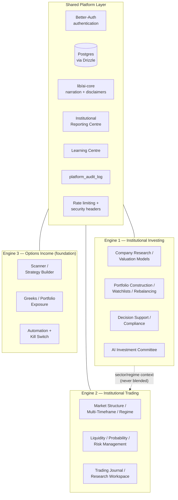

# Architecture (Version 1)

A top-level orientation. For engine-specific depth, see the linked
documents in each section rather than duplicating them here.

## The three-engine platform

**Never-blend-across-engines discipline.** Every phase that composes
figures from more than one engine (the Cross-Engine Command Center, the
Cross-Engine Daily Report) keeps each engine's own numbers side by side —
never summed or averaged into a fabricated combined figure. See
`docs/Cross-Engine-Orchestration.md` and `docs/Cross-Engine-Workspace.md`.

## Backend

Express 5, TypeScript, ESM. Every route validates its request/response
against a Zod schema generated from `lib/api-spec/openapi.yaml` — the
single source of truth for the REST contract (see
[`docs/API-Guide.md`](API-Guide.md)). Business logic lives in
`artifacts/api-server/src/lib/*.ts`, one module per concern, almost always
composing already-built modules rather than duplicating logic — every
phase's own completion report in `CLAUDE.md` states exactly what it reused
and what (if anything) was genuinely new.

Five files are under the platform's own maximum-scrutiny protection and
are never modified without explicit, specific approval:
`execution.ts`, `optionsMath.ts`, `risk.ts`, `autoExecution.ts`,
`autoAdjustment.ts`, plus broker integration code.

## Frontend

React 19 + Vite, TypeScript. Every page is route-level code-split via
`React.lazy()` (86 lazy imports covering 74 pages). Data fetching goes
through generated React Query hooks (`@workspace/api-client-react`), never
hand-written `fetch()` calls against undocumented endpoints. Shared UI
primitives (`Card`, `Skeleton`, `Badge`, `Button`) are used near-
universally across pages — see `docs/UI-Standards.md` and
`docs/RC1-UI-UX-Review.md`.

## Database

Postgres via Drizzle ORM. Schema lives in `lib/db/src/schema/*.ts`; every
schema change ships as a hand-written, reviewable SQL script in
`lib/db/manual-migrations/` — this project does not trust `drizzle-kit
push` alone for changes touching existing data (nullable → backfill →
enforce-not-null, per CLAUDE.md rule 7). See
[`docs/RC1-Diagrams-And-Catalogues.md`](RC1-Diagrams-And-Catalogues.md) §4
for the full table inventory.

## AI narration

Every LLM-narrated surface in the platform (the Options AI Coach, the
Investing AI Coach, the Trading AI Coach, the Investment Committee
narrator, the Cross-Engine Daily Report narrator) routes through the same
`lib/ai-core` package: a provider-agnostic `complete()`/`completeStream()`
with caching, single-flight de-duplication, and a disclaimer-enforcement
contract that cannot be bypassed by a new caller (CLAUDE.md rule 6). When
no LLM key is configured, every narration surface falls back to a
deterministic, template-based explanation — never blocks the underlying
deterministic data.

## Multi-engine data flow

Every dashboard-composition module documents, in its own header comment,
exactly which other modules' output it reuses "verbatim, never
recomputed." This is enforced by convention and spot-checked in
`docs/RC1-Repository-Audit.md`, not by a build-time rule — but is
consistently followed across all 44 phases of this project's history.

## Portfolio intelligence

Engine 1's own portfolio-level composition (`lib/portfolioIntelligence.ts`,
Phase 13) is the platform's largest single reuse example: it composes
`buildValueResearchReport()` (per-holding valuation/committee output) and
`investingRisk.ts`'s already-shipped `computePortfolioRiskFromAllocation()`/
`band()`/`gradeLabel()` (Phase 3 Sprint 29's concentration/sector/beta
model) into one weighted-portfolio view — quality/capital-allocation/
diversification scores, sector/market-cap/growth-value allocation, and a
risk roll-up — without re-deriving any of the underlying math. Later
phases (18 Portfolio Optimisation, 41 Rebalancing Engine, 44 Portfolio
Workspace) each extend this same composition rather than forking it. See
`docs/Institutional-Portfolio-Manager.md`, `docs/Portfolio-Scoring.md`,
`docs/Portfolio-Risk-Framework.md`.

## Monitoring

Two distinct monitoring surfaces exist, for two distinct audiences, and
are deliberately not merged:

- **Operator/production monitoring** — `GET /api/monitoring/status`
  (Phase 6, Sprint 74): database connectivity, background-job health
  (auto-execution/auto-adjustment/alerts tick state), and audit-log-derived
  alert signals (guardrail block rate, auth failure rate). This is the
  surface named in `docs/Incident-Response-Runbook.md` and
  `docs/Operations-Handbook.md`.
- **User-facing portfolio/market monitoring** — Engine 1's Monitoring
  Engine (`lib/monitoringEngine.ts`, Phase 16) and
  `pages/MonitoringDashboard.tsx`: per-holding/per-watchlist alert states
  and notes, surfaced through the same `platform_notifications` table the
  Alerts & Notifications feature (Phase 4, Sprint 56) already writes to.
  See `docs/Monitoring-Engine.md`, `docs/Alert-Framework.md`.

## Navigation

`lib/nav-items.ts` is the single source of truth for every route; see
`docs/RC1-Diagrams-And-Catalogues.md` §5 for the full navigation map
grouped by engine. As of **v1.1.0**, the sidebar itself
(`components/layout/AppLayout.tsx`) presents that registry as 10
collapsible, groupable, pinnable, compact-mode-capable groups rather than
one flat list — a presentation-layer change only, preserving every one of
the (by v1.1.0) 82 routes' own reachability, plus the global command
palette (⌘K / Ctrl+K, Phase 10), which finds every route regardless of
which group is collapsed. Sidebar layout preferences persist client-side
only (`dk-sidebar-navigation-state` in `localStorage`), never server-side.
See `docs/v1.1.0-Sidebar-Navigation-Redesign.md`.

## Broker integration

`lib/providers/alpacaBroker.ts` is the platform's only broker integration,
**Paper Trading only by deliberate, unconditional design** — no live-
trading code path exists anywhere in this codebase. It backs three
layered surfaces, each read-only or preview-only until CLAUDE.md's own
protected-file approval process is invoked for anything further:
Broker Health (`routes/brokerHealth.ts`, a cached account/connectivity
check feeding `Settings.tsx`'s "Check Connection" panel and `GET /settings`'s
computed `alpacaConnected` field), Order Lifecycle & Reconciliation
(`lib/brokerReconciliation.ts` + `lib/providers/alpacaOrderLifecycle.ts`,
normalizing Alpaca's own order states against the local `trades` table),
and the Paper Portfolio Dashboard (`pages/PaperPortfolio.tsx`, live
broker positions, read-only). None of this touches `execution.ts` —
order submission remains exclusively the existing, protected Options
Income Engine execution path. See
`docs/Alpaca-Paper-Trading-Architecture.md`, `docs/Broker-Reconciliation.md`.

## Related documents

- `docs/DK-AI-OS-Architecture-Blueprint.md` — the original target
  architecture and phase roadmap this platform was built against.
- `docs/Trading-Engine-Architecture.md`, `docs/Investing-Platform-Architecture.md`,
  `docs/Options-Architecture.md` — per-engine architecture detail.
- `docs/RC1-Diagrams-And-Catalogues.md` — the engine/module dependency
  diagrams, database overview, navigation map, and report/learning/coach
  catalogues.
- `docs/v1.1.0-Sidebar-Navigation-Redesign.md` — the post-RC1 navigation
  presentation change described in "Navigation" above.
- `docs/v1.2.0-Trade-Execution-Center.md` — a worked example of the
  reuse-first composition discipline described throughout this page:
  a whole guided workflow page built with zero new backend routes,
  composing Scanner, Order Preview, Risk Validation, Broker Health, and
  Trade Monitor verbatim.
- `CLAUDE.md` §3a–§3e — the reconciled Sprint/Phase numbering history
  behind every module named on this page.
