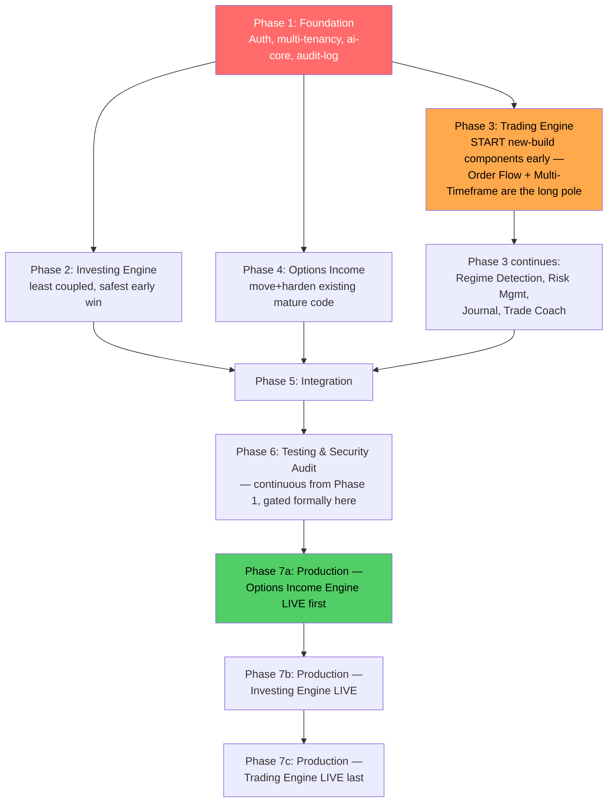

# DK AI Institutional Investing & Trading OS
## Architecture & Implementation Blueprint
**Prepared as:** Chief Software Architect deliverable | **Basis:** Technical audit of `dk-option-engine-source` (July 2026)
**Mandate:** Evolve, don't rebuild. Every line below assumes the existing codebase is the foundation, not a reference.

---

## 0. How to Read This Document

This blueprint answers six questions in order: what does the final system look like, where does every existing module go, what's a move vs. an enhancement vs. new build, what's the phased delivery plan, and what should be built first and why. No code — this is the map, not the territory.

---

## 1. Final Architecture

Three independent engines sitting on one shared platform layer. Engines talk to each other only through the platform layer (shared DB, shared AI layer, shared API gateway) — never directly to each other's internals. This is the design constraint that keeps "independent but connected" true instead of becoming a monolith with three UI tabs.

```mermaid
flowchart TB
    subgraph Client["Client Layer"]
        WebApp[React Web App\none codebase, engine-aware routing]
    end

    subgraph Platform["Shared Platform Layer"]
        Auth[Auth + User Management\nNEW]
        Gateway[API Gateway\nOpenAPI contract, versioned per engine]
        AICore[Shared AI Layer\nprovider-agnostic, extracted from coachLLM.ts]
        Reporting[Reporting Engine\nextracted from dailyReport/marketBriefing]
        Notify[Notification Service\nNEW]
        PortfolioDB[(Unified Portfolio DB\nstocks + options positions)]
        SettingsDB[(User-scoped Settings\nextends singleton pattern)]
        AuditLog[(Platform Audit Log\nextends autoExecutionLog pattern)]
        CoreDB[(Core Postgres\nDrizzle ORM)]
    end

    subgraph E1["Engine 1: Institutional Investing"]
        E1a[Company Research]
        E1b[Valuation Models]
        E1c[Moat / Quality / Management]
        E1d[Industry Comparison]
        E1e[Portfolio Construction]
        E1f[Macro & Economic Analysis]
    end

    subgraph E2["Engine 2: Institutional Trading"]
        E2a[Market Structure / Liquidity]
        E2b[Order Flow]
        E2c[Multi-Timeframe Analysis]
        E2d[Probability Engine]
        E2e[Regime Detection]
        E2f[Risk Mgmt / Journal]
    end

    subgraph E3["Engine 3: Options Income"]
        E3a[Scanner]
        E3b[Strategy Builder]
        E3c[Greeks / Portfolio Mgmt]
        E3d[Automation / Execution]
        E3e[Risk Analytics]
    end

    WebApp --> Gateway
    Gateway --> Auth
    Gateway --> E1 & E2 & E3
    E1 & E2 & E3 --> AICore
    E1 & E2 & E3 --> Reporting
    E1 & E2 & E3 --> PortfolioDB
    E1 & E2 & E3 --> SettingsDB
    E1 & E2 & E3 --> AuditLog
    Reporting --> Notify
    AuditLog --> Notify
    Auth --> CoreDB
    PortfolioDB --> CoreDB
    SettingsDB --> CoreDB
    AuditLog --> CoreDB

    subgraph External["External Data / AI Providers"]
        Alpaca[Alpaca]
        Polygon[Polygon]
        FMP[FMP / Alpha Vantage]
        LLM[Anthropic / OpenAI]
        OrderFlowFeed[Order Flow Data Feed\nNEW — vendor TBD]
    end

    E3d -.-> Alpaca
    E3a -.-> Polygon
    E1a -.-> FMP
    AICore -.-> LLM
    E2b -.-> OrderFlowFeed
```



**Design principle enforced above:** the three engines never call each other's routes directly. If Engine 2's Risk Management needs a position from Engine 3's options book, it reads from the **shared Portfolio DB**, not from `execution.ts`. This is what makes "independent but connected" real instead of aspirational.

---

## 2. Complete Module Mapping

Legend: 🟢 MOVE (working code relocates, minimal change) · 🟡 ENHANCE (working code exists, needs generalization/extension) · 🔴 NEW (no equivalent exists today)

### 2.1 Shared Platform Services

| Target Service | Existing Code | Action | Notes |
|---|---|---|---|
| Authentication | — | 🔴 NEW | Biggest single gap. Nothing in the schema or routes implies multi-user today. |
| User Management | — | 🔴 NEW | Depends on Auth. |
| Database (core) | `lib/db` (Drizzle, 14 tables) | 🟡 ENHANCE | Structure is solid; every table needs a `user_id` FK added. This is a migration, not a rebuild. |
| Shared AI Layer | `artifacts/api-server/src/lib/coachLLM.ts` | 🟡 ENHANCE | Already provider-agnostic (Anthropic/OpenAI auto-detect) and already enforces a disclaimer invariant centrally. Extract into `lib/ai-core` package so all three engines' coaches import the same base instead of three copies. |
| Reporting Engine | `lib/dailyReport.ts`, `lib/marketBriefing.ts` | 🟡 ENHANCE | Same extraction pattern — generalize from "portfolio daily report" to "any engine can assemble a report through this service." |
| Notification Service | — | 🔴 NEW | No email/push/webhook delivery exists anywhere in the audited code. |
| API Layer | `lib/api-spec/openapi.yaml` + Orval codegen | 🟢 MOVE | Contract-first discipline is already correct. Expand namespaces per engine, add versioning. Don't touch the pattern — it works. |
| Portfolio Database | `trades` table (options-only) | 🟡 ENHANCE | Needs to become instrument-agnostic (stocks + options positions) so all three engines write to one place. |
| Settings | `settings` table (singleton pattern) | 🟡 ENHANCE | Explicitly documented as "always fetch/update row 1." Becomes user-scoped — same table shape, new key. |
| Audit Logs | `autoExecutionLog` table | 🟡 ENHANCE | Already the right pattern (logs every automated decision with outcome). Generalize to log across all three engines, not just options execution. |

### 2.2 Engine 1 — Institutional Investing

| Module | Existing Code | Action | Notes |
|---|---|---|---|
| Company Research | `routes/stockAnalyst.ts`, `pages/StockResearch.tsx` | 🟢 MOVE | Working end to end today. |
| Financial Statement Analysis | `lib/fundamentals.ts` | 🟡 ENHANCE | Data-fetching seam exists (FMP/Alpha Vantage); needs a dedicated structured statement-analysis layer on top. |
| Valuation Models (DCF, Graham, Buffett) | `lib/valueInvesting.ts`, `lib/valueReport.ts` | 🟡 ENHANCE | Valuation logic exists; needs to be split into explicitly named, swappable models rather than one blended approach. |
| Economic Moat Analysis | — | 🔴 NEW | No equivalent found. |
| Quality Score | — | 🔴 NEW | Could reuse the scanner's weighted-scoring *pattern* (Ravish Score formula) as a template — same shape of problem. |
| Management Analysis | — | 🔴 NEW | Likely LLM-assisted qualitative analysis on filings/transcripts — reuse `lib/ai-core` once extracted. |
| Industry Comparison | — | 🔴 NEW | Needs peer-group data model + comparison UI. |
| Portfolio Construction | — | 🔴 NEW | Distinct from position tracking (which exists) — this is allocation/optimization tooling. |
| AI Research Assistant | `lib/valueSchool.ts` (education-focused) | 🟡 ENHANCE | Current version teaches; needs an open-ended research mode alongside it. |
| Macro & Economic Analysis | `lib/marketBriefing.ts` (regime/VIX/breadth) | 🟡 ENHANCE | Currently lives inside Portfolio AI cockpit — extract into a standalone macro module, shared with Engine 2's Regime Detection. |

### 2.3 Engine 2 — Institutional Trading

| Module | Existing Code | Action | Notes |
|---|---|---|---|
| Market Structure | — | 🔴 NEW | |
| Liquidity | `optionsMath.ts` (liquidity as a scoring input) | 🟡 ENHANCE | Currently a weighted input inside the Ravish Score — needs to become a standalone, instrument-agnostic view. |
| Order Flow | — | 🔴 NEW | Largest data/infra lift in the whole roadmap — see §5, Phase 3. |
| Multi-Timeframe Analysis | — | 🔴 NEW | |
| Probability Engine | `optionsMath.ts` (POP calculation) | 🟡 ENHANCE | Solid math, options-specific. Generalize to work across instruments, not just option spreads. |
| Market Regime Detection | `lib/marketBriefing.ts` | 🟡 ENHANCE | Already computes regime/synthetic VIX/breadth — genuinely close to done, just needs to move out from under Portfolio AI and gain real data. |
| Institutional Dashboard | `pages/Dashboard.tsx` | 🟡 ENHANCE | Exists but options-flavored; broaden scope. |
| Risk Management | `lib/risk.ts`, `lib/eventRisk.ts` | 🟢 MOVE, then 🟡 ENHANCE | Solid foundation; generalize beyond options-specific risk checks. |
| Trading Journal | `journalEntries` table, `pages/Journal.tsx` | 🟢 MOVE | Schema is already instrument-agnostic — clean move. |
| AI Trade Coach | `lib/coach.ts`, `lib/coachLLM.ts` | 🟡 ENHANCE | Reuse the pattern (deterministic math + LLM narration + enforced disclaimer) but extend beyond options-only explanations. |

### 2.4 Engine 3 — Options Income

| Module | Existing Code | Action | Notes |
|---|---|---|---|
| Scanner | `routes/scanner.ts`, `lib/liveScanner.ts`, `lib/optionsMath.ts` | 🟢 MOVE | Mature, tested, working. |
| Strategy Builder | Fixed 3 strategies in `execution.ts`/`optionsMath.ts` | 🟡 ENHANCE | Currently iron_condor/iron_fly/calendar_spread/earnings only — generalize into a composable builder. |
| Portfolio Management | `routes/portfolio.ts`, `lib/thetaIncome.ts` | 🟡 ENHANCE | Move logic as-is, but repoint at the new shared Portfolio DB instead of the options-only `trades` table. |
| Greeks | `routes/options.ts` | 🟢 MOVE | |
| Income Optimisation | `lib/thetaIncome.ts` | 🟢 MOVE | |
| Risk Analytics | `lib/risk.ts`, `lib/performanceAnalytics.ts` | 🟢 MOVE, flag caveat | Performance Analytics runs on synthetic data today (correctly badged) — carry that caveat forward, don't quietly "fix" it into looking real. |
| Automation | `execution.ts`, `autoExecution.ts`, `adjustment.ts`, `autoAdjustment.ts`, `tradeClose.ts` | 🟢 MOVE, then harden | Highest-value, highest-risk code in the repo. Move with the existing 21-test suite as a regression gate — do not refactor and move in the same step. |
| AI Options Coach | `lib/coach.ts` (options-specific parts) | 🟢 MOVE | Once shared AI layer exists, this becomes a thin config of it. |

---

## 3. Move / Enhance / New — Summary Counts

| Action | Count (approx.) | Reading |
|---|---|---|
| 🟢 MOVE | 12 modules | Confirms the audit's finding: Options Income is nearly a complete engine already. Lowest risk, do first among engine work. |
| 🟡 ENHANCE | 17 modules | The bulk of the work. Mostly "generalize an options-specific thing" or "extract a buried thing into its own module." |
| 🔴 NEW | 11 modules | Concentrated almost entirely in Engine 2 (Order Flow, Multi-Timeframe, Market Structure) and the platform layer (Auth, User Mgmt, Notifications). Engine 1 has fewer, smaller new builds (Moat, Quality Score, Management Analysis, Industry Comparison, Portfolio Construction). |

**Reading this correctly:** the "three engines" work is not evenly distributed. Engine 3 is a move. Engine 1 is a well-scaffolded enhancement job. Engine 2 is the only place with genuinely new, unproven engineering — treat it as the long pole, not an equal-sized third.

---

## 4. Target Monorepo Structure

Directory reorganization to make the engine boundaries real in code, not just in this document:

```
dk-ai-os/
├── platform/
│   ├── auth/                 NEW — session/JWT, user table
│   ├── ai-core/               extracted from coachLLM.ts
│   ├── reporting-core/        extracted from dailyReport.ts + marketBriefing.ts
│   ├── notifications/        NEW
│   └── audit-log/             extracted/generalized from autoExecutionLog
├── lib/
│   ├── db/                    existing, + user_id migration + unified portfolio schema
│   ├── api-spec/               existing openapi.yaml, namespaced per engine
│   ├── api-zod/                existing codegen output
│   └── api-client-react/       existing codegen output
├── engines/
│   ├── investing/
│   │   ├── api/                stockAnalyst.ts + new routes
│   │   └── lib/                 valueInvesting.ts, fundamentals.ts, + new modules
│   ├── trading/
│   │   ├── api/                new routes
│   │   └── lib/                 marketBriefing.ts (regime), risk.ts, eventRisk.ts, + new modules
│   └── options-income/
│       ├── api/                scanner.ts, execution.ts, autoExecution.ts, etc. (moved as-is)
│       └── lib/                 optionsMath.ts, thetaIncome.ts, adjustment.ts, providers/
└── apps/
    └── web/                    single React app, engine-aware routing (was artifacts/ravish-trading)
```

`artifacts/mockup-sandbox` is deliberately excluded — resolve its fate (archive or keep as design tooling) before this restructure, don't drag ambiguity into the new tree.

---

## 5. Phased Roadmap

### Phase 1 — Foundation
**Objective:** Build the shared platform services every engine depends on, without touching a single existing product feature.

**Deliverables:**
- Auth + session layer, user table
- `user_id` migration across all 14 existing tables (backward-compatible, nullable-then-backfilled)
- `settings` singleton → user-scoped settings (same table shape, new key strategy)
- `lib/ai-core` extracted from `coachLLM.ts`
- `audit-log` generalized from `autoExecutionLog`
- Secrets management (replace raw env vars for API keys)
- Fix `OPENAI_API_KEY` overload (split into correct provider-specific vars)
- CI pipeline wired to existing `typecheck`/`build`/`test` scripts
- Monorepo restructure into `platform/ / engines/ / apps/`

**Existing code reused:** `settings.ts` singleton pattern (template for scoping), `coachLLM.ts` (becomes `ai-core`), `autoExecutionLog` schema (becomes platform audit log), `openapi.yaml` contract discipline, pnpm workspace + `minimumReleaseAge` supply-chain protection (keep as-is).

**New code required:** Auth/session/JWT, user table + all FK migrations, secrets vault integration, CI config, notification service skeleton (built here, wired up in Phase 5).

**Risks:** This phase touches every table in the database despite being called "Foundation" — it is the **highest blast-radius phase in the entire roadmap**. A botched multi-tenant migration here breaks all three engines simultaneously. Treat every schema migration as production-grade even though current data is dev/demo — build the habit now.

**Complexity:** High (not algorithmically hard, but structurally load-bearing — mistakes here are expensive later).

**Order:** **Must be first.** Nothing else in this roadmap can start in earnest until user-scoping and the shared AI/audit patterns exist — every subsequent phase writes to tables this phase changes.

---

### Phase 2 — Institutional Investing Engine
**Objective:** Mature the existing Value module into the full Investing Engine.

**Deliverables:** Company Research (moved), Financial Statement Analysis (enhanced), named Valuation Models — DCF/Graham/Buffett explicitly split out, Economic Moat Analysis (new), Quality Score (new), Management Analysis (new), Industry Comparison (new), Portfolio Construction (new), AI Research Assistant (enhanced from Value School), Macro & Economic Analysis (extracted + enhanced, shared with Engine 2).

**Existing code reused:** `fundamentals.ts` provider seam, `valueInvesting.ts`, `valueReport.ts`, `valueSchool.ts`, `stockAnalyst.ts` routes, `StockResearch.tsx`/`StockScanner.tsx`/`ValueInvestingSchool.tsx`, `valueWatchlist`/`valueQuizResults`/`stockAnalysisHistory` tables, `ai-core` (from Phase 1) for the Research Assistant.

**New code required:** Moat model, Quality Score model, Management Analysis (LLM-assisted, reads filings/transcripts via `ai-core`), Industry Comparison (peer-group data model + UI), Portfolio Construction (allocation/optimization engine, distinct from position tracking).

**Risks:** Live-data dependency (FMP/Alpha Vantage) is unverified per the audit — confirm this works before building five new modules on top of an unproven data seam. Moat/Quality/Management scores read as investment advice — the same disclaimer discipline already proven in the Options Coach must apply here from day one, not bolted on later.

**Complexity:** Medium-High.

**Order:** **Second**, running in parallel with Phase 4 once Phase 1 lands. Least coupled to the other two engines — safest place to build momentum early.

---

### Phase 3 — Institutional Trading Engine
**Objective:** Extract trading-specific logic currently buried inside the options engine into its own standalone engine, then build the genuinely new capabilities.

**Deliverables:** Market Structure (new), Liquidity (generalized), Order Flow (new), Multi-Timeframe Analysis (new), Probability Engine (generalized), Market Regime Detection (extracted + enhanced), Institutional Dashboard (enhanced), Risk Management (generalized), Trading Journal (moved), AI Trade Coach (enhanced).

**Existing code reused:** `optionsMath.ts` liquidity/POP components as the generalization basis, `marketBriefing.ts` regime detection, `lib/risk.ts`, `eventRisk.ts`, `journalEntries` table + `Journal.tsx`, `coach.ts`/`coachLLM.ts` pattern via `ai-core`.

**New code required:** Order flow data ingestion + visualization, multi-timeframe candle/indicator engine, market structure detection (support/resistance, trend structure), instrument-agnostic probability engine.

**Risks:** **This is the biggest net-new engineering lift in the entire roadmap.** Order flow and multi-timeframe analysis are genuinely new domains for this codebase — they require new real-time market-data feeds beyond what Alpaca/Polygon currently supply for options pricing. Order-flow-grade data is often expensive and institutional-tier — budget and vendor selection is a real dependency here, not just engineering time.

**Complexity:** **Highest of the three engines.**

**Order:** **Third numerically, but start its new-build components early** — in parallel with Phase 2/4 — because it's the long pole. If you wait until Phase 2 and 4 are "done" to start Phase 3, this becomes the critical-path bottleneck for the whole 12 months.

---

### Phase 4 — Options Income Engine
**Objective:** Harden and formalize the already-mature options engine as an independent engine on the new shared platform; generalize the fixed-strategy scanner into a real strategy builder.

**Deliverables:** Scanner (moved), Strategy Builder (enhanced from 3 fixed strategies to composable), Portfolio Management (moved, repointed at shared Portfolio DB), Greeks (moved), Income Optimisation (moved), Risk Analytics (moved, live-data verified), Automation (moved + security-hardened), AI Options Coach (moved to shared AI layer).

**Existing code reused:** Nearly the entire current `artifacts/api-server` — `scanner.ts`, `optionsMath.ts`, `execution.ts`, `autoExecution.ts`, `adjustment.ts`, `autoAdjustment.ts`, `tradeClose.ts`, `thetaIncome.ts`, `providers/` (Alpaca, Polygon, mock), `performanceAnalytics.ts`.

**New code required:** Composable strategy builder, live-data end-to-end verification (unproven per audit), migration of the `trades` table into the shared Portfolio DB schema.

**Risks:** This is **money-moving code.** Any refactor — even "just moving it" — risks silently breaking the guardrail/kill-switch invariants documented across `.agents/memory/`. This must be a careful lift-and-shift gated by the existing 21-test suite, never a rewrite disguised as a move. The single highest-consequence mistake available in this entire roadmap is here.

**Complexity:** Medium engineering effort, but **high-stakes** given real-money automation — complexity and risk are not the same axis here.

**Order:** **Fourth numerically, but run largely in parallel with Phase 3** once Phase 1 lands — most of this phase is move-and-harden, not new development, so it doesn't need to wait its turn.

---

### Phase 5 — Integration
**Objective:** Connect all three engines through the shared platform layer — unified portfolio view, cross-engine reporting, live notifications, unified settings, and AI assistant routing across engines.

**Deliverables:** Unified Portfolio Dashboard (stocks + options combined), cross-engine Reporting (daily reports spanning all three engines), Notification delivery live end-to-end (guardrail trips, daily reports, research alerts), unified Settings UI, cross-engine AI Assistant routing (one chat surface, dispatches to the correct engine's coach).

**Existing code reused:** `dailyReport.ts`/`marketBriefing.ts` pattern (becomes the shared Reporting Engine's template), Portfolio AI cockpit (becomes the basis for the Unified Portfolio Dashboard), `routes/ai.ts`'s existing intent-detection (already auto-routes "teaching intent" into coach narration — generalize this exact pattern to route by engine).

**New code required:** Notification delivery infrastructure (email/push/webhook), cross-engine data aggregation layer, unified dashboard UI.

**Risks:** This phase is where the "three independent but connected" principle is easiest to violate. Over-coupling engines here — letting Engine 2 call into Engine 3's route handlers directly, for example — undoes the modularity you asked for. Integration must stay at the API/data layer (shared Portfolio DB, shared reporting) not by merging engine internals.

**Complexity:** Medium-High.

**Order:** **Fifth.** Cannot start meaningfully until at least two engines are functional — in practice, Investing (Phase 2) and Options Income (Phase 4) will likely finish first; Trading (Phase 3) integrates when its slower build catches up.

---

### Phase 6 — Testing
**Objective:** Close the test-coverage gaps identified in the original audit and add integration/security testing across the newly connected system.

**Deliverables:** Frontend test coverage extended to remaining untested pages, integration test suite spanning all three engines, end-to-end tests for auth/multi-tenancy, load testing for automation + notification delivery, a dedicated security review of the kill-switch/guardrail system with real-capital implications in scope.

**Existing code reused:** The existing 21-test suite as the regression baseline, `page-test-pattern.guardrail.test.ts` (already enforces a consistent test convention — extend it rather than inventing a new one).

**New code required:** Integration/e2e test harness, formal security audit (internal or external), load/chaos testing for the scheduler-driven automation engine.

**Risks:** Testing debt compounds silently. If this phase gets compressed to hit a date, it's the automation/execution path — the one with real money attached — that pays for it first.

**Complexity:** Medium.

**Order:** **Sixth as a formal checkpoint, but unit/integration tests should be written continuously within Phases 1–5, not batched to the end.** Phase 6 is the hardening and audit gate, not the only place tests get written.

---

### Phase 7 — Production
**Objective:** Go live with the full three-engine platform on enterprise-grade infrastructure, staged per engine rather than a single cutover.

**Deliverables:** Production CI/CD pipeline, monitoring/alerting (guardrail trips, error rates, latency), incident response runbook, live-data provider keys activated and verified in production, documented rollback plan, go-live checklist specifically covering the automation kill-switch.

**Existing code reused:** `.replit` autoscale deployment config as one viable path, `pino` structured logging as the monitoring foundation, existing audit log tables as the basis for compliance/observability reporting.

**New code required:** CI/CD to production, monitoring/alerting stack, incident runbook, infra-as-code if moving beyond Replit hosting.

**Risks:** Launching all three engines' real-money/real-advice paths simultaneously is the single largest avoidable risk in this roadmap. **Stage the rollout: Options Income first (most mature, most tested), then Investing, then Trading last** (newest, least tested, still carrying novel unproven modules).

**Complexity:** Medium — mostly operational, not new development.

**Order:** **Seventh, staged per engine, not a single event.**

---

## 6. Dependency Graph — What Gets Built First, Second, Third, and Why



**Why this order, explicitly:**

1. **Phase 1 is a hard blocker, not a preference.** Every table in the schema needs `user_id`; every engine's coach needs `ai-core`; every automated action needs the generalized audit log. Starting any engine work before this is done means re-doing that engine's data layer later.
2. **Phase 4 (Options Income) can move fast because it's mostly relocation, not invention.** Its risk is precision (don't break the kill-switch), not uncertainty (the logic already works). Start it early to bank a working, production-ready engine while the harder engine is still being built.
3. **Phase 2 (Investing) is the second-safest parallel track.** It's additive to working code with a clear existing pattern (provider seam, disclaimer discipline) to extend.
4. **Phase 3 (Trading) is flagged orange because its new-build components — Order Flow and Multi-Timeframe — are genuinely unproven, take the longest, and have external dependencies (data vendor selection, possibly new costs).** Starting these late is the single most likely cause of the 12-month timeline slipping. Start them in parallel with Phase 1 finishing, not after.
5. **Phase 5 (Integration) genuinely cannot start until at least two engines exist** — there's nothing to integrate before that.
6. **Phase 6 (Testing) is drawn as a gate, but the intent is continuous testing throughout, formalized here** — don't literally wait until month 10 to write your first integration test.
7. **Phase 7 is staged, not a single line, because launching three real-money/real-advice engines simultaneously is avoidable risk with no offsetting benefit.**

---

## 7. Critical Path Summary

The **longest pole in this roadmap is Phase 3's new-build components** (Order Flow, Multi-Timeframe Analysis, Market Structure) — not because they're numbered third, but because they're the only modules in the entire mapping with no existing code to build on *and* external data-vendor dependencies outside engineering's direct control. Everything else in this plan is either a move, a generalization of working code, or additive to a proven pattern.

**Practical implication for sequencing your team:** if you have to choose where to put your most senior engineers first, put them on Phase 1 (foundation correctness) and the Phase 3 new-build track (highest uncertainty) simultaneously — not on Phase 4, which is lower-risk despite being "the important product."

---

*This blueprint assumes zero code changes have been made since the July 2026 audit. Before Phase 1 begins, re-verify the audit's Q9 finding (live data providers unverified) — it's the one open assumption everything else in this plan is built on top of.*
