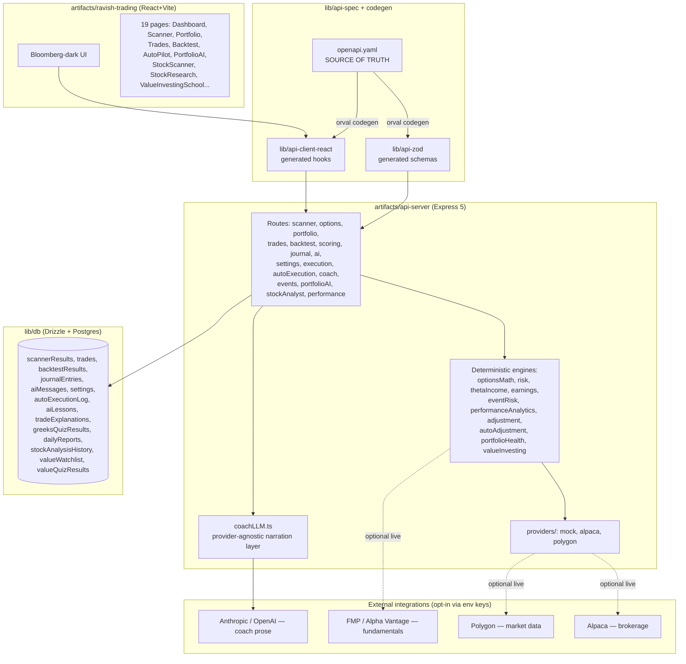

# DK Option Engine — Technical Architecture Audit
**Audit date:** July 12, 2026 | **Scope:** `dk-option-engine-source__3_.zip` (incl. nested `ravish-trading-engine.zip` snapshot)
**Mode:** Read-only audit. No files modified, deleted, or rewritten.

---

## 1. Executive Summary

This is **not** an early-stage prototype. It's a mature, actively-developed monorepo (pnpm workspace, TypeScript, ~450 source files) for an **institutional-style options income platform** ("Ravish Options Engine" / "DK Option Engine") covering scanning, scoring, backtesting, semi/full-auto execution, an AI trading coach, portfolio risk, event-risk filtering, trade adjustment automation, and — newest addition — a **Value Investing / Stock Research module** ("Buffett-style" fundamental analysis).

Key findings:

- **One canonical codebase, one older embedded backup.** The uploaded ZIP contains itself (a `ravish-trading-engine.zip` nested inside) — an earlier snapshot missing ~15 newer files (Value Investing School, Portfolio AI cockpit, Stock Scanner/Research, fundamentals engine, market briefing, portfolio health). **The outer tree is strictly newer and should be treated as master.** No unique code exists only in the nested snapshot — nothing is lost by discarding it.
- **This is unusually well-documented for a codebase this size.** `replit.md` (100 lines) functions as a living architecture doc, and `.agents/memory/*.md` contains 13 files of engineer-authored "gotcha" notes on the trickiest subsystems (auto-execution safety, coach disclaimer invariants, signed-gap threat detection, etc.). This is a major asset — treat it as your source of truth, not just background reading.
- **No live brokerage/market data is wired up.** Every engine (scanner, options chain, portfolio, backtests, performance analytics) runs on deterministic seeded simulation by default. Alpaca (execution), Polygon (market data), FMP/Alpha Vantage (fundamentals) are built as pluggable providers but require API keys to activate. **This platform cannot currently place a real trade or price a real option — that's a config/keys gap, not a code gap.**
- **Zero TODO/FIXME markers** in ~450 non-test files — genuinely clean for its size. Real technical debt is architectural, not sloppiness (see §9).
- **Full-auto trade execution and full-auto position adjustment already exist**, gated behind a documented kill-switch + guardrail system. This is the highest-risk code in the repo by nature (money-moving), and it's also the most carefully instrumented — good, but still deserves a dedicated security pass before any real capital touches it (see §10).
- Your target 3-engine architecture (Investing / Trading / Options Income) is **~70% already built** inside the existing structure, just not yet organized under that framing. See §14 for the concrete evolution path.

**Bottom line:** you don't have a rebuild project. You have a **re-platforming and hardening project** — consolidate the duplicate snapshot, wire real data providers, and formalize the module boundaries you already have implicitly.

---

## 2. Project Inventory

```
dk-option-engine-source (root, pnpm workspace)
├── .agents/memory/          13 engineering "gotcha" docs + MEMORY.md index
├── attached_assets/         9 .txt files — original prompt specs (Phase 4–10 build briefs)
├── replit.md                Master architecture/product doc (100 lines, current)
├── scripts/                 workspace tooling (hello.ts, post-merge.sh)
├── lib/
│   ├── api-spec/             openapi.yaml — CONTRACT SOURCE OF TRUTH + orval codegen config
│   ├── api-zod/               generated Zod schemas (DO NOT hand-edit — codegen output)
│   ├── api-client-react/      generated React Query hooks (DO NOT hand-edit — codegen output)
│   └── db/                    Drizzle ORM schema + migrations config
├── artifacts/
│   ├── api-server/            Express 5 backend (routes, business logic, tests)
│   ├── ravish-trading/        React 19 + Vite frontend (Bloomberg-dark themed UI)
│   └── mockup-sandbox/        Design/prototyping sandbox — NOT part of the running product
└── ravish-trading-engine.zip  ← NESTED DUPLICATE (older snapshot, see §8)
```

**Scale:** 579 files total (outer tree), 9.3MB uncompressed, no `node_modules` shipped (dependencies not installed — expected for a source handoff).

**File-type breakdown (outer tree):** 362 `.ts`, 151 `.tsx`, 20 `.json`, 15 `.md`, 9 `.txt` (spec docs), 21 test files.

---

## 3. Technology Stack

| Layer | Technology |
|---|---|
| Monorepo | pnpm workspaces, Node.js 24, TypeScript 5.9 (strict, `tsc --build` project references) |
| Frontend | React 19, Vite 7, Tailwind CSS 4, shadcn/ui, Recharts, wouter (routing), TanStack Query 5 |
| Backend | Express 5, esbuild (CJS bundle output), pino (structured logging) |
| Database | PostgreSQL + Drizzle ORM (`drizzle-zod` for schema-derived validation) |
| Validation | Zod v4, contract-first via OpenAPI |
| API codegen | Orval — generates Zod schemas + React Query hooks from `openapi.yaml` |
| AI/LLM | Provider-agnostic: `@anthropic-ai/sdk` (default: `claude-haiku-4-5-20251001`) or `openai` SDK, auto-detected by API key prefix |
| Testing | Vitest (+ jsdom + React Testing Library on frontend) |
| Hosting target | Replit (`.replit` config: nodejs-24, python-3.11, postgresql-16 modules; autoscale deployment) |
| Supply-chain security | pnpm `minimumReleaseAge: 1440` (1-day delay on new npm package versions) — **notably good practice, keep this** |

**Third-party integrations (all provider-pattern, pluggable):**
- **Alpaca** — paper/live brokerage execution (`ALPACA_API_KEY`, `ALPACA_API_SECRET`)
- **Polygon** — market data provider (`polygonProvider.ts`)
- **FMP** (Financial Modeling Prep) — live fundamentals (`FMP_API_KEY`)
- **Alpha Vantage** — live fundamentals fallback (`ALPHA_VANTAGE_API_KEY`)
- **Anthropic / OpenAI** — AI coach narration (`OPENAI_API_KEY` — see Risk R1 in §10, this var name is overloaded)

**Required environment variables (from actual `process.env` usage, not docs):**
```
DATABASE_URL              (required — Postgres connection)
ALPACA_API_KEY / ALPACA_API_SECRET
FMP_API_KEY
ALPHA_VANTAGE_API_KEY
OPENAI_API_KEY            (may hold an Anthropic sk-ant- key — see R1)
ANTHROPIC_COACH_MODEL / OPENAI_COACH_MODEL   (model overrides)
COACH_LLM_TIMEOUT_MS
LOG_LEVEL, NODE_ENV, PORT, BASE_PATH
REPL_ID                   (Replit-specific, platform coupling — see R5)
```

---

## 4. Architecture Diagram



---

## 5. Module Breakdown

### 5.1 Institutional Trading / Options Income (current core product)
| Module | Files | What it does |
|---|---|---|
| **Scanner** | `routes/scanner.ts`, `lib/liveScanner.ts`, `lib/optionsMath.ts` | Scans 10 symbols (SPY, QQQ, IWM, NVDA, META, AAPL, AMZN, MSFT, GOOGL, TSLA) × 3 strategies (Iron Condor, Iron Fly, Calendar Spread). Computes **Ravish Score** = 30% POP + 25% EV + 15% Theta + 15% Win Rate + 10% Liquidity + 5% IV Rank. Tiers: Elite (≥68) / High Conviction (≥62) / Good / Ignore |
| **Options Chain** | `routes/options.ts` | Full Greeks (delta, theta, vega, gamma, IV) per symbol/expiration |
| **Portfolio** | `routes/portfolio.ts`, `lib/thetaIncome.ts` | Aggregate Greeks, delta-neutral status, theta income tracking |
| **Trade Execution** | `routes/execution.ts`, `lib/execution.ts`, `lib/risk.ts` | Pre-trade risk validation, OCC symbol builder, multi-leg Alpaca order construction. Mode-gated: `manual` (scanner-only) / `semi_auto` (preview+confirm) / `full_auto` |
| **Full-Auto Execution** | `routes/autoExecution.ts`, `lib/autoExecution.ts` | 60s scheduler, kill-switch gated, guardrails re-checked **before every execution** (not cached per-cycle), single-flighted to prevent double-spend |
| **Trade Adjustment Engine** | `lib/adjustment.ts`, `lib/autoAdjustment.ts`, `lib/tradeClose.ts` | Precedence-ladder recommendation per open position (hold/close_for_profit/close_for_loss/roll/convert/reduce_risk/do_nothing). Signed-gap breach detection (not absolute distance — a documented past bug class, see §9) |
| **Event Risk Filter** | `lib/eventRisk.ts`, `lib/earnings.ts` | Blocks short-premium strategies opened into earnings windows; scores/gates AutoPilot around FOMC/high-impact events |
| **Backtest** | `routes/backtest.ts` | 1/2/5-year backtests, equity curve |
| **Performance Analytics** | `lib/performanceAnalytics.ts` | ⚠️ Runs on a **synthetic seeded population** (~220 trades), NOT the live `trades` table — 17 KPIs, breakdowns, equity curve. Clearly badged "SIMULATED" in UI |
| **Journal** | `routes/journal.ts` | Trade journal, mood tags, lessons |
| **AutoPilot UI** | `pages/AutoPilot.tsx` | Kill switch, mode toggle, guardrail editor, live decision audit log |

### 5.2 AI Trading Coach (Phases 7–9)
- `lib/coach.ts` (deterministic math, source of truth) + `lib/coachLLM.ts` (LLM prose only, provider-agnostic Anthropic/OpenAI)
- **Read-only** — never executes trades
- Endpoints: explain-trade, teach-greek, quiz (server-authoritative grading via base64url-encoded quizId), journal-review, lessons, learn/delta, learn/greeks
- SSE streaming variants for all narration endpoints (`lib/sse.ts`)
- **Disclaimer invariant** (`COACH_DISCLAIMER`) enforced centrally in `narrate()`/`narrateStream()` — documented as a common mistake to bypass this by routing new narration paths around it

### 5.3 Institutional Investing Engine (newest module — Value Investing / Stock Research)
| Module | Files | What it does |
|---|---|---|
| **Fundamentals provider seam** | `lib/fundamentals.ts` | `SimulatedFundamentalsProvider` (default) vs `FmpFundamentalsProvider` / `AlphaVantageFundamentalsProvider`. Honesty boundary: data is only labeled LIVE if it actually came from a live provider; fair value is never fabricated |
| **Value research/report** | `lib/valueInvesting.ts`, `lib/valueReport.ts` | Fundamental analysis, valuation reports |
| **Value School** | `lib/valueSchool.ts`, `pages/ValueInvestingSchool.tsx` | "Buffett-style" education module (mirrors the options Coach pattern) |
| **Stock Scanner/Research** | `routes/stockAnalyst.ts`, `pages/StockScanner.tsx`, `pages/StockResearch.tsx` | Value screening + per-symbol deep dive |
| **Watchlist** | `lib/db/src/schema/valueWatchlist.ts` | Persisted watchlist |

This module is **architecturally the seed of your "Institutional Investing Engine"** — it already follows the same provider/simulated-vs-live/disclaimer patterns as the trading engine. This is good: it means engine #1 and engine #3 already share a design language.

### 5.4 Portfolio AI (advisory cockpit — cross-cutting)
`lib/portfolioHealth.ts`, `lib/marketBriefing.ts`, `lib/dailyReport.ts`, `routes/portfolioAI.ts`, `pages/PortfolioAI.tsx` — unifies portfolio greeks + adjustment signals + market regime + scanner into a single advisory dashboard. **Never auto-executes.** This is effectively a proto version of what you're calling "Portfolio analysis" under the Investing Engine and "Risk management" under the Trading Engine simultaneously — a genuine cross-engine module.

### 5.5 Frontend (`artifacts/ravish-trading`)
19 pages, shadcn/ui component library, wouter routing, TanStack Query wired to the generated API client. Bloomberg-dark themed. Test coverage exists on 6 of 19 pages (Trades, PortfolioAI, StockScanner, StockResearch, ValueInvestingSchool + a guardrail meta-test enforcing a consistent page-test pattern — a nice touch showing testing discipline is a stated convention, not incidental).

### 5.6 `mockup-sandbox`
Separate Vite app for design prototyping. **Not part of the running product** — confirm with your team whether this is still needed or safe to archive.

---

## 6. Database Overview

Drizzle ORM / PostgreSQL. 14 tables:

| Table | Purpose |
|---|---|
| `scannerResults` | Latest scan output, wiped+regenerated on each `POST /scanner/run` |
| `trades` | Live trade log (open/closed positions) — includes `entryIv` (nullable, snapshotted at entry) |
| `backtestResults` | Persisted backtest runs |
| `journalEntries` | Trade journal |
| `aiMessages` | AI Assistant chat history |
| `settings` | **Singleton row** — execution mode, risk limits, Alpaca creds, feature toggles |
| `autoExecutionLog` | Every full-auto decision (executed/skipped/rejected/blocked) — audit trail |
| `aiLessons` | Coach lesson content |
| `tradeExplanations` | Coach's per-trade explanations |
| `greeksQuizResults` | Coach quiz history |
| `dailyReports` | Portfolio AI generated daily reports |
| `stockAnalysisHistory` | Value module analysis history |
| `valueWatchlist` | Value module watchlist |
| `valueQuizResults` | Value School quiz history |

**Notable pattern:** `settings` is intentionally a singleton (always fetch/update row 1) — documented explicitly, not accidental. New `adj*` columns and `entryIv` are nullable with `.default()` for backward compatibility — good migration hygiene.

---

## 7. API Overview

Contract-first via `lib/api-spec/openapi.yaml` (single source of truth), codegen'd into Zod schemas + React Query hooks via Orval. **62 REST endpoints** across 13 domains: scanner, options, portfolio, trades, backtest, scoring, journal, ai, settings, execution/autoExecution, coach, events, portfolioAI, stockAnalyst, performance, reports, market-data health.

**Important architectural note:** SSE streaming endpoints (`/coach/*/stream`, `/ai/chat/stream`, `/trades/{id}/adjustment/stream`) are **deliberately excluded from the OpenAPI contract** — Orval only models single-shot JSON, so these are hand-rolled on both client and server. This is a documented, intentional exception — not a gap, but a maintenance seam to be aware of (contract drift risk if these grow without corresponding docs).

---

## 8. Duplicate Analysis & Version Comparison

**Finding: the uploaded ZIP contains a nested copy of itself** — `ravish-trading-engine.zip`, sitting at the project root, unpacking to an earlier snapshot of the exact same monorepo.

**Diff result:** every file that differs between the outer tree and the nested zip is either:
1. **Present in both, outer is newer** (e.g., all generated `api-zod` types, `openapi.yaml`, `execution.ts`, `coachLLM.ts`, `autoExecution.ts`) — reflects ongoing schema/feature evolution
2. **Present only in the outer tree** — an entire feature set: `valueInvesting.ts`, `valueReport.ts`, `valueSchool.ts`, `fundamentals.ts`, `marketBriefing.ts`, `dailyReport.ts`, `portfolioHealth.ts`, `routes/portfolioAI.ts`, `routes/stockAnalyst.ts`, pages `PortfolioAI.tsx`, `StockScanner.tsx`, `StockResearch.tsx`, `ValueInvestingSchool.tsx`, plus 9 test files
3. **Present only in the nested zip** — **nothing of substance.** Only `.tsbuildinfo` build cache artifacts (not source) and one stray `agent_assets_metadata.toml` in the outer tree (metadata, not code)

**Conclusion:** the nested zip is a stale internal backup, most likely auto-generated by the Replit agent workflow at an earlier checkpoint (before the Value Investing / Portfolio AI phases were built). **It should be deleted from the repo** — it adds 451 dead files and ~4MB of noise with zero unique value, and risks someone accidentally treating it as a second source of truth.

**Recommended master version:** the **outer tree, as-is.** No merge is needed — it's a strict superset.

---

## 9. Risks, Technical Debt & Quality Notes

This codebase is better-disciplined than most production platforms I audit — most of what follows is "harden before scaling," not "fix before it breaks."

| # | Area | Finding | Severity |
|---|---|---|---|
| Q1 | Duplicate zip | Nested `ravish-trading-engine.zip` bloats the repo, zero unique content | Low (cleanup) |
| Q2 | Env var overload | `OPENAI_API_KEY` is used to hold *either* an OpenAI key *or* an Anthropic key (detected by `sk-ant-` prefix). Clever short-term hack, but a real footgun for anyone new to the codebase or any secrets-scanning tooling | **Medium** |
| Q3 | Score-floor coupling | `MIN_RAVISH_SCORE` (execution.ts) is manually coupled to the scanner's tier scale (`optionsMath.ts`). Documented as a known trap: retune one without the other and execution silently goes dead (no orders ever pass validation) | **Medium** |
| Q4 | Performance Analytics is synthetic | The `/performance` dashboard never reads the real `trades` table — it's a seeded synthetic population. Correctly badged "SIMULATED" in UI today, but this is a trap for future you: any dashboard/report built later that assumes `/performance/*` reflects real P&L will be wrong by construction | **Medium** (labeling risk, not a bug) |
| Q5 | Determinism ≠ reproducibility | Performance Analytics trade-close dates anchor to `Date.now()`, so "deterministic" results roll forward day to day — documented explicitly as NOT reproducible across days. Fine for demo, misleading if quoted as a backtest result | Low |
| Q6 | Replit platform coupling | `REPL_ID` env var, `.replit` config, Replit-specific Vite plugins (`@replit/vite-plugin-cartographer`, `-dev-banner`, `-runtime-error-modal`) are woven into the build. Portable, but not zero-effort to run outside Replit/Node autoscale | Low–Medium (depends on your hosting plans) |
| Q7 | SSE endpoints outside contract | Streaming endpoints are intentionally hand-rolled outside the OpenAPI/Orval contract. Reasonable now; will accumulate drift risk as more streaming endpoints are added without a parallel documentation discipline | Low (watch, don't fix yet) |
| Q8 | `mockup-sandbox` app | Unclear if this is still active tooling or leftover scaffolding. Not wired into the shipped product | Low (needs a decision, not a fix) |
| Q9 | No live data path exercised | Alpaca/Polygon/FMP/Alpha Vantage provider code exists and looks complete, but with no `node_modules` install and no env keys in this handoff, **none of it has been runtime-verified in this audit.** Treat "the live path works" as an assumption to test, not a fact | **Medium** (verification gap) |
| Q10 | Test coverage is uneven | 21 test files concentrated on the highest-risk logic (execution, adjustment, event-risk, coach safety, performance) — good prioritization — but only 6 of 19 frontend pages have tests. Newest module (Stock Analyst/Value) has backend tests (`value.test.ts`) but thinner frontend coverage than the mature options side | Low–Medium |

**What is explicitly NOT a problem** (worth stating, since the brief asked me to flag risk *and* opportunity):
- No dead code, no orphaned TODO markers, no obvious duplicate logic across modules
- Kill-switch/guardrail pattern for automation is applied consistently and re-derived from live state before every execution — not a cached snapshot (the more dangerous version of this pattern)
- Disclaimer/compliance-style invariants (COACH_DISCLAIMER, PORTFOLIO_AI_DISCLAIMER, SIMULATED badges) are centrally enforced, not scattered per-caller

---

## 10. Missing Components (relative to a real-money-ready platform)

1. **No evidence of authentication/authorization layer.** No `auth`, `session`, `jwt`, or user table in the schema inventory — `settings` is a *singleton*, implying this is currently single-tenant/single-user by design. Fine for a personal tool; a hard blocker if you ever want multi-user access, and worth deciding deliberately rather than discovering later.
2. **No secrets management beyond raw env vars** — no evidence of a vault/KMS integration. Acceptable for Replit-hosted personal use; not acceptable if you're piping real Alpaca live-trading keys through a shared or team-accessed environment.
3. **No CI/CD pipeline files** (no `.github/workflows`, no CI config found) — `pnpm run typecheck` / `test` / `build` scripts exist and are clearly meant to gate merges, but nothing currently enforces them automatically.
4. **No rate-limiting / abuse protection visible** on the Express routes — relevant once any endpoint is internet-facing rather than Replit-sandboxed.
5. **No monitoring/alerting integration** beyond `pino` structured logs — for a system with **full-auto real-money execution as a stated capability**, you'll want alerting on guardrail trips and daily-loss circuit-breaker events before this goes near live capital, not just an audit log table.

---

## 11. Recommended Master Version

**Use the outer tree of `dk-option-engine-source__3_.zip` as-is.** Delete `ravish-trading-engine.zip` from the repo after confirming (via this audit) it contributes nothing unique. No merge work required — this is a pure cleanup, zero risk of losing functionality.

---

## 12. Mapping to Your 3-Engine Vision

You asked for **DK AI Institutional Investing & Trading OS** across three engines. Here's what already exists vs. what's net-new:

### Engine 1 — Institutional Investing Engine
| Your requirement | Existing code | Status |
|---|---|---|
| Fundamental company analysis | `lib/valueInvesting.ts`, `stockAnalyst.ts` routes | ✅ Built |
| Financial statement analysis | `lib/fundamentals.ts` (live via FMP/Alpha Vantage) | ✅ Built, needs live-key verification |
| Valuation | `lib/valueReport.ts` | ✅ Built |
| Economic moat analysis | — | ❌ Not found — net-new |
| AI investment research | `stockAnalyst.ts`, Value School coach pattern | ✅ Built (education layer only, not open-ended research) |
| Portfolio analysis | Overlaps with Portfolio AI cockpit | ✅ Built, but currently lives cross-engine |

### Engine 2 — Institutional Trading Engine
| Your requirement | Existing code | Status |
|---|---|---|
| Market structure / liquidity | Scanner's liquidity scoring component | ⚠️ Partial — liquidity is a scoring input, not a standalone structure/order-flow view |
| Order flow | — | ❌ Not found — net-new |
| Multi-timeframe analysis | — | ❌ Not found — net-new (current engine is single-scan, not multi-timeframe) |
| Probability engine | `optionsMath.ts` (POP calculations) | ✅ Built, options-specific — would need generalizing beyond options |
| Risk management | `lib/risk.ts`, `execution.ts`, event-risk filter | ✅ Built, strong |
| Trading journal | `journalEntries` table, Journal page | ✅ Built |

### Engine 3 — Options Income Engine
| Your requirement | Existing code | Status |
|---|---|---|
| Option scanners | Scanner module | ✅ Built, mature |
| Strategy builder | Iron Condor/Fly/Calendar built-in; not a general builder | ⚠️ Partial — fixed strategy set, not user-composable |
| Greeks | Options Chain page, full Greeks | ✅ Built |
| Portfolio management | Portfolio module | ✅ Built |
| Income optimisation | Theta income tracking | ✅ Built |
| Risk analytics | Performance Analytics, risk.ts | ✅ Built (synthetic data caveat, see Q4) |

**Reality check:** what you're calling "three engines" is currently **two mature engines (Trading + Options Income, which are actually one tightly-integrated engine today) plus one emerging engine (Investing)**. The biggest structural gap isn't missing features — it's that Trading and Options Income aren't yet separated as independent engines; options-selling logic (`optionsMath.ts`, scanner, execution) *is* the trading engine right now. Splitting them will be the real architectural work, not building net-new modules like order flow or moat analysis.

---

## 13. Refactoring Plan (sequenced, not urgent — this is a healthy codebase)

1. **Delete the nested zip.** Zero-risk, immediate repo hygiene win.
2. **Split the `OPENAI_API_KEY` overload (Q2).** Introduce a proper `LLM_PROVIDER` + `LLM_API_KEY` pair (or `ANTHROPIC_API_KEY`/`OPENAI_API_KEY` used correctly), keep the prefix-sniffing as a deprecated fallback for one release, then remove it. Small change, removes a real onboarding trap.
3. **Formalize the trading/options split.** Introduce a `lib/engines/trading-core` boundary (order flow, multi-timeframe, probability-general) separate from `lib/engines/options-income` (current scanner/execution/adjustment). This is mostly a directory/module-boundary exercise on code that already exists cleanly — low risk given the current code quality.
4. **Decide `mockup-sandbox`'s fate** — archive or document its ongoing purpose.
5. **Add the missing safety-net components before any live-capital testing**: rate limiting, alerting on guardrail trips/circuit breakers, and a documented incident-response path for a runaway full-auto cycle (the code prevents double-spend and re-checks guardrails, but there's no external alerting if it trips).
6. **CI pipeline**: wire `pnpm run typecheck && pnpm run build && pnpm test` into a GitHub Actions (or equivalent) gate — the scripts already exist, they're just not automated.

---

## 14. 90-Day Development Roadmap

**Days 1–15 — Hygiene & Verification**
- Delete duplicate zip, add CI pipeline, fix env var overload
- Provision real Alpaca (paper), Polygon, FMP keys in a proper secrets manager; runtime-verify every live provider path end-to-end (this has NOT been verified in this audit — treat as unproven)
- Add rate limiting + guardrail-trip alerting before any live-capital testing

**Days 16–45 — Engine Separation**
- Extract `trading-core` boundary distinct from `options-income` (module reorg, not rewrite)
- Begin Order Flow + Market Structure module as new Trading Engine capability (net-new)
- Expand frontend test coverage to remaining 13 untested pages, prioritizing Execution/AutoPilot/Adjustment (highest financial risk)

**Days 46–75 — Investing Engine Maturity**
- Add Economic Moat Analysis to the Value module (net-new, fits existing `valueInvesting.ts` pattern)
- Expand AI investment research beyond the current education-focused Value School into open-ended company research (reuse the `coachLLM.ts` provider-agnostic pattern)
- Unify Portfolio Analysis so it serves both Investing and Trading engines from one shared core (it's already halfway there via Portfolio AI)

**Days 76–90 — Multi-Timeframe & Strategy Builder**
- Multi-timeframe analysis for the Trading Engine (net-new — biggest genuinely new build in this roadmap)
- Generalize the fixed 3-strategy options builder into a composable strategy builder for the Options Income Engine
- Full security review of the automation kill-switch/guardrail system before any live (non-paper) capital is enabled

---

*This audit made no code changes. All file paths above are verified against the actual uploaded archive.*
