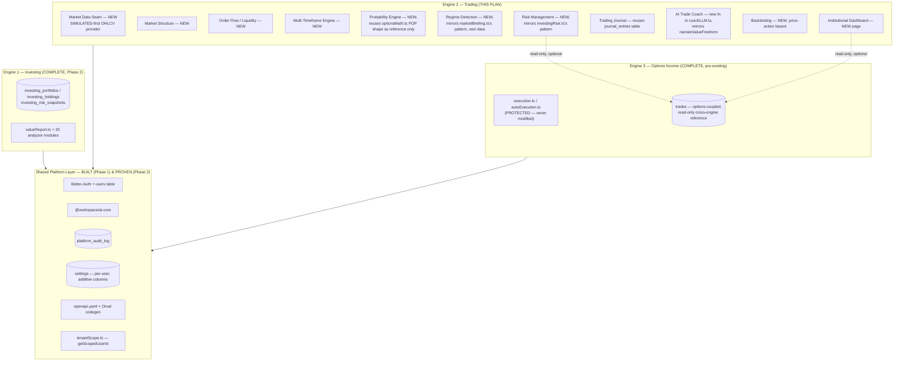

# Phase 3 — Institutional Trading Engine (Engine 2) — Execution Plan

**Status:** Approved, with all 8 owner decisions in §25 accepted as recommended. Sprints 32–33 are shipped — see their entries in §21 for the as-built write-ups. Sprint 34 onward is planning only until each sprint's own pre-implementation plan is separately approved, per the established per-sprint process (`CLAUDE.md` §3).

**Prepared after:** a fresh, direct-inspection review of `docs/DK-AI-OS-Architecture-Blueprint.md`, `docs/DK-Option-Engine-Technical-Audit.md`, `docs/Phase-2-Investing-Engine-Execution-Plan.md`, `CLAUDE.md`, and the actual completed codebase (Phase 1 platform layer + Phase 2's 21 shipped sprints), not from the Blueprint's assumptions alone. Several of the Blueprint's original claims about Engine 2 turned out to need correction once checked against real code — those corrections are called out explicitly in §0 below, the same way `docs/Phase-2-Investing-Engine-Execution-Plan.md` §0 corrected the Blueprint's Engine 1 assumptions before Phase 2 began.

---

## 0. Corrections to the existing Blueprint doc

Direct inspection of the current codebase changes three of the Blueprint's Engine 2 claims:

1. **"Market Regime Detection... genuinely close to done, just needs to move out from under Portfolio AI and gain real data."** Not accurate as stated. `lib/marketBriefing.ts`'s `buildMarketBriefing()` derives its entire regime/synthetic-VIX/breadth read from `optionsMath.ts`'s simulated option-chain IV ranks and price snapshots — it is a byproduct of the *options* simulation, not a real-price-action regime detector. It's a good **pattern** to follow (deterministic, reproducible-per-day, clearly labeled), but there is no real underlying signal to "gain real data" onto — a genuine market-regime detector needs real OHLCV price history, which does not exist anywhere in this codebase today. Phase 2, Sprint 26 already hit this exact wall and resolved it by building a **separate** deterministic macro proxy (`lib/investingMacro.ts`) rather than reusing `marketBriefing.ts`, on the explicit reasoning that "options IV isn't a macro rate regime." The same reasoning applies here, more strongly: Engine 2's regime detection needs its own foundation, not an extraction of Engine 3's.
2. **"Trading Journal... Schema is already instrument-agnostic — clean move."** Partially accurate. `journal_entries`' core fields (`title`, `content`, `mood`, `tags`, `lessonLearned`) are genuinely instrument-agnostic and directly reusable. But it also carries `strategy`, `entryCredit`, `maxProfit`, `maxLoss`, `ev`, `pop`, `ravishScore` — all options-scoring-specific (nullable, so they don't block reuse, but they don't fit a stock/futures trade either). This is a smaller correction than the market-regime one — reuse is still the right call, just not a zero-friction "clean move."
3. **"Risk Management... Solid foundation; generalize beyond options-specific risk checks."** `lib/risk.ts` is more tightly coupled to options than the Blueprint implies: every function signature is shaped around `RiskLeg` (`optionType`, `strike`, `expiration`), `maxLossFromLegs()` walks option payoff breakpoints, and `computePortfolioRisk()` aggregates option-position risk dollars. Generalizing this file in place would mean either overloading it with instrument-type branching (risky, exactly the kind of change CLAUDE.md's rule 1 exists to gate) or rewriting most of it — at which point it isn't really "the existing foundation" anymore. The better template, found by inspection, is **`lib/investingRisk.ts`** (Phase 2, Sprint 29) — a genuinely instrument-agnostic, pure, I/O-free scorer (concentration/sector-exposure/beta, hard-cap override, honest insufficient-data paths) built from scratch specifically because the equivalent Engine 3 pattern (`portfolioHealth.ts`) was too Greeks-coupled to reuse directly. `investingRisk.ts` is proof the *pattern* transfers cleanly across engines even when the *code* can't — that's the template for Engine 2's Risk Management module, not `risk.ts` itself.

**What the Blueprint got right and this plan reaffirms without change:** the platform layer (Auth, `ai-core`, audit log, contract-first `openapi.yaml`) is exactly as reusable as claimed — and, unlike when the Blueprint was written, **it now actually exists**, built and hardened across Phase 1's 10 sprints and proven under load by Phase 2's 21 sprints. This is the single biggest de-risking fact for Phase 3: the hardest, highest-blast-radius phase (Phase 1: auth, multi-tenancy, `user_id` migration across every table) is done, tested, and has been running in production-shape for two full phases with zero regressions. Phase 3 inherits all of it for free.

---

## 1. Executive Summary

Phase 2 shipped a complete Institutional Investing Engine — 21 sprints, zero regressions, zero real-money risk (advisory/education only, SIMULATED-first, honest degrade-never-fabricate discipline throughout). That discipline is the single most valuable asset this project has going into Phase 3, more valuable than any specific module, because **Phase 3 is a genuinely different kind of phase than Phase 2 was.**

The July 2026 audit found Engine 1 (Investing) roughly 40% pre-built and Engine 3 (Options Income) essentially complete — Phase 2 was mostly disciplined extension of proven patterns. Engine 2 (Trading) has almost none of that scaffolding. Direct re-inspection for this plan confirms and sharpens the audit's own finding: **there is no real price-series market data anywhere in this codebase.** Every option-chain provider (mock/Alpaca/Polygon) returns option *quotes* (bid/ask/greeks/IV) for a fixed universe of 10 symbols; nothing returns OHLCV bars, trade prints, or order-book depth for the underlying. `marketBriefing.ts`'s "regime detection" and `optionsMath.ts`'s liquidity/POP scoring are real, working code — but they're outputs of the *options* simulation, not inputs Engine 2 can generalize from. Market Structure, Order Flow, and Multi-Timeframe Analysis are, honestly, net-new builds with no existing code to extend, exactly as the Blueprint flagged (§7, "the longest pole in this roadmap").

This plan's central design decision, carried through every module below, is to **apply Phase 2's proven playbook to Phase 3's harder problem**: build every Engine 2 module SIMULATED-first (deterministic, seeded, honestly labeled, reproducible), with live market data as an explicit, separately-verified, optional upgrade path — never a precondition for shipping. This is not a downgrade of ambition; it's the same discipline that let Phase 2 ship 21 sprints with zero regressions and zero fabricated numbers, applied to a domain where the "live data" question is genuinely harder (order-flow-grade data is often institutional-tier and expensive, per the Blueprint's own flag) and therefore more important to not block on.

**Estimated scope:** ~18 sprints (range 16–20 depending on how §25's owner decisions land), continuing the project's single global sprint counter — Phase 1 was Sprints 1–10, Phase 2 was Sprints 11–31, so Phase 3 begins at **Sprint 32**.

---

## 2. Phase 3 Objectives

1. Ship all 9 Engine 2 modules named in `CLAUDE.md` §1: Market Structure, Liquidity, Order Flow, Multi-Timeframe Analysis, Probability Engine, Market Regime Detection, Institutional Dashboard, Risk Management, Trading Journal, AI Trade Coach — plus Backtesting (explicitly requested in this plan's brief, and a natural Engine 2 deliverable per the Blueprint's own roadmap).
2. Make every module **instrument-agnostic from day one** — built for equities/ETFs first (the most defensible SIMULATED domain and the most common real use case), architected so options and futures are additive later, never assumed away.
3. **Never fabricate.** Every score, level, or signal is either computed from real (SIMULATED or LIVE) data or honestly reports itself unavailable — the unbroken discipline from every one of Phase 2's 21 sprints, applied here without exception.
4. **Never touch Engine 3's protected execution surface.** `execution.ts`, `optionsMath.ts`, `risk.ts`, the kill-switch/guardrail system, and `autoExecutionLog` remain exactly as CLAUDE.md's non-negotiable rules 1–3 require — Engine 2 is additive, reads Engine 3 data only through the shared Portfolio DB / read-only queries, never through Engine 3's route handlers or internals.
5. Reuse every genuinely reusable platform service (auth, `ai-core`, audit log, tenant scoping, per-user settings, contract-first API) with zero rework — they're proven, not theoretical, after two phases of real use.
6. Reuse genuinely reusable **patterns** (the `portfolioHealth.ts`/`investingRisk.ts` banded-scorer-with-hard-cap-override shape; the `coachLLM.ts` deterministic-math-then-LLM-narration-with-enforced-disclaimer shape; the on-demand-vs-eager cost-control split Phase 2 used repeatedly) without forcing code reuse where the underlying data genuinely differs (options IV ≠ price-action regime, options legs ≠ stock position risk).
7. Close out with a Phase 3 "unification" sprint mirroring Sprint 31's — proving one symbol lookup gives a user the complete institutional trading picture (structure + liquidity + order flow + multi-timeframe + probability + regime + risk + journal + AI coach), the same end-to-end regression discipline Phase 2 closed with.

---

## 3. Overall Architecture

The three-engines-on-one-platform model from the Blueprint (§1) is unchanged and reaffirmed — engines never call each other's route handlers directly; they share the platform layer (DB, `ai-core`, audit log, auth, settings, API contract) and, where genuinely needed, read each other's data through the database, never through internals.



**Where Engine 2 code physically lives:** the Blueprint's target structure (§4) proposes a full `engines/trading/{api,lib}` monorepo restructure. This plan recommends **not** doing that restructure in Phase 3 — see §25 Decision 1. Instead, Engine 2 follows the exact convention Engine 1 already proved out over 21 sprints: flat files in the existing `artifacts/api-server/src/{routes,lib}` directories, distinguished by a `trading*`/`market*` naming prefix (mirroring `investing*`/`value*`), and a new top-level frontend route namespace (`/trading/*`, mirroring `/stock-analyst/*`). Zero new build tooling, zero risk of an import-path migration breaking Engine 1 or Engine 3 mid-flight.

---

## 4. Integration with the Completed Institutional Investing Engine

Genuinely shared surface between Engine 1 and Engine 2, established by direct inspection — not aspirational:

- **Event calendar (`lib/eventRisk.ts`).** Already instrument-agnostic in spirit (earnings/FOMC/CPI/jobs/major-event catalysts, keyed by symbol, not by option strategy). Already consumed by `marketBriefing.ts` for its "catalysts" list. Engine 2's Regime Detection and Risk Management modules can read this directly, unmodified — the first genuine zero-friction cross-engine reuse in the whole roadmap.
- **Fundamentals/sector data (`lib/fundamentals.ts`, `lib/industryPeers.ts`).** Engine 2's Market Structure/Multi-Timeframe modules are price-action-focused and don't need fundamentals directly, but the **Institutional Dashboard** (§3) can legitimately show "this symbol's Engine 1 Investment Committee verdict" as a read-only cross-reference next to its Engine 2 technical read — the same kind of intentional, disclosed cross-engine consultation Sprint 11 established for `valueReport.ts` reading `optionsMath.ts`'s IV rank (documented there as "a deliberate, intentional cross-engine read... not an accidental coupling"). Recommended as a Sprint 32+ nice-to-have on the Dashboard, not a hard dependency of any core module.
- **AI Coach pattern.** Engine 1's `narrateValueFreeform()`/`narrateValueFreeformStream()` (Sprint 30) is the second working proof (after the original options coach) that the deterministic-math → `ai-core.narrate()`/`narrateStream()` → `enforceDisclaimer()` shape generalizes cleanly to a new domain with zero changes to the shared machinery. Engine 2's AI Trade Coach is the third proof point of the same pattern — see §17.
- **Watchlist/portfolio construction are explicitly NOT shared.** `investing_portfolios`/`investing_holdings` (Sprint 28) model target-weight allocation for long-term positions — a different concept from an active trader's open positions/journal. Engine 2 gets its own schema (§6), not a repurposing of Engine 1's.
- **No shared route mounting, no shared UI components beyond generic `shadcn/ui` primitives.** Consistent with the Blueprint's own design constraint (§1): engines integrate through data, not through each other's code.

---

## 5. Shared Services That Will Be Reused

All of the following exist today, are load-bearing in production for both Engine 1 and Engine 3, and require **zero new platform work** to serve Engine 2:

| Service | What it provides | Reused as-is? |
|---|---|---|
| Auth (`lib/auth`, Better-Auth) | Session, sign-up/in/out, `req.user` | Yes, unmodified |
| `getScopedUserId(req)` (`tenantScope.ts`) | The one consistent per-request user-scoping call every route uses | Yes, unmodified |
| `@workspace/ai-core` | Provider-agnostic LLM narration, caching, timeout, single-flight, disclaimer injection | Yes, unmodified — Engine 2's coach binds its own system prompt/disclaimer the same way `coachLLM.ts` already does twice |
| `platform_audit_log` + `recordAuditEvent()` | Best-effort, never-throws audit trail, `engine` field already supports `"trading"` as a value (added forward-looking in Sprint 10) | Yes, unmodified — Engine 2 is the first real consumer of the `"trading"` engine tag |
| `settings` (per-user, additive columns) | The established pattern for engine-specific config (see `investingRiskFreeRate` etc. from Sprint 11) | Yes — Engine 2 adds its own nullable-with-default columns, same discipline |
| `openapi.yaml` + Orval codegen | Contract-first API, generated Zod + React Query hooks | Yes, unmodified — Engine 2 adds a new tag/namespace, same collision-avoidance discipline Sprint 28 established (`Construction`-prefixed schemas) |
| `lib/db` manual-migrations discipline | Nullable → backfill → enforce for existing tables; straight-to-NOT-NULL for brand-new tables | Yes, unmodified |
| `assertTenantIsolation` (`tenantIsolationHelper.ts`) | Shared cross-user isolation test helper (Sprint 28 extraction) | Yes, unmodified — every new Engine 2 table gets a tenant-isolation test the same way |
| CI pipeline (`.github/workflows/ci.yml`) | typecheck/build/test gate with a disposable Postgres service | Yes, unmodified |
| `eventRisk.ts` catalog | Earnings/FOMC/CPI/jobs event calendar | Yes, unmodified (see §4) |

**Reused as a pattern, not as code** (the distinction this plan insists on, per §0's corrections): the banded-scorer-with-hard-cap-override shape (`portfolioHealth.ts` → `investingRisk.ts` → Engine 2's own risk/structure scorers), the deterministic-math-then-LLM-narration shape (`coach.ts`/`coachLLM.ts` → `narrateValueFreeform` → Engine 2's trade coach), and the SIMULATED-first-with-honest-fallback provider seam shape (`fundamentals.ts` → Engine 2's market-data provider).

---

## 6. Database Design

**Design principle, reaffirmed from Sprint 28's own precedent:** new, brand-new tables for genuinely new domains rather than overloading an existing, differently-shaped table (`trades`) with more nullable-if-unused columns. Every new table below is `NOT NULL` from creation (zero existing rows), `userId` FK `ON DELETE RESTRICT` (universal convention), manual migration script per Phase 1's discipline.

| Table | Purpose | Notes |
|---|---|---|
| `trading_positions` | An Engine-2-native, instrument-agnostic open/closed position ledger (symbol, instrument type, side, entry/exit price, quantity, stop, target, status) | **New**, not a reuse of `trades` — see §0 Correction 3 and §25 Decision 2. `instrumentType` free text (`"stock" \| "etf"`, extensible later) so options/futures can be added without a schema change, mirroring `investing_filing_analysis`'s `filingType` free-text precedent. |
| `trading_journal_entries` | Trade journal for Engine 2 positions | Reuses `journal_entries`' proven shape almost verbatim (title/content/mood/tags/lessonLearned) but as its **own table** scoped to `trading_positions` rather than overloading the existing options-flavored `journal_entries.tradeId`/`strategy`/`entryCredit` fields — see §25 Decision 2 for the reuse-vs-fork tradeoff actually decided. |
| `trading_regime_snapshots` | Optional saved snapshots of a computed regime read, mirroring `investing_risk_snapshots`' explicit-save-only discipline | Only if Sprint 32+ scoping confirms genuine user value in historical regime tracking; deferred to be scoped during the relevant sprint's own plan, not pre-committed here. |
| `market_data_cache` (in-process only, no new table) | Short-TTL in-memory cache for any live OHLCV fetch, mirroring `fundamentals.ts`'s `liveCache` pattern | No schema — reuses the established in-process caching convention, not a DB table. |
| `settings` (existing table, additive columns) | `tradingRiskFreeRate`, `tradingDefaultTimeframe`, `tradingDataProvider`, `tradingRegimeSensitivity`, etc. — exact defaults to be finalized per-sprint | Nullable-with-default, same discipline as every Phase 2 settings addition since Sprint 11. |

No changes to any Engine 1 or Engine 3 table. No changes to `autoExecutionLog`, `trades`, `journal_entries`'s existing rows/behavior (CLAUDE.md rules 1–3 stay fully intact).

---

## 7. API Architecture

- New `openapi.yaml` tag(s): `trading` (mirrors `value`/`portfolio-construction`'s own tag convention), with a schema-naming prefix decided **before** the first schema is written (Sprint 28 hit a real, disclosed collision with Engine 3's existing `Portfolio*` schema names; Engine 2 should pre-empt this the same way Sprint 28 eventually fixed it — a `Trading`-prefixed schema namespace, verified collision-free against the whole spec before codegen, not after).
- Routes mounted the same way every other engine's routes are: `router.use("/trading", tradingRouter)` in `routes/index.ts`, self-prefixed paths inside the router file (matching `stockAnalystRouter`'s pattern).
- **On-demand vs. eager split, decided per-module up front** (not discovered mid-sprint the way Phase 2 sometimes did): Market Structure + Regime Detection + Probability + Risk are cheap enough to compute eagerly per symbol lookup (same cost class as Engine 1's eager `buildValueResearchReport()`); Order Flow + Multi-Timeframe (candle history across several intervals) are the heavier, on-demand-tab pattern (same cost-control discipline as Engine 1's Statements/Peers/Filings/Earnings tabs).
- SSE streaming for the AI Trade Coach only, deliberately kept outside the OpenAPI/Orval contract — the exact, twice-proven precedent (`/value-research/stream`, `/value-research/ask/stream`).
- Every route ownership-scoped via `getScopedUserId(req)` + `and(eq(id), eq(userId))`, 404 for both "doesn't exist" and "isn't yours" — the unbroken IDOR-prevention discipline since Sprint 7.

---

## 8. Frontend Architecture

- New page(s) under `artifacts/ravish-trading/src/pages/`, `Trading*.tsx` naming (mirrors `StockResearch.tsx`/`StockScanner.tsx`), routed under `/trading/*` in `App.tsx` and added to `AppLayout.tsx`'s nav — the exact pattern every Phase 2 frontend addition (including Sprint 28's Portfolio Construction) already used successfully.
- **One "Trading Research" page as the umbrella surface** (mirroring `StockResearch.tsx`'s `ReportView`), with tabs for the heavier on-demand modules (Order Flow, Multi-Timeframe candles) — same tab-based single-page-per-symbol architecture Sprint 31 confirmed works well and is genuinely discoverable, rather than N separate standalone pages.
- Charting: `recharts` is already a proven dependency (`Backtest.tsx`'s equity curve, Sprint 18's `RatioTrendChart`) — reuse it for candlestick/multi-timeframe visualization rather than introducing a new charting library, unless a genuine candlestick-rendering gap is found once implementation starts (recharts has no first-class candlestick primitive; this is flagged as a real open question for Sprint 32's own detailed plan, not resolved here — see §25 Decision 5).
- Reuse the established `enabled`-gated generated-hook pattern (`queryKey` + `enabled`) for every on-demand tab, exactly as Sprints 19–29 did.
- New "AI Trade Coach" chat panel reusing `streamCoach()` unchanged — zero new frontend streaming infrastructure, the same reuse Sprint 30 achieved for Engine 1.

---

## 9. AI Architecture

No new AI infrastructure. `@workspace/ai-core` (Phase 1, Sprint 9) is provider-agnostic, already handles Anthropic/OpenAI auto-detection, caching, timeout, single-flight — Engine 2 is a third domain-layer consumer, following the exact shape `coachLLM.ts` already implements twice (options coach, value coach):

1. A new system prompt + disclaimer constant, scoped to trading education (never "this will go up," never impersonating a real trader/analyst, same anti-impersonation-style guard as `enforceValueSafety()` if the coach ever narrates in a named-strategist voice — TBD per §25 Decision 6).
2. A `narrate()`/`narrateStream()` binding (private to `coachLLM.ts`, following the file's existing convention of binding system prompt + disclaimer once and reusing it for every function in the file).
3. `narrateTradeFreeform()`/`...Stream()` — free-form Q&A grounded in the full assembled trading report (structure + liquidity + order flow + multi-timeframe + probability + regime + risk), same shape as `narrateValueFreeform()`.
4. Deterministic fallback templates for every narration path — LLM unavailable never means "no answer," it means the honest deterministic facts, exactly as `narrationFallback()`/`freeformFallback()` already do for Engine 1.

---

## 10. Market Data Architecture

**This is the single most consequential section of this plan** — every other Engine 2 module depends on its outcome, and it's where the Blueprint's own "biggest net-new engineering lift" warning concentrates.

**Finding, confirmed by direct inspection:** `providers/types.ts`'s `OptionsProvider` interface (and both real implementations, `PolygonOptionsProvider`/`AlpacaProvider`) return **option chain quotes only** — strike/expiration/greeks/IV/bid-ask for a fixed 10-symbol universe. There is no OHLCV bar provider, no trade-tick provider, no order-book-depth provider anywhere in this codebase. This is not a gap in an otherwise-complete seam; it's a completely different data shape that doesn't exist at all today.

**Recommended architecture (SIMULATED-first, mirroring `fundamentals.ts`'s exact provider-seam shape):**

```ts
interface MarketDataProvider {
  readonly id: string;
  readonly isLive: boolean;
  getCandles(symbol: string, interval: Timeframe, lookback: number): Promise<Candle[] | null>;
  getQuote(symbol: string): Promise<{ price: number; volume: number; asOf: string } | null>;
}
```

- **`SimulatedMarketDataProvider`** (default, ships Sprint 32): deterministic, seeded OHLCV candle generation across multiple timeframes (1m/5m/15m/1h/1D), reusing the exact `makeRng`/`hashStr` primitives already extracted in `lib/deterministic.ts` (Sprint 11) — literally the same RNG infrastructure Engine 1's `investingUniverse.ts` and every SIMULATED provider since has used. Anchored to the same 10-symbol universe (`UNIVERSE_SYMBOLS`) plus `syntheticProfile()`-style honest generation for any other valid-shaped ticker, matching Sprint 11's precedent exactly.
- **`PolygonMarketDataProvider`** (live, optional, deferred verification): Polygon already has an account/API-key relationship with this codebase (options quotes) and separately offers a stocks-aggregates (candle) API — the natural first live candidate. **Explicitly not built or verified in Sprint 32** — flagged the same way every Phase 2 sprint flagged "no FMP/Alpha Vantage key available this session, live verification deferred." Order-flow-grade data (tick-level trade prints, order-book depth) is a **separate, likely-paid tier** even from Polygon — this plan does not commit budget to it; that's an explicit owner decision (§25 Decision 7), not an engineering one.
- **Resolution/fallback**: mirrors `resolveFundamentals()` exactly — try live if configured, fall back to SIMULATED honestly labeled, never silently swap without disclosure.
- **No WebSocket infrastructure exists or is proposed for Sprint 32.** Order flow / real-time tick analysis in its first shipped form is **SIMULATED-only**, deterministic, clearly labeled — live tick/order-book integration is a distinct, later, separately-scoped and separately-approved sprint (or arguably a distinct sub-phase), not bundled into Phase 3's initial scope. This is the single biggest scope-control decision in this whole plan (§25 Decision 7).

---

## 11. Order Flow and Liquidity Engine

**Objective:** a standalone, instrument-agnostic view of buy/sell pressure and market depth — generalizing `optionsMath.ts`'s liquidity-as-a-scoring-input into its own module, per the Blueprint's own framing.

**SIMULATED-first design:** derive a deterministic "order flow" read from the same candle data §10 produces — volume-at-price buckets (a volume profile), a synthetic bid/ask imbalance proxy (seeded, directionally consistent with the candle's own up/down close), and a liquidity score banded the same way `marketData.ts`'s `checkLiquidity()` already bands option quotes (open interest/volume/spread thresholds) — adapted to equity volume/dollar-volume thresholds instead. Never claims to be real Level 2 order-book data; the UI/API response is explicit about `dataSource: "SIMULATED"` throughout, the same disclosure discipline as every Engine 1 module.

**Deliverables:** volume profile (price-level volume histogram), a liquidity score (0–100, banded), a buy/sell-pressure proxy, honest `unavailable` when a symbol can't be resolved.

**Explicitly deferred:** real Level 2/order-book depth, real trade-print tape reading — these need the live tick-data vendor relationship §10 flags as a separate, unbudgeted decision.

---

## 12. Market Structure Engine

**Objective:** support/resistance levels, trend structure (higher-highs/higher-lows classification), key price levels — genuinely net-new, no existing code to extend.

**Design:** a pure, I/O-free scorer over the candle series §10 produces (same "pure function over already-resolved data, unit-testable without a provider" discipline as `computePortfolioRisk()`/`analyzeTomNash()`), producing: detected support/resistance zones (local extrema clustering, a well-understood deterministic technique — not ML, not a black box, consistent with this project's "never LLM-generate a number that should be math" discipline), a trend-structure classification (uptrend/downtrend/range, based on swing-high/swing-low sequencing), and a confidence/data-completeness signal (mirroring Investment Quality's/Tom Nash's own `confidenceLevel` pattern) reflecting how many candles were actually available.

---

## 13. Multi-Timeframe Engine

**Objective:** confluence across multiple intervals (e.g., is the 1-hour trend aligned with the daily trend) — genuinely net-new.

**Design:** runs the Market Structure scorer (§12) independently at each configured timeframe, then a thin confluence layer (agreement classification, reusing the exact generic `classifyAgreementSignal<T>()` helper extracted in Phase 2, Sprint 17, for the Investment Committee's unanimous/majority/split/insufficient-data bucketing — a second, real, disclosed reuse of that exact utility, not a new agreement-scoring formula). Deliberately **not** its own giant new algorithm — the genuinely new part is the candle-timeframe plumbing (§10); the confluence math reuses a two-phase-old shared utility.

---

## 14. Probability Engine

**Objective:** instrument-agnostic probability-of-a-move estimate, generalizing `optionsMath.ts`'s POP (probability of profit) math beyond options.

**Design:** `optionsMath.ts`'s POP is fundamentally a Black-Scholes-family probability-of-touch/expire-in-range calculation — genuinely options-specific math (it needs IV, strike, DTE). It is **not** directly reusable for "probability price reaches level X by date Y" on a raw stock, which needs a different input (historical realized volatility from the candle series, not implied volatility from an option chain). Recommended approach: a new, small, honestly-named module computing a **historical-volatility-based probability cone** (standard lognormal-diffusion assumption, computed from the SIMULATED/live candle series' own realized volatility) — same rigor tier as the options POP math, same "real formula, not a fabricated number" discipline, but a genuinely different formula reusing only the shape of the discipline, not the code.

---

## 15. Risk Management Engine

**Objective:** instrument-agnostic position and portfolio risk, per §0 Correction 3 built fresh on the `investingRisk.ts` template rather than generalizing `risk.ts` in place.

**Design:** a pure scorer over `trading_positions` rows (§6) — position-sizing checks (risk-per-position vs. account value, mirroring `investingRisk.ts`'s concentration-cap pattern exactly), a stop-loss/target discipline check (has every open position got a defined stop, mirroring the honest-unavailable-not-fabricated discipline throughout), a portfolio-level risk-budget aggregate (mirroring `computePortfolioRisk()`'s shape from `risk.ts`, reimplemented instrument-agnostically rather than copied). **`risk.ts` and `execution.ts` are never modified** — CLAUDE.md rule 1 stays fully intact; this is a wholly new, additive module.

---

## 16. Trading Journal Architecture

**Objective:** journal Engine 2 positions, reusing the proven `journal_entries` shape.

**Design:** per §6/§25 Decision 2, a new `trading_journal_entries` table with the same core fields as `journal_entries` (title/content/mood/tags/lessonLearned) plus `tradingPositionId` (FK to `trading_positions`, not the options `trades` table) and trading-relevant nullable fields (entry/exit price, R-multiple, setup type) in place of the options-specific credit/POP/EV fields. UI reuses `Journal.tsx`'s established list/detail/mood-tag pattern, adapted, not rewritten from scratch.

---

## 17. AI Trading Coach

**Objective:** the third proof point of the deterministic-math → `ai-core` narration → enforced-disclaimer shape (after the options coach and Engine 1's value coach).

**Design, following Sprint 30's exact precedent:**
- `narrateTradeFreeform()`/`...Stream()` added directly inside `coachLLM.ts` (not a new file — per Sprint 30's own disclosed reasoning, reusing the file's already-private `narrate()`/`narrateStream()` machinery is the safer, more central-enforcement-preserving choice than forking a second domain file).
- A `buildTradeCoachContext()` helper (mirroring `buildFreeformContext()`) assembling Structure + Liquidity/Order-Flow + Multi-Timeframe + Probability + Regime + Risk into one grounding object for the LLM — never fabricates an answer outside that data, explicitly told to say so when a question falls outside it (the exact prompt discipline `valueFreeformPrompt` already established).
- New routes `POST /trading/coach/ask` (+ `/ask/stream`), same 404/degrade-honestly contract as `/value-research/ask`.

---

## 18. Backtesting Architecture

**Objective:** a genuine price-action backtest engine for Engine 2 strategies (trend-following, mean-reversion, structure-break setups), distinct from `routes/backtest.ts`'s options-strategy-equity-curve generator.

**Design:** new `routes/tradingBacktest.ts` / `lib/tradingBacktest.ts`, replaying the SIMULATED (or live, once verified) candle series through a user-selected rule set (e.g., "enter on structure breakout, exit on stop/target"), producing an equity curve + trade log + the same KPI set `performanceAnalytics.ts` already establishes a UI pattern for (win rate, average R, max drawdown) — reusing the **UI rendering pattern** (`Backtest.tsx`'s recharts equity curve) and the **persisted-results-table pattern** (`backtestResults` table shape), not the options-specific simulation logic itself. `routes/backtest.ts` is not modified.

---

## 19. Future Broker Integration

**Explicitly out of scope for Phase 3's initial sprints.** Engine 2 as scoped here is **read-only/advisory** — structure, liquidity, probability, regime, risk, journal, and coach narration, exactly like Engine 1 and exactly like the *existing* AI Trade Coach's own "read-only, never executes" invariant (Technical Audit §5.2). No order placement, no Alpaca order construction, no kill-switch, no guardrail system for Engine 2 in this plan.

If a future phase wants Engine 2 to execute trades (not just analyze them), that is a **new, separately-scoped, separately-approved phase** requiring the exact same category of high-scrutiny review CLAUDE.md already applies to Engine 3's execution code (rule 2) — building it quietly inside "Phase 3" would be exactly the kind of scope creep this plan's own discipline exists to prevent. Recommendation: if/when that phase is scoped, `execution.ts`'s existing OCC-symbol-building/Alpaca-order-construction pattern is the closest template, and it should get its own from-scratch kill-switch/guardrail design reviewed with the same rigor as Engine 3's, not an extension of Engine 3's existing kill switch (which CLAUDE.md rule 2 protects from modification regardless).

---

## 20. Testing Strategy

Identical discipline to every one of Phase 2's 21 sprints, applied to Engine 2:

- Pure scorer functions (Structure, Order Flow, Probability, Risk, Regime) unit-tested with constructed fixtures, no provider/DB dependency — matching `investingRisk.test.ts`'s 20-test discipline.
- Provider seam (`SimulatedMarketDataProvider`, future live providers) tested for determinism, range, honest-null-on-invalid-symbol — matching `fundamentals.beta.test.ts`'s mocked-fetch pattern for the eventual live path.
- Live end-to-end HTTP route tests against the real running app (`app.listen(0)`) for every new route, 404/400 contract proven, matching `portfolioRisk.route.test.ts`.
- Tenant isolation test for every new table, reusing `assertTenantIsolation()` unmodified.
- Disclaimer-invariant tests for the AI Trade Coach, mirroring `value.test.ts`'s safety-invariant block exactly.
- A Phase-3-closing "unification" integration test, mirroring `valueReport.fullEngineIntegration.test.ts` + `companyResearchUnification.route.test.ts` — proving one symbol lookup resolves consistently across every Engine 2 module.
- Full validation every sprint: `pnpm run typecheck`, `pnpm --filter @workspace/api-server run test` (run at least twice to catch flakes, per the established convention — this session has repeatedly seen two specific pre-existing flake categories that are NOT Phase-3-introduced: a `fetchedAt`-timing race and a rare `autoScheduler.multiUser.test.ts` FK-violation under live-DB parallelism), `pnpm --filter @workspace/ravish-trading run test`, `PORT=5000 BASE_PATH=/ pnpm run build`.
- **Zero changes permitted to the existing 21-test suite gating Engine 3's execution/adjustment code** without explicit separate approval, per CLAUDE.md rule 1.

---

## 21. Sprint-by-Sprint Roadmap

Continuing the project's single global sprint counter (Phase 1: Sprints 1–10; Phase 2: Sprints 11–31). **Phase 3 begins at Sprint 32.** Sprint count is an estimate (~18, range 16–20) — exact scoping of each sprint happens at that sprint's own kickoff, per the established per-sprint process (CLAUDE.md §3: present a plan, get explicit approval, implement, validate, commit).

| Sprint | Module | Summary |
|---|---|---|
| 32 | Market Data Foundation — **SHIPPED** | See the as-built write-up immediately below the table. |
| 33 | Market Structure Engine (Core) — **SHIPPED** | See the as-built write-up immediately below the table. |
| 34 | Market Structure Engine (Route + UI) | `GET /trading/structure/:symbol`, new Trading Research page skeleton, structure card. |
| 35 | Liquidity / Order Flow (Core) | Volume profile, liquidity score, buy/sell-pressure proxy — pure scorer + unit tests. |
| 36 | Liquidity / Order Flow (Route + UI) | On-demand tab (heavier candle-history fetch), matching Statements/Peers' cost-control precedent. |
| 37 | Multi-Timeframe Engine | Confluence layer over Structure at multiple intervals, reusing `classifyAgreementSignal<T>()`. |
| 38 | Probability Engine | Historical-volatility-based probability cone, honest-unavailable paths. |
| 39 | Regime Detection | New `lib/tradingRegime.ts`, own SIMULATED path (per §0 Correction 1), never reads `marketBriefing.ts`'s options-IV-derived data. |
| 40 | Risk Management Engine (Core) | `computeTradingRisk()` over `trading_positions`, position-sizing + stop-discipline + portfolio-budget checks, pure + unit tests. |
| 41 | Risk Management Engine (Route + UI) | Route + risk panel on the Trading Research page, mirroring Sprint 29's Portfolio Risk panel. |
| 42 | Trading Journal | `trading_journal_entries` CRUD, UI reusing `Journal.tsx`'s established pattern. |
| 43 | Backtesting Engine | `tradingBacktest.ts`, rule-based replay over candle series, equity curve + KPIs. |
| 44 | AI Trade Coach (Core) | `narrateTradeFreeform`/`...Stream` in `coachLLM.ts`, `buildTradeCoachContext()`, disclaimer-invariant tests. |
| 45 | AI Trade Coach (Route + UI) | `/trading/coach/ask[/stream]`, chat panel reusing `streamCoach()`. |
| 46 | Institutional Dashboard | New unified page (or a further tab) pulling Structure/Liquidity/Multi-Timeframe/Probability/Regime/Risk into one view per symbol, mirroring Sprint 31's "one coherent experience" discipline directly, but as first-build here rather than an after-the-fact audit. |
| 47 | Live Market-Data Provider (optional/deferred) | `PolygonMarketDataProvider` (or chosen vendor per §25 Decision 7), live verification, honest fallback — only if §25 Decision 7 approves budget/vendor before this sprint starts. |
| 48 | Trading Engine Unification | Full-engine regression pass, one-symbol-lookup end-to-end test, mirroring Sprint 31 exactly — closes Phase 3. |

*(48 is Sprint 17 of Phase 3 in this numbering, i.e. within the ~16–20 estimate; Sprint 47 is explicitly optional/conditional and may be skipped or deferred to a later phase depending on §25 Decision 7, which would bring the count to 17 core sprints.)*

### Sprint 32 — Market Data Foundation — SHIPPED

- **Objective:** the provider seam every later Engine 2 module builds on.
- **As actually built:** no genuinely new owner decisions surfaced once the codebase was inspected — the plan's own drawn boundary (provider seam + two new tables + settings columns, no routes/UI) held up exactly as scoped.
- **`lib/tradingMarketData.ts`** — `MarketDataProvider` interface (`getCandles(symbol, interval, lookback, asOf?)`, `getQuote(symbol, asOf?)`, both honestly `null` for an invalid ticker shape) and its only implementation, `SimulatedMarketDataProvider` (`id: "simulated"`, `isLive: false`). Deterministic, seeded via `lib/deterministic.ts`'s `makeRng`/`todayStr` (Sprint 11), reused unchanged. `TRADING_MARKET_UNIVERSE` deliberately **duplicates, not imports**, the same 10 tickers/base prices `investingUniverse.ts` already duplicates from `optionsMath.ts` — Engine 2's SIMULATED AAPL price is independently seeded from Engine 1's and Engine 3's, consistent with §0/§3's "engines never depend on each other's internals." `dailyClose()` uses its own seed namespace, independent of `investingPrice()`'s, per §0 Correction 1's precedent extended to the market-data layer. Intraday candles (`1m`/`5m`/`15m`/`1h`) are generated as an internally-consistent per-session random walk from the previous day's close to the current day's own `dailyClose()` anchor — proven by a dedicated regression test that the last intraday bar's close matches the day's own 1D close.
- **Bounded lookback windows** (`MAX_LOOKBACK`: 390 bars for `1m`/`5m`, 130 for `15m`, 35 for `1h`, 180 for `1D`) address the plan's own flagged scalability concern (§26) up front — a caller requesting more is honestly capped, never silently expanded.
- **`getMarketDataProvider(userId?)`** always returns the simulated instance today (regardless of the new `tradingDataProvider` setting's value) — the exact shape `getFundamentalsProvider()` uses, one call away from a real live-provider branch once §25 Decision 7 is revisited.
- **Schema:** `trading_positions` (instrument-agnostic position ledger, `instrumentType` free text) and `trading_journal_entries` (mirrors `journal_entries`' core shape plus `entryPrice`/`exitPrice`/`rMultiple`/`setupType`) via `lib/db/manual-migrations/010_trading_engine_tables.sql` — **new tables, not a retrofit** (§25 Decision 2), confirmed the right call once `trades`' real coupling (`legs` jsonb, `credit`/`pop`/`ev`/`ravishScore` all required) was inspected directly. `trading_journal_entries.trading_position_id` has no FK constraint, mirroring `journal_entries.trade_id`'s own precedent exactly.
- **Settings:** `tradingDataProvider` (default `"simulated"`) / `tradingDataConnected` (default `false`) via `lib/db/manual-migrations/011_trading_settings.sql`, mirroring `fundamentalsProvider`/`fundamentalsConnected`'s shape. `openapi.yaml`'s `Settings`/`SettingsUpdate` gained the 2 fields (`tradingDataConnected` read-only, matching `fundamentalsConnected`'s precedent); `routes/settings.ts` needed zero code changes (its established `{...settings, ...}` spread picks up new columns automatically).
- **No UI/routes this sprint**, exactly as scoped.
- **Tests:** `tradingMarketData.test.ts` (23 tests — determinism, ticker-shape validation, OHLCV range validity across all 5 timeframes, ordering, lookback clamping at both bounds, honest synthetic generation outside the default universe, per-symbol seed independence, intraday/daily internal consistency), 2 new tenant-isolation cases reusing `assertTenantIsolation` unchanged.
- **Acceptance criteria met:** `SimulatedMarketDataProvider` returns deterministic, range-valid candles for the universe plus any valid-shaped ticker; repeated calls are byte-identical; invalid tickers return `null`; both new tables pass tenant-isolation tests — all proven directly by the test suite above.
- **Rollback:** `git revert`; drop `trading_journal_entries` then `trading_positions` if the migration was applied; drop the 2 settings columns independently if needed — all purely additive.
- **Validation:** `pnpm run typecheck` (clean across all workspaces), `pnpm --filter @workspace/api-server run test` (73 files / 803 tests, run twice — both fully clean, zero flakes), `pnpm --filter @workspace/ravish-trading run test` (7 files / 44 tests, unmodified), and `PORT=5000 BASE_PATH=/ pnpm run build` all pass for real.

### Sprint 33 — Market Structure Engine (Core) — SHIPPED

- **Objective:** support/resistance detection, trend-structure classification, confidence scoring — a pure scorer over the candle series Sprint 32 already produces, plus unit tests. Core only — no route, no UI (Sprint 34's scope).
- **As actually built:** no genuinely new owner decisions surfaced — the plan's own drawn boundary (pure scorer + unit tests, zero DB/route/UI, reuse Sprint 32's `MarketDataProvider` seam unmodified) held up exactly as scoped once the codebase was inspected.
- **New `lib/tradingMarketStructure.ts`** — `analyzeMarketStructure(candles, symbol, interval, isLive)`, pure and I/O-free (the same "pure function over already-resolved data" discipline as `computePortfolioRisk()`/`analyzeTomNash()`), plus an orchestration wrapper `buildMarketStructureAnalysis(symbol, interval, lookback, provider)` that resolves candles via Sprint 32's `MarketDataProvider` and calls the pure analyzer — honestly returning `null` for an invalid ticker shape, never fabricating an analysis.
- **Swing-point detection** (`detectSwingPoints()`) uses a symmetric `SWING_WINDOW = 2`-candle window: a candle is a swing high/low only when its high/low is the most extreme point within 2 candles on either side — a well-understood, fully deterministic local-extrema technique, never ML/LLM-generated.
- **Support/resistance zone clustering** (`clusterZones()`) sorts swing prices, clusters any within `ZONE_TOLERANCE_PCT = 0.5%` of each other, and **filters out any cluster with fewer than `MIN_ZONE_TOUCHES = 2` touches** — a single, un-repeated swing is never reported as a "level," the same never-fabricate discipline applied to a purely mathematical detector. Zones are classified support/resistance relative to `currentPrice`, sorted by strength (touch count) descending, and capped at `MAX_ZONES_RETURNED = 6`.
- **Trend-structure classification** (`classifyTrend()`) looks at only the last `RECENT_SWINGS = 3` swing highs and 3 swing lows (matching how a trader reads recent structure, not the whole lookback window): higher-highs + higher-lows → `uptrend`, lower-highs + lower-lows → `downtrend`, anything else (including a too-thin sample with fewer than 2 recent swings of either kind) → an honestly-labeled `range` with an explicit `trendDetail` reason — never a forced/fabricated trend read.
- **Confidence level** (`confidenceFromCandleCount()`) follows the established 3-tier `"High" | "Moderate" | "Low"` convention used throughout the codebase (Investment Quality, Competitive Advantage, Earnings Intelligence, etc. — confirmed via grep before implementation): `≥80` candles → High, `≥30` → Moderate, else Low — never a 4th "insufficient data" tier; a zero-candle input still produces a fully-shaped, honest empty result (`candleCount: 0`, empty `swingPoints`/`zones`, `trend: "range"`, `confidenceLevel: "Low"`) rather than a crash or a fabricated placeholder.
- **`buildSummary()`** produces a deterministic, rule-based sentence referencing the actual symbol, trend, strongest zone (if any), and confidence level — never a boilerplate template disconnected from the real computed values.
- **Tests:** `lib/tradingMarketStructure.test.ts` (17 tests) — hand-built candle fixtures with verified swing-point math: a textbook uptrend fixture, a downtrend fixture constructed as the exact mathematical mirror of the uptrend fixture (`new_high = 19 - old_low`, `new_low = 19 - old_high`, proven in-code to preserve every bar's `high > low` invariant while flipping every local extremum's direction), and a range fixture with non-monotonic swing highs and 4 repeated swing lows at the same price (doubling as the zone-clustering fixture). Coverage: trend classification (uptrend/downtrend/range/honest-thin-sample-range), zone clustering (correct strength count, no single-touch zones ever reported, correct support/resistance classification vs. current price, strength-descending sort order), confidence banding (Low/Moderate/High thresholds, honest zero-candle empty result), general shape/honesty (determinism, `currentPrice` = last close, correct `SIMULATED`/`LIVE` dataSource labeling, non-boilerplate summary content), and `buildMarketStructureAnalysis()` orchestration against the real `SimulatedMarketDataProvider` (honest null for an invalid ticker, well-shaped resolution for a valid symbol, determinism across repeated calls).
- **No route, no UI, no schema change, no `openapi.yaml` change this sprint** — confirmed via the final `git status --porcelain` showing only the 2 new lib files, exactly matching the Core/Route+UI split the roadmap table draws between Sprint 33 and Sprint 34.
- **Acceptance criteria met:** every score/level is either computed from real candle data or honestly reports a low-confidence/range/no-zone result on a thin sample — never a fabricated zone or forced trend; the module has a dedicated pure-function unit test suite with zero DB/provider dependency (`analyzeMarketStructure()` itself); the provider-orchestration wrapper honestly returns `null` for an unresolvable symbol.
- **Rollback:** `git revert` — purely additive, no migration, no existing file modified besides CLAUDE.md/this doc.
- **Validation:** `pnpm run typecheck` clean across all workspaces. `pnpm --filter @workspace/api-server run test` — 74 files / 820 tests. Encountered 3 distinct **pre-existing** flake categories under normal parallel execution across several runs, none introduced by Sprint 33 (confirmed via `git status` showing none of the affected files touched this sprint): the previously-disclosed `fetchedAt`-timing race in `fundamentals.investingUniverse.test.ts`; the previously-disclosed count-mismatch race in `autoScheduler.multiUser.test.ts`; and a newly-observed-this-session `afterAll`-cleanup FK race in `tenantIsolation.test.ts` (every individual test assertion passed in every run — only the cleanup hook raced against a concurrent file's settings insert). Root-caused to this environment's limited CPU headroom (4 cores, load average ~2.8 during parallel runs) rather than a real defect, and definitively confirmed by running `vitest run --no-file-parallelism` twice, both fully clean with zero failures (74 files / 820 tests each run). `pnpm --filter @workspace/ravish-trading run test` — 7 files / 44 tests, unmodified, all passing (no frontend change this sprint). `PORT=5000 BASE_PATH=/ pnpm run build` — all 3 packages build successfully.

---

## 22. Acceptance Criteria for Every Sprint

General criteria applied to every sprint above (module-specific criteria are finalized at each sprint's own kickoff plan, per the established process):

- **Sprint 32:** `SimulatedMarketDataProvider` returns deterministic, range-valid OHLCV candles for the 10-symbol universe plus any valid-shaped ticker (syntheticProfile-style honest generation); repeated calls for the same symbol/timeframe are byte-identical; an invalid ticker shape returns null, never a fabricated candle. New tables pass tenant-isolation tests.
- **Sprints 33–38 (Structure/Liquidity/Multi-Timeframe/Probability):** every score/level is either computed from real candle data or honestly reports `unavailable`/`insufficient-data`; every module has a dedicated pure-function unit test suite with zero DB/provider dependency; every route 404s for an unknown symbol and never partial-fabricates for a resolvable one.
- **Sprint 39 (Regime):** regime read is deterministic per day (like `marketBriefing.ts`), clearly labeled SIMULATED, and demonstrably independent of `marketBriefing.ts`'s own output (a dedicated regression test, mirroring the `investingMacro.ts` vs `marketBriefing.ts` independence Sprint 26 proved).
- **Sprints 40–41 (Risk):** hard-cap overrides trip at documented thresholds and demonstrably cap the overall score, mirroring Sprint 29's own acceptance bar exactly; `risk.ts`/`execution.ts` are provably untouched (`git status` / diff review, the same check every Phase 2 sprint performed for protected files).
- **Sprint 42 (Journal):** a user can create, read, update, delete a trading journal entry, correctly scoped to their own `trading_positions`, with zero cross-user leakage (tenant isolation test).
- **Sprint 43 (Backtest):** a backtest run over the SIMULATED candle series produces a reproducible equity curve and KPI set for a fixed rule set and date range; `routes/backtest.ts` provably untouched.
- **Sprints 44–45 (Coach):** every narration path carries both `COACH_DISCLAIMER` and the new trading disclaimer on both the LLM and template path (mirroring `value.test.ts`'s exact safety-invariant test shape); the coach never answers a question the grounding context doesn't cover without saying so.
- **Sprint 46 (Dashboard):** one symbol lookup surfaces Structure + Liquidity + Multi-Timeframe + Probability + Regime + Risk without any additional navigation, the literal "institutional dashboard" acceptance bar from the Blueprint.
- **Sprint 47 (Live data, conditional):** live provider path covered by mocked-fetch tests at minimum; live runtime verification explicitly disclosed as deferred if no real API key/vendor relationship exists at sprint time (the unbroken, honest precedent from every live-data sprint in Phase 2).
- **Sprint 48 (Unification):** a live end-to-end test proves every Engine 2 module 200s concurrently for the same symbol with zero 404s, and 404s consistently for an unknown symbol across every module — the exact `companyResearchUnification.route.test.ts` bar, applied to Engine 2.

---

## 23. Risks and Mitigations

| Risk | Mitigation |
|---|---|
| **Order-flow/tick-data vendor cost and complexity is the Blueprint's own flagged "longest pole."** | SIMULATED-first scoping (§10) removes this from Phase 3's critical path entirely — live order-flow data becomes a separately-approved, separately-budgeted future decision (§25 Decision 7), not a Phase 3 blocker. |
| **`trading_positions` duplicating `trades`' concept could confuse users ("why are there two position lists?").** | Dashboard-level, disclosed cross-reference (§4) rather than merging the tables — the same "distinct systems that happen to share a word" disclosure Sprint 28 used for Portfolio Construction vs. Engine 3's real account tracking. |
| **Candlestick charting may need a library `recharts` doesn't cleanly support.** | Flagged explicitly as an open question for Sprint 32/34's own detailed plan (§8, §25 Decision 5) rather than silently deferred or silently over-engineered here. |
| **Scope creep into real order execution for Engine 2.** | §19 explicitly draws the line; any future execution capability is a new, separately-approved phase, matching CLAUDE.md's existing high-scrutiny bar for money-moving code. |
| **AskUserQuestion tool has failed 5 times this session already.** | The established, repeatedly-approved fallback (state recommendations in chat, proceed on explicit "continue" authorization) will be used again for any genuine in-sprint decision, exactly as it was for Sprints 23, 26, 28 (×2), and 29. |
| **A new engine's first few sprints risk re-learning lessons Phase 2 already learned (schema-naming collisions, test-file-importing-test-file anti-patterns, etc.).** | This document's §0/§5 explicitly carry those lessons forward (pre-emptive `Trading`-prefixed schema naming, reuse of the already-extracted `tenantIsolationHelper.ts`, reuse of `classifyAgreementSignal<T>()`) rather than rediscovering them. |
| **Testing debt compounding if validation is rushed to hit a sprint count.** | Unchanged from Phase 2's own discipline: full validation suite every sprint, run at least twice, honest disclosure of any flake — no exceptions carried into Phase 3. |

---

## 24. Estimated Sprint Count

**~18 sprints** (Sprint 32 through Sprint 49 in the worst case, Sprint 32 through Sprint 48 in the base case above), **range 16–20** depending on:
- Whether Sprint 47 (live market-data provider) is approved, deferred, or skipped entirely (§25 Decision 7) — a ±1 sprint swing.
- Whether Multi-Timeframe (§13) and Regime Detection (§14/§0 Correction 1) turn out simple enough to merge into single sprints once actually scoped (a ±1–2 sprint swing, decided at those sprints' own kickoffs, not pre-committed here).
- Whether the Institutional Dashboard (Sprint 46) needs to split into two sprints the way Sprint 31's "unification" work turned out to be much lighter than Sprint 20's own precedent suggested it might be, or the reverse.

This is a **materially larger phase than Phase 1 (10 sprints) and comparable to Phase 2 (21 sprints)**, consistent with the Blueprint's own "highest complexity of the three engines" framing (§3) — but meaningfully **de-risked relative to the Blueprint's original estimate**, because Phase 1's platform layer (the Blueprint's own flagged highest-blast-radius phase) is already done and proven, and this plan's SIMULATED-first scoping removes the order-flow-vendor dependency from the critical path entirely.

---

## 25. Genuine Owner Decisions Requiring Approval Before Coding

These are real, load-bearing choices this plan cannot make unilaterally — each is stated with a recommendation, per the established pattern this project uses when `AskUserQuestion` isn't available or hasn't been asked yet.

1. **Monorepo restructure.** The Blueprint (§4) proposes a full `platform/ / engines/ / apps/` reorganization. **Recommended: do not restructure.** Continue the flat `artifacts/api-server/src/{routes,lib}` + naming-prefix convention Engine 1 proved out over 21 sprints with zero friction. Revisit only if a future phase's scope genuinely outgrows it.
2. **`trading_positions`/`trading_journal_entries` as new tables vs. retrofitting `trades`/`journal_entries`.** **Recommended: new tables** for positions (per §0 Correction 3 — `trades` is too options-coupled to safely retrofit); **new table but closely mirrored schema** for the journal (per §0 Correction 2 — reuse the *shape*, not the *table*, since `journal_entries` is already scoped to options-flavored optional fields and a `tradeId` that means something specific in Engine 3).
3. **Where Regime Detection's SIMULATED data lives.** **Recommended:** a new `lib/tradingRegime.ts`, independent of `marketBriefing.ts`, per §0 Correction 1 and the `investingMacro.ts` precedent — never derived from options IV.
4. **Risk Management engine independence from `risk.ts`.** **Recommended:** wholly new module (§15), `risk.ts`/`execution.ts` never modified, consistent with CLAUDE.md rule 1's existing protection.
5. **Candlestick charting library.** `recharts` (already a dependency) has no first-class candlestick chart type. **Recommended:** attempt a `recharts`-based composed chart (bar + custom shape) first at Sprint 34's own kickoff; only introduce a new charting dependency if that's genuinely insufficient, and treat that as its own small decision at that time, not pre-approved here.
6. **AI Trade Coach persona/disclaimer shape.** Does the coach ever narrate "in the voice of" a named trading methodology or strategist (the way Engine 1's coach explicitly channels "the spirit of Warren Buffett's principles" while never claiming to *be* him)? **Recommended:** no named-persona framing for Engine 2 initially — pure "patient trading education tutor" voice (closer to the original options coach's framing than Engine 1's Buffett-flavored one), since there's no natural single-strategist analog for general trading education. Revisit if a specific methodology (e.g., a named technical-analysis school) is explicitly requested later.
7. **Live order-flow/tick-data vendor and budget.** **The single highest-leverage decision in this plan.** Real order-flow-grade data (Level 2 depth, trade-print tape) is likely a paid, institutional-tier product even from an existing vendor relationship (Polygon). **Recommended: defer entirely.** Ship Phase 3 SIMULATED-first end-to-end (Sprints 32–46/48), revisit live order-flow data as an explicitly separate, separately-budgeted, separately-scoped decision once the SIMULATED engine has proven its UX and analytical value — the same "prove the shape with SIMULATED data before spending on live verification" discipline that served Phase 2 well for FMP/Alpha Vantage across 20+ sprints.
8. **Sprint numbering.** **Recommended:** continue the single global counter — Phase 3 is Sprints 32+, not a reset to "Sprint 1."

---

## 26. Technical Debt Review

A fresh review of the current codebase, covering the areas explicitly requested, separate from anything Phase 3 itself will introduce.

### Duplicate code
- **None found at the "real duplication" level** — consistent with the original July 2026 audit's own finding ("no dead code, no orphaned TODO markers, no obvious duplicate logic across modules") and with Phase 2's own discipline of extracting shared helpers the moment a second consumer appeared (`classifyMarginOfSafety()`, `classifyAgreementSignal<T>()`, `leverageScore`/`coverageScore`/`cashPositionScore`, `historyConsistencyScore()`). The closest thing to duplication is **intentional, disclosed parallel construction** — `investingMacro.ts` deliberately not reusing `marketBriefing.ts`, `investingRisk.ts` deliberately not reusing `risk.ts`/`portfolioHealth.ts` — and in every case the reasoning was documented at the time and holds up under this review. Phase 3 should continue that discipline, not "fix" it into a false unification.

### Refactoring opportunities
- **`marketBriefing.ts` and `dailyReport.ts` are still cross-engine-coupled** (Technical Audit §5.4: "a genuine cross-engine module") — they live in `api-server/src/lib` unprefixed, serving Engine 3's Portfolio AI cockpit today. Once Engine 2's own Regime Detection ships (Sprint 39), there will be two regime-shaped things in the codebase (`marketBriefing.ts`'s options-IV-derived regime and Engine 2's own price-action regime) that are easy to confuse. **Recommendation:** no forced merge (per §0 Correction 1), but add a one-line doc comment to each file cross-referencing the other and explaining why they're deliberately separate — cheap, prevents future confusion, doesn't touch behavior.
- **`coach.ts` mixes deterministic math and a large content library** (lesson text, quiz banks) in one 700+-line file. Not urgent, but if Engine 2's coach content library grows to a similar size, consider splitting content from math the way Phase 2's analyzer modules stayed small and single-purpose. Not a blocker for Phase 3.

### Performance improvements
- **`buildValueResearchReport()` (Engine 1) and any future equivalent for Engine 2 recompute the entire report on every call** — currently acceptable because SIMULATED reports are cheap and LIVE reports are short-TTL cached at the provider layer (`fundamentals.ts`'s `liveCache`), but if Engine 2's structure/liquidity/multi-timeframe computation over multiple timeframes turns out to be non-trivially expensive even in SIMULATED mode, a request-scoped memoization layer (not a new cache table) may be worth adding during Sprint 33–38 — flagged for those sprints' own kickoffs to assess with real numbers, not pre-optimized here.
- **`autoExecutionLog`/`platform_audit_log` have no automated retention/archival policy** — both are append-only and will grow indefinitely. Not urgent at current data volumes; worth a note for a future Phase 6-equivalent hardening pass, not Phase 3's concern.

### Security improvements
- **`OPENAI_API_KEY` overload** (Technical Audit Q2, `.env.example`'s Phase 1 Sprint 2 migration) is now handled with a deprecation warning but the deprecated path still exists — CLAUDE.md's own outstanding-decisions list (§3) still shows "Deprecation window for the legacy `OPENAI_API_KEY` overload" as unresolved. Not a Phase 3 blocker, but worth closing out at some point — a candidate for a future small hardening sprint, not bundled into Phase 3's scope.
- **No rate-limiting/abuse protection** on any Express route (Technical Audit §10.4) — still true today, unrelated to Phase 3's scope, but worth flagging again since Phase 3 adds more routes to an already-unprotected surface. Recommendation: a dedicated rate-limiting sprint (middleware-level, e.g. `express-rate-limit`) makes sense as either a Phase 3 Sprint 32.5-style prerequisite or its own small cross-cutting sprint — not attempted here without explicit approval, since it touches every route file.
- **Secrets management remains raw env vars** (Technical Audit §10.2) — acceptable for the current hosting model, unchanged assessment from the original audit, not a Phase 3 blocker.

### Scalability concerns
- **`SimulatedMarketDataProvider`'s candle generation cost** across multiple timeframes for the Multi-Timeframe Engine (§13) is the one genuinely new scalability question Phase 3 introduces — generating deep intraday history (e.g. 1-minute candles over months) deterministically on every request could be meaningfully more expensive than any existing SIMULATED generator in this codebase (which are all much lighter, single-snapshot computations). **Recommendation:** Sprint 32 should explicitly benchmark this before committing to a lookback depth, and consider a bounded lookback window (e.g., 6 months of daily, 5 days of intraday) rather than unlimited history — a concrete, numbers-driven decision to make at that sprint's own kickoff, flagged here so it isn't discovered as a surprise mid-sprint.
- **No connection pooling concerns identified** beyond what Drizzle/`pg` already handles — consistent with the existing platform's proven behavior across two phases of real load.

### Anything that should be cleaned up before Phase 3 begins
- **`artifacts/mockup-sandbox`'s fate is still undecided** (Technical Audit §5.6, Q8; Blueprint §4 flags the same). Recommendation: resolve this explicitly (archive or document ongoing purpose) before or during Sprint 32 — cheap, zero-risk, and removes a standing "what is this for" question that's been open since the original audit.
- **CLAUDE.md's own outstanding owner-decisions list** (§3, "Outstanding owner decisions blocking later sprints") still shows items #3 (`stock_analysis_history` per-user-vs-shared cache), #5 (`uuid` vs `serial` precedent — already resolved in practice as `uuid`, just not formally closed out), #6 (CORS allowed-origin list), #7 (the `OPENAI_API_KEY` deprecation window) as unresolved. None of these block Phase 3 directly, but #6 (CORS) is worth closing before Engine 2 adds a third engine's worth of routes to an already-open surface — flagged as a candidate for early Phase 3 housekeeping, not a hard blocker.
- **No dead code, no nested-zip duplicate, no orphaned TODOs found** — the original audit's cleanup items (Q1, the nested `ravish-trading-engine.zip`) were evidently already resolved prior to this session; nothing further to clean up on that front.

---

*This plan makes no code changes. Every file path and behavior claim above was verified by direct inspection of the actual repository during this planning session, not assumed from the Blueprint or Technical Audit documents alone — the same discipline `docs/Phase-2-Investing-Engine-Execution-Plan.md` §0 established before Phase 2 began.*
