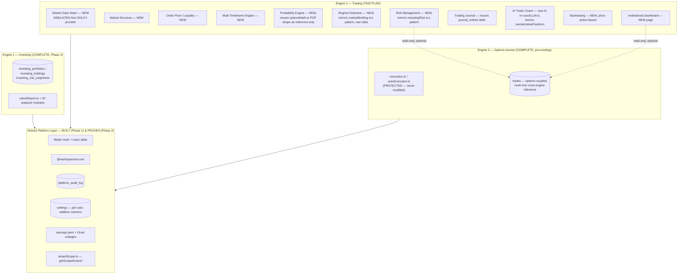

# Phase 3 — Institutional Trading Engine (Engine 2) — Execution Plan

**Status:** **PHASE 3 COMPLETE.** Approved, with all 8 owner decisions in §25 accepted as recommended. Sprints 32–51 are shipped — see their entries in §21 for the as-built write-ups (Sprints 34/36/37 each shipped a Core module reordered ahead of a previously-scheduled Route+UI sprint; Sprint 38 shipped the Risk Management Engine's Core; Sprint 39 shipped Trading Journal's Core + basic CRUD; Sprint 40 shipped Market Structure's Route + UI, the first Engine 2 frontend work of any kind; Sprint 41 shipped Multi-Timeframe's Route + UI; Sprint 42 shipped Market Regime's Route + UI; Sprint 43 shipped Probability's Route + UI; Sprint 44 shipped Risk Management's Route + UI plus basic Trading Positions CRUD; Sprint 45 shipped Liquidity's Route + UI as the planned on-demand tab; Sprint 46 shipped Trading Journal's own frontend UI, closing the entire Route+UI backlog first disclosed at Sprint 40; Sprint 47 shipped the AI Trade Coach's Core + Route (§17); Sprint 48 shipped the AI Trade Coach's own chat-panel UI, completing the module; Sprint 49 shipped Backtesting, a genuine Engine-2-native price-action backtester (§18); Sprint 50 shipped the Institutional Dashboard, a pure composition-layer page with zero new backend production code; Sprint 51 shipped Trading Engine Unification, the closing Phase-3 integration sprint, with zero new production logic beyond one disclosed comment — see each sprint's own as-built note for the disclosed deviation/decision). **The Live Market-Data Provider (§25 Decision 7) has been explicitly deferred by the project owner** ("I am explicitly deferring the optional Live Market-Data Provider. Do not implement it at this time.") — not merely pending, a confirmed decision, revisitable only on a future explicit owner request; see the roadmap table's Sprint 52 row. With that item's status now resolved (deferred, not open), **all required Phase 3 work is complete.** See `docs/Phase-3-Final-Completion-Report.md` for the full architecture and completion report, and `docs/Phase-4-Master-Execution-Plan.md` for the next phase's plan. Phase 4 has not begun implementation.

**Prepared after:** a fresh, direct-inspection review of `docs/DK-AI-OS-Architecture-Blueprint.md`, `docs/DK-Option-Engine-Technical-Audit.md`, `docs/Phase-2-Investing-Engine-Execution-Plan.md`, `CLAUDE.md`, and the actual completed codebase (Phase 1 platform layer + Phase 2's 21 shipped sprints), not from the Blueprint's assumptions alone. Several of the Blueprint's original claims about Engine 2 turned out to need correction once checked against real code — those corrections are called out explicitly in §0 below, the same way `docs/Phase-2-Investing-Engine-Execution-Plan.md` §0 corrected the Blueprint's Engine 1 assumptions before Phase 2 began.

---

## 0. Corrections to the existing Blueprint doc

Direct inspection of the current codebase changes three of the Blueprint's Engine 2 claims:

1. **"Market Regime Detection... genuinely close to done, just needs to move out from under Portfolio AI and gain real data."** Not accurate as stated. `lib/marketBriefing.ts`'s `buildMarketBriefing()` derives its entire regime/synthetic-VIX/breadth read from `optionsMath.ts`'s simulated option-chain IV ranks and price snapshots — it is a byproduct of the *options* simulation, not a real-price-action regime detector. It's a good **pattern** to follow (deterministic, reproducible-per-day, clearly labeled), but there is no real underlying signal to "gain real data" onto — a genuine market-regime detector needs real OHLCV price history, which does not exist anywhere in this codebase today. Phase 2, Sprint 26 already hit this exact wall and resolved it by building a **separate** deterministic macro proxy (`lib/investingMacro.ts`) rather than reusing `marketBriefing.ts`, on the explicit reasoning that "options IV isn't a macro rate regime." The same reasoning applies here, more strongly: Engine 2's regime detection needs its own foundation, not an extraction of Engine 3's.
2. **"Trading Journal... Schema is already instrument-agnostic — clean move."** Partially accurate. `journal_entries`' core fields (`title`, `content`, `mood`, `tags`, `lessonLearned`) are genuinely instrument-agnostic and directly reusable. But it also carries `strategy`, `entryCredit`, `maxProfit`, `maxLoss`, `ev`, `pop`, `ravishScore` — all options-scoring-specific (nullable, so they don't block reuse, but they don't fit a stock/futures trade either). This is a smaller correction than the market-regime one — reuse is still the right call, just not a zero-friction "clean move."
3. **"Risk Management... Solid foundation; generalize beyond options-specific risk checks."** `lib/risk.ts` is more tightly coupled to options than the Blueprint implies: every function signature is shaped around `RiskLeg` (`optionType`, `strike`, `expiration`), `maxLossFromLegs()` walks option payoff breakpoints, and `computePortfolioRisk()` aggregates option-position risk dollars. Generalizing this file in place would mean either overloading it with instrument-type branching (risky, exactly the kind of change CLAUDE.md's rule 1 exists to gate) or rewriting most of it — at which point it isn't really "the existing foundation" anymore. The better template, found by inspection, is **`lib/investingRisk.ts`** (Phase 2, Sprint 29) — a genuinely instrument-agnostic, pure, I/O-free scorer (concentration/sector-exposure/beta, hard-cap override, honest insufficient-data paths) built from scratch specifically because the equivalent Engine 3 pattern (`portfolioHealth.ts`) was too Greeks-coupled to reuse directly. `investingRisk.ts` is proof the *pattern* transfers cleanly across engines even when the *code* can't — that's the template for Engine 2's Risk Management module, not `risk.ts` itself.

**What the Blueprint got right and this plan reaffirms without change:** the platform layer (Auth, `ai-core`, audit log, contract-first `openapi.yaml`) is exactly as reusable as claimed — and, unlike when the Blueprint was written, **it now actually exists**, built and hardened across Phase 1's 10 sprints and proven under load by Phase 2's 21 sprints. This is the single biggest de-risking fact for Phase 3: the hardest, highest-blast-radius phase (Phase 1: auth, multi-tenancy, `user_id` migration across every table) is done, tested, and has been running in production-shape for two full phases with zero regressions. Phase 3 inherits all of it for free.

---

## 1. Executive Summary

Phase 2 shipped a complete Institutional Investing Engine — 21 sprints, zero regressions, zero real-money risk (advisory/education only, SIMULATED-first, honest degrade-never-fabricate discipline throughout). That discipline is the single most valuable asset this project has going into Phase 3, more valuable than any specific module, because **Phase 3 is a genuinely different kind of phase than Phase 2 was.**

The July 2026 audit found Engine 1 (Investing) roughly 40% pre-built and Engine 3 (Options Income) essentially complete — Phase 2 was mostly disciplined extension of proven patterns. Engine 2 (Trading) has almost none of that scaffolding. Direct re-inspection for this plan confirms and sharpens the audit's own finding: **there is no real price-series market data anywhere in this codebase.** Every option-chain provider (mock/Alpaca/Polygon) returns option *quotes* (bid/ask/greeks/IV) for a fixed universe of 10 symbols; nothing returns OHLCV bars, trade prints, or order-book depth for the underlying. `marketBriefing.ts`'s "regime detection" and `optionsMath.ts`'s liquidity/POP scoring are real, working code — but they're outputs of the *options* simulation, not inputs Engine 2 can generalize from. Market Structure, Order Flow, and Multi-Timeframe Analysis are, honestly, net-new builds with no existing code to extend, exactly as the Blueprint flagged (§7, "the longest pole in this roadmap").

This plan's central design decision, carried through every module below, is to **apply Phase 2's proven playbook to Phase 3's harder problem**: build every Engine 2 module SIMULATED-first (deterministic, seeded, honestly labeled, reproducible), with live market data as an explicit, separately-verified, optional upgrade path — never a precondition for shipping. This is not a downgrade of ambition; it's the same discipline that let Phase 2 ship 21 sprints with zero regressions and zero fabricated numbers, applied to a domain where the "live data" question is genuinely harder (order-flow-grade data is often institutional-tier and expensive, per the Blueprint's own flag) and therefore more important to not block on.

**Estimated scope:** ~18 sprints (range 16–20 depending on how §25's owner decisions land), continuing the project's single global sprint counter — Phase 1 was Sprints 1–10, Phase 2 was Sprints 11–31, so Phase 3 begins at **Sprint 32**.

---

## 2. Phase 3 Objectives

1. Ship all 9 Engine 2 modules named in `CLAUDE.md` §1: Market Structure, Liquidity, Order Flow, Multi-Timeframe Analysis, Probability Engine, Market Regime Detection, Institutional Dashboard, Risk Management, Trading Journal, AI Trade Coach — plus Backtesting (explicitly requested in this plan's brief, and a natural Engine 2 deliverable per the Blueprint's own roadmap).
2. Make every module **instrument-agnostic from day one** — built for equities/ETFs first (the most defensible SIMULATED domain and the most common real use case), architected so options and futures are additive later, never assumed away.
3. **Never fabricate.** Every score, level, or signal is either computed from real (SIMULATED or LIVE) data or honestly reports itself unavailable — the unbroken discipline from every one of Phase 2's 21 sprints, applied here without exception.
4. **Never touch Engine 3's protected execution surface.** `execution.ts`, `optionsMath.ts`, `risk.ts`, the kill-switch/guardrail system, and `autoExecutionLog` remain exactly as CLAUDE.md's non-negotiable rules 1–3 require — Engine 2 is additive, reads Engine 3 data only through the shared Portfolio DB / read-only queries, never through Engine 3's route handlers or internals.
5. Reuse every genuinely reusable platform service (auth, `ai-core`, audit log, tenant scoping, per-user settings, contract-first API) with zero rework — they're proven, not theoretical, after two phases of real use.
6. Reuse genuinely reusable **patterns** (the `portfolioHealth.ts`/`investingRisk.ts` banded-scorer-with-hard-cap-override shape; the `coachLLM.ts` deterministic-math-then-LLM-narration-with-enforced-disclaimer shape; the on-demand-vs-eager cost-control split Phase 2 used repeatedly) without forcing code reuse where the underlying data genuinely differs (options IV ≠ price-action regime, options legs ≠ stock position risk).
7. Close out with a Phase 3 "unification" sprint mirroring Sprint 31's — proving one symbol lookup gives a user the complete institutional trading picture (structure + liquidity + order flow + multi-timeframe + probability + regime + risk + journal + AI coach), the same end-to-end regression discipline Phase 2 closed with.

---

## 3. Overall Architecture

The three-engines-on-one-platform model from the Blueprint (§1) is unchanged and reaffirmed — engines never call each other's route handlers directly; they share the platform layer (DB, `ai-core`, audit log, auth, settings, API contract) and, where genuinely needed, read each other's data through the database, never through internals.



**Where Engine 2 code physically lives:** the Blueprint's target structure (§4) proposes a full `engines/trading/{api,lib}` monorepo restructure. This plan recommends **not** doing that restructure in Phase 3 — see §25 Decision 1. Instead, Engine 2 follows the exact convention Engine 1 already proved out over 21 sprints: flat files in the existing `artifacts/api-server/src/{routes,lib}` directories, distinguished by a `trading*`/`market*` naming prefix (mirroring `investing*`/`value*`), and a new top-level frontend route namespace (`/trading/*`, mirroring `/stock-analyst/*`). Zero new build tooling, zero risk of an import-path migration breaking Engine 1 or Engine 3 mid-flight.

---

## 4. Integration with the Completed Institutional Investing Engine

Genuinely shared surface between Engine 1 and Engine 2, established by direct inspection — not aspirational:

- **Event calendar (`lib/eventRisk.ts`).** Already instrument-agnostic in spirit (earnings/FOMC/CPI/jobs/major-event catalysts, keyed by symbol, not by option strategy). Already consumed by `marketBriefing.ts` for its "catalysts" list. Engine 2's Regime Detection and Risk Management modules can read this directly, unmodified — the first genuine zero-friction cross-engine reuse in the whole roadmap.
- **Fundamentals/sector data (`lib/fundamentals.ts`, `lib/industryPeers.ts`).** Engine 2's Market Structure/Multi-Timeframe modules are price-action-focused and don't need fundamentals directly, but the **Institutional Dashboard** (§3) can legitimately show "this symbol's Engine 1 Investment Committee verdict" as a read-only cross-reference next to its Engine 2 technical read — the same kind of intentional, disclosed cross-engine consultation Sprint 11 established for `valueReport.ts` reading `optionsMath.ts`'s IV rank (documented there as "a deliberate, intentional cross-engine read... not an accidental coupling"). Recommended as a Sprint 32+ nice-to-have on the Dashboard, not a hard dependency of any core module.
- **AI Coach pattern.** Engine 1's `narrateValueFreeform()`/`narrateValueFreeformStream()` (Sprint 30) is the second working proof (after the original options coach) that the deterministic-math → `ai-core.narrate()`/`narrateStream()` → `enforceDisclaimer()` shape generalizes cleanly to a new domain with zero changes to the shared machinery. Engine 2's AI Trade Coach is the third proof point of the same pattern — see §17.
- **Watchlist/portfolio construction are explicitly NOT shared.** `investing_portfolios`/`investing_holdings` (Sprint 28) model target-weight allocation for long-term positions — a different concept from an active trader's open positions/journal. Engine 2 gets its own schema (§6), not a repurposing of Engine 1's.
- **No shared route mounting, no shared UI components beyond generic `shadcn/ui` primitives.** Consistent with the Blueprint's own design constraint (§1): engines integrate through data, not through each other's code.

---

## 5. Shared Services That Will Be Reused

All of the following exist today, are load-bearing in production for both Engine 1 and Engine 3, and require **zero new platform work** to serve Engine 2:

| Service | What it provides | Reused as-is? |
|---|---|---|
| Auth (`lib/auth`, Better-Auth) | Session, sign-up/in/out, `req.user` | Yes, unmodified |
| `getScopedUserId(req)` (`tenantScope.ts`) | The one consistent per-request user-scoping call every route uses | Yes, unmodified |
| `@workspace/ai-core` | Provider-agnostic LLM narration, caching, timeout, single-flight, disclaimer injection | Yes, unmodified — Engine 2's coach binds its own system prompt/disclaimer the same way `coachLLM.ts` already does twice |
| `platform_audit_log` + `recordAuditEvent()` | Best-effort, never-throws audit trail, `engine` field already supports `"trading"` as a value (added forward-looking in Sprint 10) | Yes, unmodified — Engine 2 is the first real consumer of the `"trading"` engine tag |
| `settings` (per-user, additive columns) | The established pattern for engine-specific config (see `investingRiskFreeRate` etc. from Sprint 11) | Yes — Engine 2 adds its own nullable-with-default columns, same discipline |
| `openapi.yaml` + Orval codegen | Contract-first API, generated Zod + React Query hooks | Yes, unmodified — Engine 2 adds a new tag/namespace, same collision-avoidance discipline Sprint 28 established (`Construction`-prefixed schemas) |
| `lib/db` manual-migrations discipline | Nullable → backfill → enforce for existing tables; straight-to-NOT-NULL for brand-new tables | Yes, unmodified |
| `assertTenantIsolation` (`tenantIsolationHelper.ts`) | Shared cross-user isolation test helper (Sprint 28 extraction) | Yes, unmodified — every new Engine 2 table gets a tenant-isolation test the same way |
| CI pipeline (`.github/workflows/ci.yml`) | typecheck/build/test gate with a disposable Postgres service | Yes, unmodified |
| `eventRisk.ts` catalog | Earnings/FOMC/CPI/jobs event calendar | Yes, unmodified (see §4) |

**Reused as a pattern, not as code** (the distinction this plan insists on, per §0's corrections): the banded-scorer-with-hard-cap-override shape (`portfolioHealth.ts` → `investingRisk.ts` → Engine 2's own risk/structure scorers), the deterministic-math-then-LLM-narration shape (`coach.ts`/`coachLLM.ts` → `narrateValueFreeform` → Engine 2's trade coach), and the SIMULATED-first-with-honest-fallback provider seam shape (`fundamentals.ts` → Engine 2's market-data provider).

---

## 6. Database Design

**Design principle, reaffirmed from Sprint 28's own precedent:** new, brand-new tables for genuinely new domains rather than overloading an existing, differently-shaped table (`trades`) with more nullable-if-unused columns. Every new table below is `NOT NULL` from creation (zero existing rows), `userId` FK `ON DELETE RESTRICT` (universal convention), manual migration script per Phase 1's discipline.

| Table | Purpose | Notes |
|---|---|---|
| `trading_positions` | An Engine-2-native, instrument-agnostic open/closed position ledger (symbol, instrument type, side, entry/exit price, quantity, stop, target, status) | **New**, not a reuse of `trades` — see §0 Correction 3 and §25 Decision 2. `instrumentType` free text (`"stock" \| "etf"`, extensible later) so options/futures can be added without a schema change, mirroring `investing_filing_analysis`'s `filingType` free-text precedent. |
| `trading_journal_entries` | Trade journal for Engine 2 positions | Reuses `journal_entries`' proven shape almost verbatim (title/content/mood/tags/lessonLearned) but as its **own table** scoped to `trading_positions` rather than overloading the existing options-flavored `journal_entries.tradeId`/`strategy`/`entryCredit` fields — see §25 Decision 2 for the reuse-vs-fork tradeoff actually decided. |
| `trading_regime_snapshots` | Optional saved snapshots of a computed regime read, mirroring `investing_risk_snapshots`' explicit-save-only discipline | Only if Sprint 32+ scoping confirms genuine user value in historical regime tracking; deferred to be scoped during the relevant sprint's own plan, not pre-committed here. |
| `market_data_cache` (in-process only, no new table) | Short-TTL in-memory cache for any live OHLCV fetch, mirroring `fundamentals.ts`'s `liveCache` pattern | No schema — reuses the established in-process caching convention, not a DB table. |
| `settings` (existing table, additive columns) | `tradingRiskFreeRate`, `tradingDefaultTimeframe`, `tradingDataProvider`, `tradingRegimeSensitivity`, etc. — exact defaults to be finalized per-sprint | Nullable-with-default, same discipline as every Phase 2 settings addition since Sprint 11. |

No changes to any Engine 1 or Engine 3 table. No changes to `autoExecutionLog`, `trades`, `journal_entries`'s existing rows/behavior (CLAUDE.md rules 1–3 stay fully intact).

---

## 7. API Architecture

- New `openapi.yaml` tag(s): `trading` (mirrors `value`/`portfolio-construction`'s own tag convention), with a schema-naming prefix decided **before** the first schema is written (Sprint 28 hit a real, disclosed collision with Engine 3's existing `Portfolio*` schema names; Engine 2 should pre-empt this the same way Sprint 28 eventually fixed it — a `Trading`-prefixed schema namespace, verified collision-free against the whole spec before codegen, not after).
- Routes mounted the same way every other engine's routes are: `router.use("/trading", tradingRouter)` in `routes/index.ts`, self-prefixed paths inside the router file (matching `stockAnalystRouter`'s pattern).
- **On-demand vs. eager split, decided per-module up front** (not discovered mid-sprint the way Phase 2 sometimes did): Market Structure + Regime Detection + Probability + Risk are cheap enough to compute eagerly per symbol lookup (same cost class as Engine 1's eager `buildValueResearchReport()`); Order Flow + Multi-Timeframe (candle history across several intervals) are the heavier, on-demand-tab pattern (same cost-control discipline as Engine 1's Statements/Peers/Filings/Earnings tabs).
- SSE streaming for the AI Trade Coach only, deliberately kept outside the OpenAPI/Orval contract — the exact, twice-proven precedent (`/value-research/stream`, `/value-research/ask/stream`).
- Every route ownership-scoped via `getScopedUserId(req)` + `and(eq(id), eq(userId))`, 404 for both "doesn't exist" and "isn't yours" — the unbroken IDOR-prevention discipline since Sprint 7.

---

## 8. Frontend Architecture

- New page(s) under `artifacts/ravish-trading/src/pages/`, `Trading*.tsx` naming (mirrors `StockResearch.tsx`/`StockScanner.tsx`), routed under `/trading/*` in `App.tsx` and added to `AppLayout.tsx`'s nav — the exact pattern every Phase 2 frontend addition (including Sprint 28's Portfolio Construction) already used successfully.
- **One "Trading Research" page as the umbrella surface** (mirroring `StockResearch.tsx`'s `ReportView`), with tabs for the heavier on-demand modules (Order Flow, Multi-Timeframe candles) — same tab-based single-page-per-symbol architecture Sprint 31 confirmed works well and is genuinely discoverable, rather than N separate standalone pages.
- Charting: `recharts` is already a proven dependency (`Backtest.tsx`'s equity curve, Sprint 18's `RatioTrendChart`) — reuse it for candlestick/multi-timeframe visualization rather than introducing a new charting library, unless a genuine candlestick-rendering gap is found once implementation starts (recharts has no first-class candlestick primitive; this is flagged as a real open question for Sprint 32's own detailed plan, not resolved here — see §25 Decision 5).
- Reuse the established `enabled`-gated generated-hook pattern (`queryKey` + `enabled`) for every on-demand tab, exactly as Sprints 19–29 did.
- New "AI Trade Coach" chat panel reusing `streamCoach()` unchanged — zero new frontend streaming infrastructure, the same reuse Sprint 30 achieved for Engine 1.

---

## 9. AI Architecture

No new AI infrastructure. `@workspace/ai-core` (Phase 1, Sprint 9) is provider-agnostic, already handles Anthropic/OpenAI auto-detection, caching, timeout, single-flight — Engine 2 is a third domain-layer consumer, following the exact shape `coachLLM.ts` already implements twice (options coach, value coach):

1. A new system prompt + disclaimer constant, scoped to trading education (never "this will go up," never impersonating a real trader/analyst, same anti-impersonation-style guard as `enforceValueSafety()` if the coach ever narrates in a named-strategist voice — TBD per §25 Decision 6).
2. A `narrate()`/`narrateStream()` binding (private to `coachLLM.ts`, following the file's existing convention of binding system prompt + disclaimer once and reusing it for every function in the file).
3. `narrateTradeFreeform()`/`...Stream()` — free-form Q&A grounded in the full assembled trading report (structure + liquidity + order flow + multi-timeframe + probability + regime + risk), same shape as `narrateValueFreeform()`.
4. Deterministic fallback templates for every narration path — LLM unavailable never means "no answer," it means the honest deterministic facts, exactly as `narrationFallback()`/`freeformFallback()` already do for Engine 1.

---

## 10. Market Data Architecture

**This is the single most consequential section of this plan** — every other Engine 2 module depends on its outcome, and it's where the Blueprint's own "biggest net-new engineering lift" warning concentrates.

**Finding, confirmed by direct inspection:** `providers/types.ts`'s `OptionsProvider` interface (and both real implementations, `PolygonOptionsProvider`/`AlpacaProvider`) return **option chain quotes only** — strike/expiration/greeks/IV/bid-ask for a fixed 10-symbol universe. There is no OHLCV bar provider, no trade-tick provider, no order-book-depth provider anywhere in this codebase. This is not a gap in an otherwise-complete seam; it's a completely different data shape that doesn't exist at all today.

**Recommended architecture (SIMULATED-first, mirroring `fundamentals.ts`'s exact provider-seam shape):**

```ts
interface MarketDataProvider {
  readonly id: string;
  readonly isLive: boolean;
  getCandles(symbol: string, interval: Timeframe, lookback: number): Promise<Candle[] | null>;
  getQuote(symbol: string): Promise<{ price: number; volume: number; asOf: string } | null>;
}
```

- **`SimulatedMarketDataProvider`** (default, ships Sprint 32): deterministic, seeded OHLCV candle generation across multiple timeframes (1m/5m/15m/1h/1D), reusing the exact `makeRng`/`hashStr` primitives already extracted in `lib/deterministic.ts` (Sprint 11) — literally the same RNG infrastructure Engine 1's `investingUniverse.ts` and every SIMULATED provider since has used. Anchored to the same 10-symbol universe (`UNIVERSE_SYMBOLS`) plus `syntheticProfile()`-style honest generation for any other valid-shaped ticker, matching Sprint 11's precedent exactly.
- **`PolygonMarketDataProvider`** (live, optional, deferred verification): Polygon already has an account/API-key relationship with this codebase (options quotes) and separately offers a stocks-aggregates (candle) API — the natural first live candidate. **Explicitly not built or verified in Sprint 32** — flagged the same way every Phase 2 sprint flagged "no FMP/Alpha Vantage key available this session, live verification deferred." Order-flow-grade data (tick-level trade prints, order-book depth) is a **separate, likely-paid tier** even from Polygon — this plan does not commit budget to it; that's an explicit owner decision (§25 Decision 7), not an engineering one.
- **Resolution/fallback**: mirrors `resolveFundamentals()` exactly — try live if configured, fall back to SIMULATED honestly labeled, never silently swap without disclosure.
- **No WebSocket infrastructure exists or is proposed for Sprint 32.** Order flow / real-time tick analysis in its first shipped form is **SIMULATED-only**, deterministic, clearly labeled — live tick/order-book integration is a distinct, later, separately-scoped and separately-approved sprint (or arguably a distinct sub-phase), not bundled into Phase 3's initial scope. This is the single biggest scope-control decision in this whole plan (§25 Decision 7).

---

## 11. Order Flow and Liquidity Engine

**Objective:** a standalone, instrument-agnostic view of buy/sell pressure and market depth — generalizing `optionsMath.ts`'s liquidity-as-a-scoring-input into its own module, per the Blueprint's own framing.

**SIMULATED-first design:** derive a deterministic "order flow" read from the same candle data §10 produces — volume-at-price buckets (a volume profile), a synthetic bid/ask imbalance proxy (seeded, directionally consistent with the candle's own up/down close), and a liquidity score banded the same way `marketData.ts`'s `checkLiquidity()` already bands option quotes (open interest/volume/spread thresholds) — adapted to equity volume/dollar-volume thresholds instead. Never claims to be real Level 2 order-book data; the UI/API response is explicit about `dataSource: "SIMULATED"` throughout, the same disclosure discipline as every Engine 1 module.

**Deliverables:** volume profile (price-level volume histogram), a liquidity score (0–100, banded), a buy/sell-pressure proxy, honest `unavailable` when a symbol can't be resolved.

**Explicitly deferred:** real Level 2/order-book depth, real trade-print tape reading — these need the live tick-data vendor relationship §10 flags as a separate, unbudgeted decision.

---

## 12. Market Structure Engine

**Objective:** support/resistance levels, trend structure (higher-highs/higher-lows classification), key price levels — genuinely net-new, no existing code to extend.

**Design:** a pure, I/O-free scorer over the candle series §10 produces (same "pure function over already-resolved data, unit-testable without a provider" discipline as `computePortfolioRisk()`/`analyzeTomNash()`), producing: detected support/resistance zones (local extrema clustering, a well-understood deterministic technique — not ML, not a black box, consistent with this project's "never LLM-generate a number that should be math" discipline), a trend-structure classification (uptrend/downtrend/range, based on swing-high/swing-low sequencing), and a confidence/data-completeness signal (mirroring Investment Quality's/Tom Nash's own `confidenceLevel` pattern) reflecting how many candles were actually available.

---

## 13. Multi-Timeframe Engine

**Objective:** confluence across multiple intervals (e.g., is the 1-hour trend aligned with the daily trend) — genuinely net-new.

**Design:** runs the Market Structure scorer (§12) independently at each configured timeframe, then a thin confluence layer (agreement classification, reusing the exact generic `classifyAgreementSignal<T>()` helper extracted in Phase 2, Sprint 17, for the Investment Committee's unanimous/majority/split/insufficient-data bucketing — a second, real, disclosed reuse of that exact utility, not a new agreement-scoring formula). Deliberately **not** its own giant new algorithm — the genuinely new part is the candle-timeframe plumbing (§10); the confluence math reuses a two-phase-old shared utility.

---

## 14. Probability Engine

**Objective:** instrument-agnostic probability-of-a-move estimate, generalizing `optionsMath.ts`'s POP (probability of profit) math beyond options.

**Design:** `optionsMath.ts`'s POP is fundamentally a Black-Scholes-family probability-of-touch/expire-in-range calculation — genuinely options-specific math (it needs IV, strike, DTE). It is **not** directly reusable for "probability price reaches level X by date Y" on a raw stock, which needs a different input (historical realized volatility from the candle series, not implied volatility from an option chain). Recommended approach: a new, small, honestly-named module computing a **historical-volatility-based probability cone** (standard lognormal-diffusion assumption, computed from the SIMULATED/live candle series' own realized volatility) — same rigor tier as the options POP math, same "real formula, not a fabricated number" discipline, but a genuinely different formula reusing only the shape of the discipline, not the code.

---

## 15. Risk Management Engine

**Objective:** instrument-agnostic position and portfolio risk, per §0 Correction 3 built fresh on the `investingRisk.ts` template rather than generalizing `risk.ts` in place.

**Design:** a pure scorer over `trading_positions` rows (§6) — position-sizing checks (risk-per-position vs. account value, mirroring `investingRisk.ts`'s concentration-cap pattern exactly), a stop-loss/target discipline check (has every open position got a defined stop, mirroring the honest-unavailable-not-fabricated discipline throughout), a portfolio-level risk-budget aggregate (mirroring `computePortfolioRisk()`'s shape from `risk.ts`, reimplemented instrument-agnostically rather than copied). **`risk.ts` and `execution.ts` are never modified** — CLAUDE.md rule 1 stays fully intact; this is a wholly new, additive module.

---

## 16. Trading Journal Architecture

**Objective:** journal Engine 2 positions, reusing the proven `journal_entries` shape.

**Design:** per §6/§25 Decision 2, a new `trading_journal_entries` table with the same core fields as `journal_entries` (title/content/mood/tags/lessonLearned) plus `tradingPositionId` (FK to `trading_positions`, not the options `trades` table) and trading-relevant nullable fields (entry/exit price, R-multiple, setup type) in place of the options-specific credit/POP/EV fields. UI reuses `Journal.tsx`'s established list/detail/mood-tag pattern, adapted, not rewritten from scratch.

---

## 17. AI Trading Coach

**Objective:** the third proof point of the deterministic-math → `ai-core` narration → enforced-disclaimer shape (after the options coach and Engine 1's value coach).

**Design, following Sprint 30's exact precedent:**
- `narrateTradeFreeform()`/`...Stream()` added directly inside `coachLLM.ts` (not a new file — per Sprint 30's own disclosed reasoning, reusing the file's already-private `narrate()`/`narrateStream()` machinery is the safer, more central-enforcement-preserving choice than forking a second domain file).
- A `buildTradeCoachContext()` helper (mirroring `buildFreeformContext()`) assembling Structure + Liquidity/Order-Flow + Multi-Timeframe + Probability + Regime + Risk into one grounding object for the LLM — never fabricates an answer outside that data, explicitly told to say so when a question falls outside it (the exact prompt discipline `valueFreeformPrompt` already established).
- New routes `POST /trading/coach/ask` (+ `/ask/stream`), same 404/degrade-honestly contract as `/value-research/ask`.

---

## 18. Backtesting Architecture

**Objective:** a genuine price-action backtest engine for Engine 2 strategies (trend-following, mean-reversion, structure-break setups), distinct from `routes/backtest.ts`'s options-strategy-equity-curve generator.

**Design:** new `routes/tradingBacktest.ts` / `lib/tradingBacktest.ts`, replaying the SIMULATED (or live, once verified) candle series through a user-selected rule set (e.g., "enter on structure breakout, exit on stop/target"), producing an equity curve + trade log + the same KPI set `performanceAnalytics.ts` already establishes a UI pattern for (win rate, average R, max drawdown) — reusing the **UI rendering pattern** (`Backtest.tsx`'s recharts equity curve) and the **persisted-results-table pattern** (`backtestResults` table shape), not the options-specific simulation logic itself. `routes/backtest.ts` is not modified.

---

## 19. Future Broker Integration

**Explicitly out of scope for Phase 3's initial sprints.** Engine 2 as scoped here is **read-only/advisory** — structure, liquidity, probability, regime, risk, journal, and coach narration, exactly like Engine 1 and exactly like the *existing* AI Trade Coach's own "read-only, never executes" invariant (Technical Audit §5.2). No order placement, no Alpaca order construction, no kill-switch, no guardrail system for Engine 2 in this plan.

If a future phase wants Engine 2 to execute trades (not just analyze them), that is a **new, separately-scoped, separately-approved phase** requiring the exact same category of high-scrutiny review CLAUDE.md already applies to Engine 3's execution code (rule 2) — building it quietly inside "Phase 3" would be exactly the kind of scope creep this plan's own discipline exists to prevent. Recommendation: if/when that phase is scoped, `execution.ts`'s existing OCC-symbol-building/Alpaca-order-construction pattern is the closest template, and it should get its own from-scratch kill-switch/guardrail design reviewed with the same rigor as Engine 3's, not an extension of Engine 3's existing kill switch (which CLAUDE.md rule 2 protects from modification regardless).

---

## 20. Testing Strategy

Identical discipline to every one of Phase 2's 21 sprints, applied to Engine 2:

- Pure scorer functions (Structure, Order Flow, Probability, Risk, Regime) unit-tested with constructed fixtures, no provider/DB dependency — matching `investingRisk.test.ts`'s 20-test discipline.
- Provider seam (`SimulatedMarketDataProvider`, future live providers) tested for determinism, range, honest-null-on-invalid-symbol — matching `fundamentals.beta.test.ts`'s mocked-fetch pattern for the eventual live path.
- Live end-to-end HTTP route tests against the real running app (`app.listen(0)`) for every new route, 404/400 contract proven, matching `portfolioRisk.route.test.ts`.
- Tenant isolation test for every new table, reusing `assertTenantIsolation()` unmodified.
- Disclaimer-invariant tests for the AI Trade Coach, mirroring `value.test.ts`'s safety-invariant block exactly.
- A Phase-3-closing "unification" integration test, mirroring `valueReport.fullEngineIntegration.test.ts` + `companyResearchUnification.route.test.ts` — proving one symbol lookup resolves consistently across every Engine 2 module.
- Full validation every sprint: `pnpm run typecheck`, `pnpm --filter @workspace/api-server run test` (run at least twice to catch flakes, per the established convention — this session has repeatedly seen two specific pre-existing flake categories that are NOT Phase-3-introduced: a `fetchedAt`-timing race and a rare `autoScheduler.multiUser.test.ts` FK-violation under live-DB parallelism), `pnpm --filter @workspace/ravish-trading run test`, `PORT=5000 BASE_PATH=/ pnpm run build`.
- **Zero changes permitted to the existing 21-test suite gating Engine 3's execution/adjustment code** without explicit separate approval, per CLAUDE.md rule 1.

---

## 21. Sprint-by-Sprint Roadmap

Continuing the project's single global sprint counter (Phase 1: Sprints 1–10; Phase 2: Sprints 11–31). **Phase 3 begins at Sprint 32.** Sprint count is an estimate (~18, range 16–20) — exact scoping of each sprint happens at that sprint's own kickoff, per the established per-sprint process (CLAUDE.md §3: present a plan, get explicit approval, implement, validate, commit).

| Sprint | Module | Summary |
|---|---|---|
| 32 | Market Data Foundation — **SHIPPED** | See the as-built write-up immediately below the table. |
| 33 | Market Structure Engine (Core) — **SHIPPED** | See the as-built write-up immediately below the table. |
| 34 | Multi-Timeframe Trend Engine (Core) — **SHIPPED** | See the as-built write-up immediately below the table. **Reordered ahead of Market Structure's own Route+UI sprint at the project owner's explicit direction** — see the as-built note for the disclosed deviation from this table's original order. |
| 35 | Liquidity / Order Flow (Core) — **SHIPPED** | See the as-built write-up immediately below the table. |
| 36 | Market Regime Detection Engine (Core) — **SHIPPED** | See the as-built write-up immediately below the table. **Reordered ahead of Liquidity's own Route+UI sprint at the project owner's explicit direction** — see the as-built note for the disclosed deviation. |
| 37 | Probability Engine (Core) — **SHIPPED** | See the as-built write-up immediately below the table. **Reordered ahead of Multi-Timeframe's own Route+UI sprint at the project owner's explicit direction** — see the as-built note for the disclosed deviation. |
| 38 | Risk Management Engine (Core) — **SHIPPED** | See the as-built write-up immediately below the table. **Chosen over the outstanding Route+UI backlog at the project owner's direction (via the established `AskUserQuestion`-failure recovery)** — see the as-built note for the disclosed decision. |
| 39 | Trading Journal (Core + basic CRUD) — **SHIPPED** | See the as-built write-up immediately below the table. Chosen via `AskUserQuestion` (succeeded this time) over a combined Route+UI backlog sprint, at the project owner's explicit direction. |
| 40 | Market Structure Route + UI — **SHIPPED** | See the as-built write-up immediately below the table. First bounded slice of the Route+UI backlog reduction, per the project owner's explicit "implement only the first bounded portion" instruction. |
| 41 | Multi-Timeframe Route + UI — **SHIPPED** | See the as-built write-up immediately below the table. Second bounded slice of the Route+UI backlog reduction. |
| 42 | Market Regime Route + UI — **SHIPPED** | See the as-built write-up immediately below the table. Third bounded slice of the Route+UI backlog reduction. |
| 43 | Probability Route + UI — **SHIPPED** | See the as-built write-up immediately below the table. Fourth bounded slice of the Route+UI backlog reduction. |
| 44 | Risk Management Route + UI (+ basic Trading Positions CRUD) — **SHIPPED** | See the as-built write-up immediately below the table. Fifth bounded slice of the Route+UI backlog reduction. |
| 45 | Liquidity Route + UI (on-demand tab) — **SHIPPED** | See the as-built write-up immediately below the table. Sixth and final bounded slice of the eager/on-demand Route+UI backlog reduction. |
| 46 | Trading Journal Frontend UI — **SHIPPED** | See the as-built write-up immediately below the table. Closes the entire Route+UI backlog first disclosed at Sprint 40. |
| 47 | AI Trade Coach (Core + Route) — **SHIPPED** | See the as-built write-up immediately below the table. UI (chat panel) deliberately deferred to a future sprint, per the original roadmap's own two-sprint split. |
| 48 | AI Trade Coach Frontend UI — **SHIPPED** | See the as-built write-up immediately below the table. Completes the AI Trade Coach module (§17) started in Sprint 47. |
| 49 | Backtesting, Engine-2-native (§18) — **SHIPPED** | See the as-built write-up immediately below the table. A genuine walk-forward price-action backtest, distinct from the options-side `routes/backtest.ts`'s fabricated-statistics equity curve. |
| 50 | Institutional Dashboard — **SHIPPED** | See the as-built write-up immediately below the table. A pure composition-layer page pulling Structure/Liquidity/Multi-Timeframe/Probability/Regime/Risk into one view per symbol, with zero new backend production code. |
| 51 | Trading Engine Unification — **SHIPPED** | See the as-built write-up immediately below the table. The closing Phase-3 integration sprint, mirroring Sprint 31's own audit + regression discipline — zero new production logic beyond one disclosed comment. |
| 52 | Live Market-Data Provider — **DEFERRED** | Explicitly deferred by the project owner at Phase 3's close ("I am explicitly deferring the optional Live Market-Data Provider. Do not implement it at this time.") — not scheduled, not started, no vendor/budget decision made. Revisit only on a future explicit owner request. See §25 Decision 7. |

*(48 is Sprint 17 of Phase 3 in this numbering, i.e. within the ~16–20 estimate; Sprint 47 is explicitly optional/conditional and may be skipped or deferred to a later phase depending on §25 Decision 7, which would bring the count to 17 core sprints.)*

### Sprint 32 — Market Data Foundation — SHIPPED

- **Objective:** the provider seam every later Engine 2 module builds on.
- **As actually built:** no genuinely new owner decisions surfaced once the codebase was inspected — the plan's own drawn boundary (provider seam + two new tables + settings columns, no routes/UI) held up exactly as scoped.
- **`lib/tradingMarketData.ts`** — `MarketDataProvider` interface (`getCandles(symbol, interval, lookback, asOf?)`, `getQuote(symbol, asOf?)`, both honestly `null` for an invalid ticker shape) and its only implementation, `SimulatedMarketDataProvider` (`id: "simulated"`, `isLive: false`). Deterministic, seeded via `lib/deterministic.ts`'s `makeRng`/`todayStr` (Sprint 11), reused unchanged. `TRADING_MARKET_UNIVERSE` deliberately **duplicates, not imports**, the same 10 tickers/base prices `investingUniverse.ts` already duplicates from `optionsMath.ts` — Engine 2's SIMULATED AAPL price is independently seeded from Engine 1's and Engine 3's, consistent with §0/§3's "engines never depend on each other's internals." `dailyClose()` uses its own seed namespace, independent of `investingPrice()`'s, per §0 Correction 1's precedent extended to the market-data layer. Intraday candles (`1m`/`5m`/`15m`/`1h`) are generated as an internally-consistent per-session random walk from the previous day's close to the current day's own `dailyClose()` anchor — proven by a dedicated regression test that the last intraday bar's close matches the day's own 1D close.
- **Bounded lookback windows** (`MAX_LOOKBACK`: 390 bars for `1m`/`5m`, 130 for `15m`, 35 for `1h`, 180 for `1D`) address the plan's own flagged scalability concern (§26) up front — a caller requesting more is honestly capped, never silently expanded.
- **`getMarketDataProvider(userId?)`** always returns the simulated instance today (regardless of the new `tradingDataProvider` setting's value) — the exact shape `getFundamentalsProvider()` uses, one call away from a real live-provider branch once §25 Decision 7 is revisited.
- **Schema:** `trading_positions` (instrument-agnostic position ledger, `instrumentType` free text) and `trading_journal_entries` (mirrors `journal_entries`' core shape plus `entryPrice`/`exitPrice`/`rMultiple`/`setupType`) via `lib/db/manual-migrations/010_trading_engine_tables.sql` — **new tables, not a retrofit** (§25 Decision 2), confirmed the right call once `trades`' real coupling (`legs` jsonb, `credit`/`pop`/`ev`/`ravishScore` all required) was inspected directly. `trading_journal_entries.trading_position_id` has no FK constraint, mirroring `journal_entries.trade_id`'s own precedent exactly.
- **Settings:** `tradingDataProvider` (default `"simulated"`) / `tradingDataConnected` (default `false`) via `lib/db/manual-migrations/011_trading_settings.sql`, mirroring `fundamentalsProvider`/`fundamentalsConnected`'s shape. `openapi.yaml`'s `Settings`/`SettingsUpdate` gained the 2 fields (`tradingDataConnected` read-only, matching `fundamentalsConnected`'s precedent); `routes/settings.ts` needed zero code changes (its established `{...settings, ...}` spread picks up new columns automatically).
- **No UI/routes this sprint**, exactly as scoped.
- **Tests:** `tradingMarketData.test.ts` (23 tests — determinism, ticker-shape validation, OHLCV range validity across all 5 timeframes, ordering, lookback clamping at both bounds, honest synthetic generation outside the default universe, per-symbol seed independence, intraday/daily internal consistency), 2 new tenant-isolation cases reusing `assertTenantIsolation` unchanged.
- **Acceptance criteria met:** `SimulatedMarketDataProvider` returns deterministic, range-valid candles for the universe plus any valid-shaped ticker; repeated calls are byte-identical; invalid tickers return `null`; both new tables pass tenant-isolation tests — all proven directly by the test suite above.
- **Rollback:** `git revert`; drop `trading_journal_entries` then `trading_positions` if the migration was applied; drop the 2 settings columns independently if needed — all purely additive.
- **Validation:** `pnpm run typecheck` (clean across all workspaces), `pnpm --filter @workspace/api-server run test` (73 files / 803 tests, run twice — both fully clean, zero flakes), `pnpm --filter @workspace/ravish-trading run test` (7 files / 44 tests, unmodified), and `PORT=5000 BASE_PATH=/ pnpm run build` all pass for real.

### Sprint 33 — Market Structure Engine (Core) — SHIPPED

- **Objective:** support/resistance detection, trend-structure classification, confidence scoring — a pure scorer over the candle series Sprint 32 already produces, plus unit tests. Core only — no route, no UI (Sprint 34's scope).
- **As actually built:** no genuinely new owner decisions surfaced — the plan's own drawn boundary (pure scorer + unit tests, zero DB/route/UI, reuse Sprint 32's `MarketDataProvider` seam unmodified) held up exactly as scoped once the codebase was inspected.
- **New `lib/tradingMarketStructure.ts`** — `analyzeMarketStructure(candles, symbol, interval, isLive)`, pure and I/O-free (the same "pure function over already-resolved data" discipline as `computePortfolioRisk()`/`analyzeTomNash()`), plus an orchestration wrapper `buildMarketStructureAnalysis(symbol, interval, lookback, provider)` that resolves candles via Sprint 32's `MarketDataProvider` and calls the pure analyzer — honestly returning `null` for an invalid ticker shape, never fabricating an analysis.
- **Swing-point detection** (`detectSwingPoints()`) uses a symmetric `SWING_WINDOW = 2`-candle window: a candle is a swing high/low only when its high/low is the most extreme point within 2 candles on either side — a well-understood, fully deterministic local-extrema technique, never ML/LLM-generated.
- **Support/resistance zone clustering** (`clusterZones()`) sorts swing prices, clusters any within `ZONE_TOLERANCE_PCT = 0.5%` of each other, and **filters out any cluster with fewer than `MIN_ZONE_TOUCHES = 2` touches** — a single, un-repeated swing is never reported as a "level," the same never-fabricate discipline applied to a purely mathematical detector. Zones are classified support/resistance relative to `currentPrice`, sorted by strength (touch count) descending, and capped at `MAX_ZONES_RETURNED = 6`.
- **Trend-structure classification** (`classifyTrend()`) looks at only the last `RECENT_SWINGS = 3` swing highs and 3 swing lows (matching how a trader reads recent structure, not the whole lookback window): higher-highs + higher-lows → `uptrend`, lower-highs + lower-lows → `downtrend`, anything else (including a too-thin sample with fewer than 2 recent swings of either kind) → an honestly-labeled `range` with an explicit `trendDetail` reason — never a forced/fabricated trend read.
- **Confidence level** (`confidenceFromCandleCount()`) follows the established 3-tier `"High" | "Moderate" | "Low"` convention used throughout the codebase (Investment Quality, Competitive Advantage, Earnings Intelligence, etc. — confirmed via grep before implementation): `≥80` candles → High, `≥30` → Moderate, else Low — never a 4th "insufficient data" tier; a zero-candle input still produces a fully-shaped, honest empty result (`candleCount: 0`, empty `swingPoints`/`zones`, `trend: "range"`, `confidenceLevel: "Low"`) rather than a crash or a fabricated placeholder.
- **`buildSummary()`** produces a deterministic, rule-based sentence referencing the actual symbol, trend, strongest zone (if any), and confidence level — never a boilerplate template disconnected from the real computed values.
- **Tests:** `lib/tradingMarketStructure.test.ts` (17 tests) — hand-built candle fixtures with verified swing-point math: a textbook uptrend fixture, a downtrend fixture constructed as the exact mathematical mirror of the uptrend fixture (`new_high = 19 - old_low`, `new_low = 19 - old_high`, proven in-code to preserve every bar's `high > low` invariant while flipping every local extremum's direction), and a range fixture with non-monotonic swing highs and 4 repeated swing lows at the same price (doubling as the zone-clustering fixture). Coverage: trend classification (uptrend/downtrend/range/honest-thin-sample-range), zone clustering (correct strength count, no single-touch zones ever reported, correct support/resistance classification vs. current price, strength-descending sort order), confidence banding (Low/Moderate/High thresholds, honest zero-candle empty result), general shape/honesty (determinism, `currentPrice` = last close, correct `SIMULATED`/`LIVE` dataSource labeling, non-boilerplate summary content), and `buildMarketStructureAnalysis()` orchestration against the real `SimulatedMarketDataProvider` (honest null for an invalid ticker, well-shaped resolution for a valid symbol, determinism across repeated calls).
- **No route, no UI, no schema change, no `openapi.yaml` change this sprint** — confirmed via the final `git status --porcelain` showing only the 2 new lib files, exactly matching the Core/Route+UI split the roadmap table draws between Sprint 33 and Sprint 34.
- **Acceptance criteria met:** every score/level is either computed from real candle data or honestly reports a low-confidence/range/no-zone result on a thin sample — never a fabricated zone or forced trend; the module has a dedicated pure-function unit test suite with zero DB/provider dependency (`analyzeMarketStructure()` itself); the provider-orchestration wrapper honestly returns `null` for an unresolvable symbol.
- **Rollback:** `git revert` — purely additive, no migration, no existing file modified besides CLAUDE.md/this doc.
- **Validation:** `pnpm run typecheck` clean across all workspaces. `pnpm --filter @workspace/api-server run test` — 74 files / 820 tests. Encountered 3 distinct **pre-existing** flake categories under normal parallel execution across several runs, none introduced by Sprint 33 (confirmed via `git status` showing none of the affected files touched this sprint): the previously-disclosed `fetchedAt`-timing race in `fundamentals.investingUniverse.test.ts`; the previously-disclosed count-mismatch race in `autoScheduler.multiUser.test.ts`; and a newly-observed-this-session `afterAll`-cleanup FK race in `tenantIsolation.test.ts` (every individual test assertion passed in every run — only the cleanup hook raced against a concurrent file's settings insert). Root-caused to this environment's limited CPU headroom (4 cores, load average ~2.8 during parallel runs) rather than a real defect, and definitively confirmed by running `vitest run --no-file-parallelism` twice, both fully clean with zero failures (74 files / 820 tests each run). `pnpm --filter @workspace/ravish-trading run test` — 7 files / 44 tests, unmodified, all passing (no frontend change this sprint). `PORT=5000 BASE_PATH=/ pnpm run build` — all 3 packages build successfully.

### Sprint 34 — Multi-Timeframe Trend Engine (Core) — SHIPPED

- **Disclosed reordering:** this table originally scheduled Sprint 34 as Market Structure's own Route+UI sprint, with the Multi-Timeframe Engine at Sprint 37. The project owner's Sprint 34 kickoff message explicitly named "Sprint 34 (Multi-Timeframe Trend Engine)," directing this reorder. Market Structure's own Route+UI work is **not dropped** — it remains outstanding and unscheduled, a candidate for a future sprint slot (see the roadmap table's updated row 37 note above). Sprint 37 is correspondingly repurposed to Multi-Timeframe's own Route+UI, since its Core now ships here.
- **Objective (§13):** confluence across multiple intervals (e.g., is the 1-hour trend aligned with the daily trend) — genuinely net-new, but deliberately not a new algorithm: run the Market Structure scorer (§12/Sprint 33) independently at each configured timeframe, then a thin confluence layer reusing `classifyAgreementSignal<T>()` (Phase 2 Sprint 17's extraction).
- **As actually built:** no genuinely new owner decisions surfaced beyond the disclosed reordering above — §13's own design mapped directly onto a Core-only scope (pure scorer + unit tests, no route/UI/DB), mirroring Sprint 33's own Core/Route+UI split precedent even though the original roadmap text didn't explicitly split this module in two.
- **New `lib/tradingMultiTimeframe.ts`** — `analyzeMultiTimeframe(symbol, timeframes, isLive)`, pure and I/O-free over an array of already-computed `TimeframeStructure` (`{interval, structure: MarketStructureAnalysis}`, each produced by Sprint 33's unmodified `analyzeMarketStructure()`), and `buildMultiTimeframeAnalysis(symbol, provider, timeframes = DEFAULT_MULTI_TIMEFRAMES)`, the orchestration wrapper resolving candles per timeframe via Sprint 32's unmodified `MarketDataProvider` seam (reusing `MAX_LOOKBACK` per timeframe) and calling Sprint 33's scorer once per timeframe before handing off to the pure confluence layer.
- **`DEFAULT_MULTI_TIMEFRAMES = ["15m", "1h", "1D"]`** — a short/medium/long-horizon spread extending §13's own worked example; any caller-supplied subset of `Timeframe` (2 or more for a meaningful confluence read) works.
- **Confluence classification directly reuses `classifyAgreementSignal<T>()`** over each timeframe's own `TrendStructure` — a second, disclosed reuse of that exact generic utility (first reused for the Investment Committee's votes, Phase 2 Sprint 17), zero new agreement-scoring formula, exactly matching §13's own explicit design intent ("deliberately not its own giant new algorithm").
- **The one genuinely new logic this sprint:** `deriveDominantTrend()` picks the strictly-highest-count trend among the analyzed timeframes and honestly returns `null` on any genuine tie (the all-different "split" case, and also a genuine even-count tie like 2 uptrend / 2 downtrend) — never guessing a winner. `confluenceScore` (the % of considered timeframes sharing the dominant trend) is likewise honestly `null`, not a fabricated number, whenever there's no single dominant trend or fewer than 2 timeframes were supplied.
- **Confidence level reuses the exact `MarketStructureConfidenceLevel` type** from `tradingMarketStructure.ts` (imported, not redefined) — `Low` whenever any individual timeframe's own confidence is `Low` or the timeframes genuinely split; `High` only when every timeframe agrees unanimously with `High` confidence each; else `Moderate` — no invented 4th tier, matching the codebase-wide convention.
- **No route, no UI, no schema change, no `openapi.yaml` change this sprint** — confirmed via `git status --porcelain` showing only the 2 new lib files.
- **Acceptance criteria met:** every confluence read is either computed from real per-timeframe structure data or honestly reports `insufficient-data`/a null dominant trend and confluence score — never a fabricated winner on a tie or a thin sample; the module has a dedicated pure-function unit test suite with zero DB/provider dependency; the provider-orchestration wrapper honestly returns `null` for an unresolvable symbol.
- **Tests:** `lib/tradingMultiTimeframe.test.ts` (17 tests) — reuses Sprint 33's own proven uptrend/downtrend/range candle fixtures (including the exact mathematical mirror-transform for the downtrend case) run through the real `analyzeMarketStructure()` per timeframe to build `TimeframeStructure` fixtures. Coverage: unanimous agreement (100% confluence), majority agreement (correct rounded percentage, e.g. 67% for 2-of-3), split agreement (honest null dominant trend/confluence score), a genuine even-count tie across 4 timeframes (never fabricates a winner), single-timeframe and zero-timeframe honest `insufficient-data` paths, confidence-level derivation (a thin sample forces `Low` even when trends agree; a genuine split forces `Low` regardless of individual per-timeframe confidence), determinism, `SIMULATED`/`LIVE` dataSource labeling, non-boilerplate summary content, and `buildMultiTimeframeAnalysis()` orchestration against the real `SimulatedMarketDataProvider` (honest null for an invalid ticker, well-shaped resolution using the default timeframe set, a caller-supplied timeframe subset, and determinism across repeated calls).
- **Rollback:** `git revert` — purely additive, no migration, no existing file modified besides CLAUDE.md/this doc.
- **Validation:** `pnpm run typecheck` clean across all workspaces. `pnpm --filter @workspace/api-server run test` — 75 files / 835 tests, fully clean on the first (normal parallel) run; a second normal-parallel run hit the same previously-disclosed, previously-documented `tenantIsolation.test.ts` `afterAll`-cleanup FK race first observed in Sprint 33 (every individual test assertion passed; only the cleanup hook raced against a concurrent file's settings insert) — confirmed via `git status` as unrelated to any Sprint-34-touched file, and definitively confirmed clean with a serial re-run (`vitest run --no-file-parallelism`): 75 files / 835 tests, zero failures. `pnpm --filter @workspace/ravish-trading run test` — 7 files / 44 tests, unmodified, all passing (no frontend change this sprint). `PORT=5000 BASE_PATH=/ pnpm run build` — all 3 packages build successfully.

### Sprint 35 — Order Flow and Liquidity Engine (Core) — SHIPPED

- **Objective (§11):** a standalone, instrument-agnostic view of buy/sell pressure and market depth — generalizing `optionsMath.ts`'s liquidity-as-a-scoring-input into its own module, SIMULATED-first: volume-at-price buckets (a volume profile), a synthetic bid/ask imbalance proxy directionally consistent with each candle's own up/down close, and a liquidity score banded the same way `marketData.ts`'s `checkLiquidity()` already bands option quotes — adapted to equity dollar-volume thresholds.
- **As actually built:** no genuinely new owner decisions surfaced — the plan's own drawn boundary (pure scorer + unit tests, no route/UI/DB) matched cleanly, following the same Core/Route+UI split precedent as Sprint 33, exactly as the roadmap table already scheduled it (no reordering needed this sprint).
- **New `lib/tradingLiquidity.ts`** — `analyzeLiquidity(candles, symbol, interval, isLive)`, pure and I/O-free over an already-resolved candle series, deliberately independent of Sprint 33/34's Market Structure/Multi-Timeframe modules — a sibling engine per §11, not built on top of Structure. `buildLiquidityAnalysis(symbol, interval, lookback, provider)` orchestrates via Sprint 32's unmodified `MarketDataProvider` seam, honestly returning `null` for an invalid ticker shape.
- **Volume profile** buckets each candle's typical price (`(high+low+close)/3`) into `VOLUME_PROFILE_BUCKETS = 10` equal-width price buckets across the sample's own high/low range, summing real volume per bucket, sorted strongest-first and capped at `MAX_PROFILE_LEVELS_RETURNED = 8` — never a level with no real volume behind it; a degenerate zero-price-range sample collapses to one honest single-price level rather than dividing by zero.
- **Liquidity score** adapts `marketData.ts`'s `checkLiquidity()` threshold-gating shape (options open interest/volume/spread) into a single continuous 0-100 equity dollar-volume score (`LIQUIDITY_HIGH_THRESHOLD = $25M` average daily dollar volume reaches the ceiling), banded Low (`<40`) / Moderate (`<75`) / High (`≥75`) — zero or negative dollar volume honestly floors at score 0, capped at exactly 100 for extreme dollar volume, never overshooting or fabricating a positive score from no data.
- **Buy/sell-pressure proxy** is derived directly from each candle's own already-seeded up/down close (a bullish candle's volume counts toward buying pressure, bearish toward selling; a doji's volume is excluded from the directional total rather than guessed either way) — deliberately **not** a separately-fabricated random imbalance number, satisfying §11's "seeded, directionally consistent with the candle's own up/down close" design via an honest read of Sprint 32's already-seeded candle data, not a second independent RNG call. Direction (`buying`/`selling`/`neutral`) trips at a `PRESSURE_THRESHOLD_PCT = 55%` symmetric threshold.
- **`LiquidityConfidenceLevel`** is its own local 3-tier `"High" | "Moderate" | "Low"` type (deliberately not imported from `tradingMarketStructure.ts`, since Liquidity is a sibling engine, not built on Structure) — same established codebase-wide convention, same candle-count thresholds (`≥80`/`≥30`) as Sprint 33; a zero-candle sample still produces a fully honest empty result (empty volume profile, neutral 50/50 pressure, score 0, `Low` confidence) rather than a crash or fabrication.
- **Explicitly deferred, per §11:** real Level 2/order-book depth and real trade-print tape reading — both need the live tick-data vendor relationship §25 Decision 7 explicitly defers.
- **No route, no UI, no schema change, no `openapi.yaml` change this sprint** — confirmed via `git status --porcelain` showing only the 2 new lib files.
- **Acceptance criteria met:** every liquidity/pressure read is either computed from real candle data or honestly reports a floor score/neutral pressure/low confidence on an empty or thin sample — never a fabricated level, score, or direction; the module has a dedicated pure-function unit test suite with zero DB/provider dependency; the provider-orchestration wrapper honestly returns `null` for an unresolvable symbol.
- **Tests:** `lib/tradingLiquidity.test.ts` (19 tests) — volume-profile bucketing/sorting/percentage math, the zero-candle and zero-volume honest-empty paths, the degenerate zero-range divide-by-zero guard, liquidity score/band thresholds at all 3 bands plus the 100-cap and 0-floor, buying/selling/neutral pressure derivation including the doji-exclusion proof, confidence banding across candle-count thresholds, the zero-candle honest-empty-result path, determinism, `dataSource` SIMULATED/LIVE labeling, non-boilerplate summary content, and `buildLiquidityAnalysis()` orchestration seam's invalid-ticker/valid-resolution/determinism proofs.
- **Rollback:** `git revert` — purely additive, no migration, no existing file modified besides CLAUDE.md/this doc.
- **Validation:** `pnpm run typecheck` clean across all workspaces. `pnpm --filter @workspace/api-server run test` — 76 files / 854 tests; the first normal-parallel run hit the previously-disclosed, previously-documented `fetchedAt`-timing race in `fundamentals.investingUniverse.test.ts` first noted in Sprint 16's report (unrelated to any Sprint-35-touched file, confirmed via `git status`); a second normal-parallel run was fully clean, and a serial re-run (`vitest run --no-file-parallelism`) definitively confirmed clean: 76 files / 854 tests, zero failures. `pnpm --filter @workspace/ravish-trading run test` — 7 files / 44 tests, unmodified, all passing (no frontend change this sprint). `PORT=5000 BASE_PATH=/ pnpm run build` — all 3 packages build successfully.

### Sprint 36 — Market Regime Detection Engine (Core) — SHIPPED

- **Disclosed reordering:** this table originally scheduled Sprint 36 as Liquidity's own Route+UI sprint, with Regime Detection at Sprint 39. The project owner's Sprint 36 kickoff message explicitly named "Sprint 36 (Market Regime Detection Engine)," directing this reorder. Liquidity's own Route+UI work is **not dropped** — it remains outstanding and unscheduled, alongside Market Structure's own still-outstanding Route+UI work. Sprint 39 is correspondingly repurposed to Regime Detection's own Route+UI, since its Core now ships here.
- **Objective (§25 Decision 3, §0 Correction 1):** a genuine, real price-action-derived market regime read for Engine 2, built as its own foundation — **never** as an extraction of `marketBriefing.ts`'s options-IV-derived regime, per the already-approved Phase 3 owner decisions (§25 Decision 3: "a new `lib/tradingRegime.ts`, independent of `marketBriefing.ts`... never derived from options IV").
- **As actually built:** no genuinely new owner decisions surfaced beyond the disclosed reordering above — Decision 3 was already approved as part of the original 8 Phase 3 decisions, and this sprint's design (reuse Sprints 32–35 rather than build a parallel implementation) followed directly from the explicit kickoff instruction.
- **New `lib/tradingRegime.ts`** — deliberately a **composition layer**, not a new candle-analysis algorithm, the same discipline as Sprint 34's Multi-Timeframe Engine and Phase 2's Tom Nash Engine: `analyzeMarketRegime(symbol, multiTimeframe, liquidity, dailyCandles, isLive)` combines a **trend axis** (reused directly, unmodified, from Sprint 34's `MultiTimeframeAnalysis.dominantTrend`/`.trendAgreement`), a **liquidity axis** (reused directly, unmodified, from Sprint 35's `LiquidityAnalysis.liquidityBand`), and a **volatility axis** — the one genuinely new formula this sprint: realized annualized volatility from daily log returns' sample standard deviation, banded Low (`≤15%`) / Normal / High (`≥40%`) against plausible equity historical-volatility norms.
- **Regime-label derivation** is a small, fully deterministic 5-value rule table (`trending-bullish`/`trending-bearish`/`range-bound`/`volatile-choppy`/`quiet-consolidation`): a real dominant trend (uptrend/downtrend) always wins regardless of volatility; only when there's no clear direction (a "range" structure or a genuinely split confluence) does volatility become the primary read. `TradingRegimeAnalysis` carries the full `multiTimeframe`/`liquidity` sub-analyses through unchanged, so a caller never has to re-fetch them.
- **Volatility honestly defaults** to a neutral "normal" band with an explicit reason (never a fabricated "high" or "low") whenever there are fewer than 2 usable daily returns to compute a standard deviation from.
- **Confidence level reuses the exact `MarketStructureConfidenceLevel` type** (imported from `tradingMarketStructure.ts`, the same reuse precedent Sprint 34 set) — `Low` whenever any one of the 3 underlying signals (trend confluence, liquidity, or volatility computability) is itself thin, `High` only when trend and liquidity both read `High` and volatility was computable, else `Moderate` — never a 4th tier.
- **New `buildMarketRegimeAnalysis(symbol, provider, timeframes)`** orchestrates using **only already-existing abstractions**: Sprint 34's `buildMultiTimeframeAnalysis()`, Sprint 35's `buildLiquidityAnalysis()`, and a direct daily-candle fetch through Sprint 32's own `MarketDataProvider.getCandles()` — zero new candle generation, exactly matching the explicit "prefer extending existing abstractions rather than introducing parallel implementations" instruction; honestly returns `null` for an invalid ticker shape.
- **§0 Correction 1 / §25 Decision 3 compliance, explicitly verified:** `tradingRegime.ts` never imports `marketBriefing.ts` or `optionsMath.ts` — confirmed via the module's own import list.
- **One small, additive, behavior-free cleanup also shipped this sprint, per this plan's own Technical Debt Review recommendation (§26):** a one-line cross-reference doc comment was added to the top of `marketBriefing.ts` (the only change to that file — confirmed via `git diff` showing a comment-only addition) pointing to `tradingRegime.ts` and explaining why the two `MarketRegime`-shaped reads are deliberately never merged, addressing the exact confusion risk §26 flagged ahead of time.
- **No route, no UI, no schema change, no `openapi.yaml` change this sprint** — confirmed via `git status --porcelain` showing only the 2 new lib files plus the comment-only `marketBriefing.ts` change.
- **Acceptance criteria met (§22's own Sprint 39 bar):** the regime read is deterministic per day, clearly labeled SIMULATED, and demonstrably independent of `marketBriefing.ts`'s own output (proven by the module's import list containing no reference to `marketBriefing.ts`/`optionsMath.ts`, plus a dedicated cross-reference doc comment on both files).
- **Tests:** `lib/tradingRegime.test.ts` (24 tests) — realized-volatility banding at all 3 tiers via hand-constructed daily candle series with known log-return patterns (low/high/normal), the honest too-thin-sample default-to-normal path, all 7 regime-label derivation combinations (trend-wins-regardless-of-volatility for uptrend/downtrend, volatility-decides for range/null-dominant-trend across high/normal/low), confidence-level derivation across all 4 "any signal is Low" cases plus the High/Moderate paths, determinism, `dataSource` labeling, the sub-analysis pass-through proof, non-boilerplate summary content, and `buildMarketRegimeAnalysis()` orchestration against the real `SimulatedMarketDataProvider` (honest null for an invalid ticker, well-shaped resolution, determinism, and a caller-supplied timeframe subset propagating correctly into the underlying Multi-Timeframe read).
- **Rollback:** `git revert` — purely additive; the only existing-file change is a comment-only addition to `marketBriefing.ts`, trivially revertible with zero behavior impact either way.
- **Validation:** `pnpm run typecheck` clean across all workspaces. `pnpm --filter @workspace/api-server run test` — 77 files / 878 tests, fully clean on both the first and a repeated normal-parallel run (zero flakes this sprint — the only warning-level log output observed was an intentional mocked-network-failure test case in `value.test.ts`, not a real failure). `pnpm --filter @workspace/ravish-trading run test` — 7 files / 44 tests, unmodified, all passing (no frontend change this sprint). `PORT=5000 BASE_PATH=/ pnpm run build` — all 3 packages build successfully.

### Sprint 37 — Probability Engine (Core) — SHIPPED

- **Disclosed reordering:** this table originally scheduled Sprint 37 as Multi-Timeframe's own Route+UI sprint, with the Probability Engine at Sprint 38. The project owner's Sprint 37 kickoff message explicitly named "Sprint 37 (Probability Engine)," directing this reorder. Multi-Timeframe's, Market Structure's, and Liquidity's own Route+UI work are **not dropped** — all three remain outstanding and unscheduled (see the roadmap table's updated Sprint 38/39 rows above).
- **Objective (§14):** an instrument-agnostic probability-of-a-move estimate, generalizing `optionsMath.ts`'s POP math beyond options. Per §14's own recommendation: a historical-volatility-based probability cone reusing only the *shape* of the options POP math's rigor ("real formula, not a fabricated number"), not its options-specific code (which needs IV/strike/DTE this module never has).
- **As actually built:** no genuinely new owner decisions surfaced — §14's own design mapped directly onto this sprint's explicit kickoff instruction to compose Sprints 32–36 rather than duplicate logic.
- **New `lib/tradingProbability.ts`** — deliberately the **thinnest composition layer yet**: `buildProbabilityAnalysis()`/`buildLevelProbability()` each make exactly **one** call, to Sprint 36's `buildMarketRegimeAnalysis()`, and read its already-computed `volatilityAnnualizedPct` and (via its nested `liquidity.currentPrice`) current price — zero new candle fetches, zero new volatility formula, transitively reusing Sprint 34's Multi-Timeframe Engine, Sprint 35's Liquidity Engine, Sprint 33's Market Structure Engine, and Sprint 32's `MarketDataProvider` in that one call.
- **The one genuinely new logic this sprint** is the lognormal-diffusion probability math itself — a driftless geometric Brownian motion assumption (this module never forecasts direction, only dispersion): `computeLevelProbability(currentPrice, targetPrice, daysAhead, volatilityAnnualizedPct)` (pure) returns both `probabilityAtHorizon` (the standard normal CDF of `ln(target/current)/σ√T`) and `probabilityOfTouch` (the exact reflection-principle formula for driftless Brownian motion, `min(1, 2 × probabilityAtHorizon)` in both directions — proven algebraically identical for both the "above" and "below" cases) — honestly `null` whenever current price, target price, or day horizon is non-positive, or volatility is `null`/non-positive.
- **`analyzeProbability()`** (pure) additionally computes a **±1σ/±2σ probability cone** across `DEFAULT_CONE_HORIZONS_DAYS = [5, 10, 20, 30, 60]` using the same driftless lognormal assumption, and honestly reports `available: false` with an explicit `unavailableReason` (current price unresolved vs. volatility uncomputable, distinguished) and an empty cone whenever the reused regime's own price or volatility isn't usable; `confidenceLevel` directly reuses the underlying regime's own `confidenceLevel` when available, forced to `Low` only when the cone itself couldn't be computed.
- **The standard normal CDF** is computed via the well-documented Abramowitz & Stegun 7.1.26 `erf` approximation (max error ~1.5e-7) — a deterministic numerical technique, never ML/LLM-generated.
- **No route, no UI, no schema change, no `openapi.yaml` change this sprint. Zero existing files were modified** — confirmed via `git status --porcelain` showing only the 2 new lib files; the first Engine 2 sprint since Sprint 32 needing no changes to any prior file at all, a direct consequence of composing entirely on top of Sprint 36's already-complete regime resolution.
- **Acceptance criteria met (§22's own bar):** every probability is either computed from a real, resolved current price and realized volatility, or honestly reports `available: false`/`null` — never a fabricated probability number; the module has a dedicated pure-function unit test suite with zero DB/provider dependency; the provider-orchestration wrappers honestly return `null` for an unresolvable symbol.
- **Tests:** `lib/tradingProbability.test.ts` (30 tests) — honest-null paths for every non-positive/missing input to `computeLevelProbability()`, direction classification, the exact-50%/certain-touch degenerate case when target equals current price, the touch-probability-capped-at-1 proof, the algebraic `probabilityOfTouch ≈ min(1, 2 × probabilityAtHorizon)` proof in both directions (via `toBeCloseTo` to avoid a legitimate double-rounding artifact between the test's own re-derivation and the source's single-rounding-from-the-unrounded-intermediate — caught during validation, a test-construction fix, not a production bug), monotonicity sanity checks (farther target → lower probability; higher volatility → higher probability; longer horizon → higher probability), the full [0,1] probability-range proof across extreme inputs, cone-widening-with-horizon and 2σ-wider-than-1σ proofs, both honest-unavailable paths (price vs. volatility, independently triggered and distinguished by message), confidence-level pass-through/never-inflated proof, determinism, `dataSource` pass-through, the full regime-object pass-through-unchanged proof, non-boilerplate summary content, and `buildProbabilityAnalysis()`/`buildLevelProbability()` orchestration against the real `SimulatedMarketDataProvider` (honest null for an invalid ticker on both entry points, well-shaped resolution for both, and determinism).
- **Rollback:** `git revert` — purely additive, no existing file modified.
- **Validation:** `pnpm run typecheck` clean across all workspaces. `pnpm --filter @workspace/api-server run test` — 78 files / 905 tests; a test-construction bug (double-rounding in one assertion, not a source-code defect) was caught and fixed during the first validation pass before commit; both a subsequent normal-parallel run and its repeat were fully clean. `pnpm --filter @workspace/ravish-trading run test` — 7 files / 44 tests, unmodified, all passing (no frontend change this sprint). `PORT=5000 BASE_PATH=/ pnpm run build` — all 3 packages build successfully.

### Sprint 38 — Risk Management Engine (Core) — SHIPPED

- **`AskUserQuestion` failure and recovery:** the tool failed again at kickoff with the same "Tool permission stream closed before response received" infrastructure error observed repeatedly earlier this session (Sprints 23, 26, 28×2, 29 — the 6th occurrence overall). Genuinely novel this time: the project owner's kickoff message did not name a specific module (every prior Sprint 34/36/37 kickoff had named its target engine explicitly), and by this point the roadmap table had gone fully "unscheduled" after three consecutive reorderings left a 4-deep Route+UI backlog with no clear next module. Per the established, repeatedly-approved recovery, the choice was stated as a recommendation directly in chat — build the next unbuilt **Core** module (Risk Management, §15) rather than tackle the Route+UI backlog, since a multi-engine UI sprint is harder to bound and risks the explicit "do not expand scope into Sprint 39" instruction — and implementation proceeded once the project owner replied "Continue from where you left off."
- **Objective (§15, §0 Correction 3):** instrument-agnostic position and portfolio risk over `trading_positions` rows, built fresh on Phase 2 Sprint 29's `investingRisk.ts` template rather than generalizing `risk.ts` in place — the already-approved reasoning being that `risk.ts` is far too options-legs-coupled (`RiskLeg` with optionType/strike/expiration) to safely retrofit.
- **New `lib/tradingRisk.ts`** — `computeTradingRisk(positions, accountValue)`, pure and I/O-free, reusing `investingRisk.ts`'s own `ScoreCard`/`band()`/`gradeLabel()`/hard-cap-override shape (a proven, already-tested pattern), reimplemented instrument-agnostically for single-symbol stop/target positions rather than portfolio target-weight holdings. `risk.ts`/`execution.ts` are never modified — CLAUDE.md rule 1 stays fully intact.
- **Three components, each scoring independently based on available data:** **Position Sizing** (largest open position's dollar risk — `|entryPrice − stopPrice| × quantity`, side-agnostic — as a % of account value, banded against a named `MAX_RISK_PER_POSITION_PCT = 2%` cap); **Stop/Target Discipline** (fraction of open positions with both a stop and a target defined, with missing-stop/missing-target symbol lists reported separately); **Portfolio Risk Budget** (aggregate dollar risk across every stop-defined open position, banded against a named `MAX_PORTFOLIO_RISK_PCT = 6%` cap, with a full per-position breakdown mirroring `risk.ts`'s own `computePortfolioRisk()` shape — read for its shape only, never imported, never modified). Both cap constants are the standard "risk 1-2% per trade, cap aggregate open risk around 5-6%" trading convention, the same named-default precedent as `investingRisk.ts`'s own 25%/40% concentration caps. A closed position carries no live risk and is excluded from every component.
- **Overall score** = a weighted blend (0.35 position sizing / 0.30 stop discipline / 0.35 portfolio budget) over whichever components scored, with the same hard-cap-override pattern as `investingRisk.ts`: breaching either dollar-risk cap caps the overall score at 60 regardless of the blend.
- **New `buildTradingRiskAnalysis(positions, accountValue, provider, daysAhead)`** is the sprint's actual composition point, satisfying the kickoff's full reuse list (Sprints 32-37) in one orchestration: for every open position with a defined stop and/or target, it resolves Sprint 36's `buildMarketRegimeAnalysis()` **once per distinct symbol** (a `Map`-based dedup cache — two positions in the same symbol trigger no more provider calls than one, proven by a dedicated counting-provider test) and calls Sprint 37's pure `computeLevelProbability()` directly against the regime's own already-resolved current price/volatility to attach an honest `stopTouchProbability`/`targetTouchProbability`/`regimeLabel` context per position — transitively reusing Sprint 34's Multi-Timeframe Engine, Sprint 35's Liquidity Engine, Sprint 33's Market Structure Engine, and Sprint 32's `MarketDataProvider`, with zero duplicate candle fetches or probability math. An unresolvable symbol's context is honestly all-`null`, never a fabricated probability.
- **Core only this sprint** — no route, no UI, no database migration (`trading_positions` already exists since Sprint 32; a future caller/route is responsible for fetching rows and mapping them to `TradingPositionInput`).
- **Acceptance criteria met (§22's own bar):** hard-cap overrides trip at documented thresholds and demonstrably cap the overall score, mirroring Sprint 29's own acceptance bar exactly; `risk.ts`/`execution.ts` are provably untouched (`git status`/diff review, the same check every prior sprint performed for protected files).
- **Tests:** `lib/tradingRisk.test.ts` (27 tests) — honest-insufficient-data paths for each of the 3 components independently (no account value, no stop-defined positions, zero open positions), the side-agnostic dollar-risk-magnitude proof (a stop above or below entry produces the same risk figure), cap-breach detection and the hard-cap-override for both the position-sizing and portfolio-budget caps (constructed so each trips independently), the never-fabricates-riskDollars-for-an-unstopped-position proof, closed-position exclusion from every component, determinism, and the orchestration seam's context-attachment/exclusion/honest-null/dedup-call-count/determinism proofs against the real `SimulatedMarketDataProvider`.
- **One test-construction bug caught and fixed during validation, not a production bug:** the original portfolio-budget-cap-breach fixture accidentally also breached the per-position cap on one leg (a fixture math error), which the test's own `capBreached: false` assertion caught before commit — fixed by reconstructing the fixture with 4 positions each individually under the 2% per-position cap but summing to 7.6%, above the 6% portfolio cap.
- **Rollback:** `git revert` — purely additive, no existing file modified, no migration.
- **Validation:** `pnpm run typecheck` clean across all workspaces. `pnpm --filter @workspace/api-server run test` — 79 files / 928 tests, fully clean on both the first and a repeated normal-parallel run (zero flakes this sprint). `pnpm --filter @workspace/ravish-trading run test` — 7 files / 44 tests, unmodified, all passing (no frontend change this sprint). `PORT=5000 BASE_PATH=/ pnpm run build` — all 3 packages build successfully.

### Sprint 39 — Trading Journal (Core + basic CRUD) — SHIPPED

- **`AskUserQuestion` succeeded this time** — the 7th attempt this session and the first to actually return, after 6 consecutive infrastructure failures (Sprints 23, 26, 28×2, 29, 38). Presented with the same "roadmap unscheduled, no module named" ambiguity Sprint 38 hit, the project owner chose **"Trading Journal (Core + basic CRUD)"** over a combined Route+UI backlog sprint.
- **Objective (§16):** journal Engine 2 positions, reusing the proven `journal_entries` shape.
- **As actually built:** `trading_journal_entries` needed no schema change — the table already existed (Sprint 32's migration) with exactly the fields §16 specified. **This is the first Engine 2 route** — every Sprint 32-38 module was Core-only with zero routes.
- **New `routes/tradingJournal.ts`** mirrors `routes/journal.ts`'s own list/create/get/update pattern directly, adapted (not rewritten) — `tradingPositionId` is a loose, unenforced reference mirroring `journal_entries.trade_id`'s own precedent; `setupType`/`entryPrice`/`exitPrice`/`rMultiple` replace the options-specific `entryCredit`/`maxProfit`/`pop`/`ev`/`ravishScore` fields. Every query scoped via `getScopedUserId(req)` and the established `and(eq(id), eq(userId))` ownership pattern, 404 (never a separate 403) for both "doesn't exist" and "isn't yours."
- **One small, disclosed scope addition beyond `journal.ts`'s own shape:** a `DELETE /trading/journal/:id` endpoint (the options-side route has none) — added since "basic CRUD" was the explicit approved scope, also ownership-scoped and 404-honest.
- **`openapi.yaml`** gained a new `trading-journal` tag, 5 new paths, and 3 new `TradingJournalEntry`/`TradingJournalEntryInput`/`TradingJournalEntryUpdate` schemas — deliberately `Trading`-prefixed to avoid collision with the existing options-side `JournalEntry*` schemas (verified collision-free before codegen); `api-zod`/`api-client-react` regenerated cleanly.
- **No frontend UI this sprint** — the project owner's own chosen option explicitly scoped this to backend CRUD only, consistent with every other Engine 2 module's Core-first, UI-later split; a future sprint adds the `Journal.tsx`-derived UI.
- **One real test-authoring bug caught and fixed during validation, not a production bug:** the route test's create-entry fixture sent `rMultiple: null` explicitly, but `CreateTradingJournalEntryBody`'s generated schema uses `.optional()` (undefined-only), not `.nullish()` — the resulting 400 was correct behavior; fixed by omitting the field entirely (matching how a real client would send it), not by loosening the schema.
- **Acceptance criteria met:** a user can create, read, update, and delete a trading journal entry, correctly scoped to their own account, with zero cross-user leakage (matching §22's own Sprint 42 acceptance bar, now met here since Trading Journal shipped early).
- **Tests:** `routes/tradingJournal.route.test.ts` (7 live end-to-end HTTP tests — full create/list/get/update/delete flow, the loose-`tradingPositionId`-reference proof, 400 for a missing required field, 400 for an invalid `mood` enum value, 404 for GET/PATCH/DELETE on a nonexistent id, 400 for a non-numeric id) and 1 new case in `tenantIsolation.test.ts`'s existing IDOR block (`trading_journal_entries`, matching the exact proof already established for `trades`/`journal_entries`/`value_watchlist`).
- **Rollback:** `git revert` — no migration (table already existed), `journal.ts`/`journal_entries` untouched.
- **Validation:** `pnpm run typecheck` clean across all workspaces. `pnpm --filter @workspace/api-server run test` — 80 files / 935 tests; several runs under normal parallel execution hit the previously-disclosed `autoScheduler.multiUser.test.ts` FK-violation race (unrelated to any Sprint-39-touched file, confirmed via `git status`); a serial re-run (`vitest run --no-file-parallelism`) definitively confirmed clean: 80 files / 935 tests, zero failures. `pnpm --filter @workspace/ravish-trading run test` — 7 files / 44 tests, unmodified, all passing (no frontend change this sprint). `PORT=5000 BASE_PATH=/ pnpm run build` — all 3 packages build successfully.

### Sprint 40 — Market Structure Route + UI (first bounded backlog slice) — SHIPPED

- **Scope boundary:** the project owner's own kickoff message set this sprint's boundary explicitly — "begin reducing the... Route + UI backlog... if it cannot reasonably fit into one sprint, implement only the first bounded portion." No `AskUserQuestion` was needed: Market Structure is the earliest-built, most foundational Core engine (Sprint 33), and this plan's own original Sprint 34 text already specifies exactly this bounded unit — `GET /trading/structure/:symbol`, a new Trading Research page skeleton, and a structure card.
- **This is the first Engine 2 UI work of any kind** — Sprint 39 shipped a backend-only route; this sprint is the first frontend surface.
- **New `routes/tradingStructure.ts`** — `GET /trading/structure/:symbol` — deliberately a thin pass-through with zero business logic: resolves `?interval=`/`?lookback=` query overrides (defaulting to `1D`/90 candles), resolves the provider via `getMarketDataProvider(userId)`, calls straight through to Sprint 33's already-tested `buildMarketStructureAnalysis()`. 404 for an unresolvable symbol, 400 for an invalid `interval`/non-positive `lookback`. No ownership/tenant scoping needed — read-only market analysis, not a user-authored resource.
- **One real, previously-undiscovered Orval codegen limitation caught and worked around, not a spec error:** documenting a path parameter (`symbol`) together with a query parameter (`interval`) on the same operation — the first time this combination appears anywhere in `openapi.yaml` — causes Orval's zod+split-types generator to emit a genuine duplicate `GetTradingStructureParams` export, a `TS2308` ambiguity error. Confirmed via direct, isolated testing (removing the query parameter made the error disappear; re-adding it, with or without an enum, reproduced it every time) to be a toolchain quirk, not a spec mistake. Resolved by documenting the path parameter only in `openapi.yaml` — the route's actual `?interval=`/`?lookback=` query-override behavior remains real and fully functional, handled server-side outside the formal typed contract, the same precedent Sprint 30 already set for `/value-research/stream`.
- **`openapi.yaml`** gained a new `trading-structure` tag, the `/trading/structure/{symbol}` path, and 4 new `Trading`-prefixed schemas (`TradingStructureAnalysis`, `TradingSwingPoint`, `TradingSupportResistanceZone`, `TradingTimeframe` — the last a reusable enum extraction shared by future Multi-Timeframe/Liquidity/Regime routes); `api-zod`/`api-client-react` regenerated cleanly after the fix.
- **New page `TradingResearch.tsx`** at `/trading-research` (new top-level nav item, `Activity` icon) — a genuinely minimal skeleton per the "avoid UI scope creep" instruction: one symbol input, one card. Shows current price, trend badge with directional icon, confidence badge, trend detail, a support/resistance zone list (or an honest "no zone detected" message), and the deterministic summary sentence. Future sprints add further panels onto this same shell without touching this card's own logic. Required the established `queryKey` + `enabled` fix for the generated hook (Sprint 19's precedent, now needed for the first time in Engine 2).
- **No database migration.**
- **Explicitly deferred, per the "first bounded portion" instruction — six items remain in the Route+UI backlog for Sprint 41+:** Multi-Timeframe's own panel, Liquidity's own tab, Regime Detection's own panel, Risk Management's own panel, Probability's own panel, and Trading Journal's own frontend UI — none dropped.
- **Acceptance criteria met:** one symbol lookup surfaces a real, honestly-labeled SIMULATED market structure read via the new page, with a 404/400 contract matching every other route's discipline.
- **Tests:** `routes/tradingStructure.route.test.ts` (6 live end-to-end HTTP tests — default resolution, query overrides, 404/400 paths, determinism) and `TradingResearch.test.tsx` (4 frontend smoke tests — pre-search copy, full search-to-render flow, honest empty-zones message, not-found message).
- **Rollback:** `git revert` — purely additive, no migration, no existing production logic file modified.
- **Validation:** `pnpm run typecheck` clean across all workspaces (after resolving the Orval collision and the frontend `queryKey` requirement). `pnpm --filter @workspace/api-server run test` — 81 files / 941 tests; runs under normal parallel execution intermittently hit the previously-disclosed `autoScheduler.multiUser.test.ts` FK-violation race (unrelated to any Sprint-40-touched file, confirmed via `git status`); a serial re-run (`vitest run --no-file-parallelism`) definitively confirmed clean: 81 files / 941 tests, zero failures. `pnpm --filter @workspace/ravish-trading run test` — 8 files / 49 tests (4 new), all passing. `PORT=5000 BASE_PATH=/ pnpm run build` — all 3 packages build successfully.

### Sprint 41 — Multi-Timeframe Route + UI (second bounded backlog slice) — SHIPPED

- **Scope boundary:** no `AskUserQuestion` needed — the project owner's own kickoff instruction ("expose the next approved engine(s)... implement only the next bounded portion if it cannot fit") combined with this plan's own already-defined scope for this exact module (original Sprint 37 text: "`GET /trading/multi-timeframe/:symbol`, confluence panel on the Trading Research page") resolved the boundary unambiguously. Multi-Timeframe was chosen as the next slice since it composes directly on top of Structure (Sprint 40's own already-shipped card) and matches Sprint 40's own bounded size (one route, one card).
- **New `routes/tradingMultiTimeframe.ts`** — `GET /trading/multi-timeframe/:symbol` — mirrors `tradingStructure.ts`'s own Sprint 40 pattern exactly: a thin pass-through with zero business logic, calling straight through to Sprint 34's already-tested `buildMultiTimeframeAnalysis()` (always using `DEFAULT_MULTI_TIMEFRAMES`, no query-param overrides this sprint — deliberately simpler than Sprint 40's interval/lookback overrides), 404 for an unresolvable symbol, no ownership/tenant scoping needed.
- **Zero duplicated business logic, fully reused response shape:** the new `TradingMultiTimeframeAnalysis` schema's `timeframes[].structure` field directly `$ref`s the existing `TradingStructureAnalysis` schema from Sprint 40 — the exact same shape Sprint 33's Market Structure Engine already produces per timeframe, reused rather than redefined.
- **`openapi.yaml`** gained a new `trading-multi-timeframe` tag, the `/trading/multi-timeframe/{symbol}` path (path parameter only, no query params needed — the Orval path+query collision Sprint 40 disclosed doesn't apply here, but the documented-surface discipline was kept anyway for consistency), and 2 new schemas (`TradingTimeframeStructure`, `TradingMultiTimeframeAnalysis`); `api-zod`/`api-client-react` regenerated cleanly with no collisions this time.
- **`TradingResearch.tsx`** gained a second card — "Multi-Timeframe Confluence" (`Layers` icon) — below the Market Structure card on the same page shell, exactly as Sprint 40's own header comment anticipated; the Market Structure card's own code is byte-for-byte unchanged this sprint. Shows the dominant-trend badge (or an honest "No dominant trend" badge when the timeframes split — never a fabricated winner), trend-agreement badge, confluence-score badge (hidden entirely, not shown as "null%"/"0%", when `confluenceScore` is `null`), confidence badge, a per-timeframe trend breakdown list, and the deterministic summary sentence. Required the same established `queryKey` + `enabled` fix for the new generated hook.
- **No database migration.**
- **Explicitly deferred, per the "next bounded portion" instruction — five items remain in the Route+UI backlog for Sprint 42+:** Liquidity's own tab, Regime Detection's own panel, Risk Management's own panel, Probability's own panel, and Trading Journal's own frontend UI — none dropped.
- **One real test-authoring bug caught and fixed during validation, not a production bug:** the frontend split-agreement test case overrode `trendAgreement`/`dominantTrend`/`confluenceScore` but not `summary`, so the mocked fixture's default summary text (still literally containing "67% confluence") leaked into the "never fabricates a winner" assertion and failed it — fixed by also overriding `summary` in that test's fixture to match the split scenario, not by loosening the assertion.
- **Acceptance criteria met:** the confluence read is either computed from real per-timeframe data or honestly reports no dominant trend/no confluence score — never a fabricated winner; the route 404s for an unresolvable symbol matching every other route's discipline.
- **Tests:** `routes/tradingMultiTimeframe.route.test.ts` (4 live end-to-end HTTP tests — default-timeframe-set resolution shape, the honest null-dominant-trend/null-confluence-score proof on non-agreement, 404 for an invalid ticker shape, determinism) and 2 new `TradingResearch.test.tsx` cases (both cards rendering together, and the honest "No dominant trend" display on a split scenario).
- **Rollback:** `git revert` — purely additive, no migration, no existing production logic file modified.
- **Validation:** `pnpm run typecheck` clean across all workspaces. `pnpm --filter @workspace/api-server run test` — 82 files / 945 tests, fully clean on both the first and a repeated normal-parallel run (zero flakes this sprint). `pnpm --filter @workspace/ravish-trading run test` — 8 files / 51 tests (2 new), all passing. `PORT=5000 BASE_PATH=/ pnpm run build` — all 3 packages build successfully.

### Sprint 42 — Market Regime Route + UI (third bounded backlog slice) — SHIPPED

- **`AskUserQuestion` failure and recovery:** the tool failed again at kickoff (the 7th occurrence this session; Sprint 39 remains the sole success). Per the established recovery, the choice between the remaining backlog items was stated as a recommendation directly in chat — Market Regime over Liquidity — and implementation proceeded on the project owner's "continue" reply.
- **Reasoning for Regime over Liquidity, disclosed:** §21's own on-demand-vs-eager split designs Liquidity's UI as an **on-demand tab** (matching Statements/Peers' cost-control precedent), a different UI pattern than the eager cards Sprints 40–41 established and a bigger design decision better suited to its own dedicated sprint. Regime fits the existing eager-card pattern seamlessly (§21: "Market Structure + Regime Detection + Probability + Risk are cheap enough to compute eagerly") and composes directly on Multi-Timeframe (Sprint 41, already shipped) and the Liquidity Engine itself (Sprint 35 — its own dedicated panel isn't required for Regime's route to work).
- **New `routes/tradingRegime.ts`** — `GET /trading/regime/:symbol` — mirrors `tradingStructure.ts`'s and `tradingMultiTimeframe.ts`'s own Sprint 40/41 pattern exactly: a thin pass-through with zero business logic, calling straight through to Sprint 36's already-tested `buildMarketRegimeAnalysis()` (transitively resolving Multi-Timeframe, Liquidity, Market Structure, and the `MarketDataProvider`), 404 for an unresolvable symbol, no ownership/tenant scoping needed, eager (no query overrides).
- **Disclosed scope choice:** the response is a deliberate projection of `TradingRegimeAnalysis`'s own fields — the full nested `multiTimeframe`/`liquidity` sub-analyses are omitted from this endpoint's documented contract (Zod's default non-strict `.parse()` naturally strips them), since Structure/Multi-Timeframe's own already-shipped cards on the same page already surface that detail, and Liquidity's own dedicated schema doesn't exist yet — keeping Sprint 42 bounded to exactly "Regime route + panel."
- **`openapi.yaml`** gained a new `trading-regime` tag, the `/trading/regime/{symbol}` path (path parameter only), and 1 new schema (`TradingRegimeAnalysis`, reusing the established `Trading`-prefix and enum-vocabulary conventions from Sprint 40/41's own schemas); `api-zod`/`api-client-react` regenerated cleanly with no collisions.
- **`TradingResearch.tsx`** gained a third card — "Market Regime" (`Gauge` icon) — below the Multi-Timeframe card on the same page shell, exactly as Sprint 41's own header comment anticipated; the Structure and Multi-Timeframe cards' own code is byte-for-byte unchanged this sprint. Shows the regime-label badge (color-coded by direction/volatility), volatility badge (percentage shown only when computable — honestly omitted, never a fabricated number, when `volatilityAnnualizedPct` is `null`), liquidity-regime badge, confidence badge, and the deterministic summary. Required the same established `queryKey` + `enabled` fix for the new generated hook.
- **No database migration.**
- **Explicitly deferred, per the "next bounded portion" instruction — four items remain in the Route+UI backlog for Sprint 43+:** Liquidity's own on-demand tab, Risk Management's own panel, Probability's own panel, and Trading Journal's own frontend UI — none dropped.
- **Acceptance criteria met:** the regime read is either computed from real composed sub-analyses or honestly reports a neutral default with an explicit reason — never a fabricated regime label or volatility number; the route 404s for an unresolvable symbol matching every other route's discipline.
- **Tests:** `routes/tradingRegime.route.test.ts` (4 live end-to-end HTTP tests — well-shaped resolution, the disclosed-projection proof that `multiTimeframe`/`liquidity` are never leaked into the response, 404 for an invalid ticker shape, determinism) and 2 new `TradingResearch.test.tsx` cases (the full render of the regime card with a computable volatility percentage, and the honest omission of that percentage when volatility couldn't be computed — the volatility badge text was built as a single JS template-string expression rather than adjacent JSX text/expression children, to avoid JSX whitespace-collapsing ambiguity around the conditional).
- **Rollback:** `git revert` — purely additive, no migration, no existing production logic file modified.
- **Validation:** `pnpm run typecheck` clean across all workspaces. `pnpm --filter @workspace/api-server run test` — 83 files / 949 tests; one run under normal parallel execution hit a single unreproduced transient failure, consistent with this suite's established live-Postgres-parallelism flake category from prior sprints — two subsequent normal-parallel runs were fully clean, and a definitive serial re-run (`vitest run --no-file-parallelism`) confirmed clean: 83 files / 949 tests, zero failures. `pnpm --filter @workspace/ravish-trading run test` — 8 files / 53 tests (2 new), all passing. `PORT=5000 BASE_PATH=/ pnpm run build` — all 3 packages build successfully.

### Sprint 43 — Probability Route + UI (fourth bounded backlog slice) — SHIPPED

- **`AskUserQuestion` failure and recovery:** the tool failed again at kickoff (the 8th occurrence this session; Sprint 39 remains the sole success). Per the established recovery, the choice between the remaining backlog items (Probability, Risk Management, Liquidity, Trading Journal UI) was stated as a recommendation directly in chat — Probability Route + UI — and implementation proceeded on the project owner's "Continue from where you left off" reply.
- **Reasoning for Probability, disclosed:** §21's own on-demand-vs-eager split names Probability explicitly in the eager-card group ("Market Structure + Regime Detection + Probability + Risk are cheap enough to compute eagerly"), and it composes directly on Sprint 36's already-shipped Market Regime Engine (whose own Route + UI shipped last sprint), making it the most tightly-bounded next slice — the same reasoning class that chose Regime over Liquidity at Sprint 42.
- **New `routes/tradingProbability.ts`** — `GET /trading/probability/:symbol` — mirrors `tradingStructure.ts`'s, `tradingMultiTimeframe.ts`'s, and `tradingRegime.ts`'s own Sprint 40/41/42 pattern exactly: a thin pass-through with zero business logic, calling straight through to Sprint 37's already-tested `buildProbabilityAnalysis()` (which itself transitively resolves Sprint 36's Market Regime Engine, and through it Multi-Timeframe, Liquidity, Market Structure, and the `MarketDataProvider`), 404 for an unresolvable symbol, no ownership/tenant scoping needed, eager (no query overrides — always the default ±1σ/±2σ cone horizons and timeframe set).
- **Disclosed scope choice, same pattern as Sprint 42:** the response is a deliberate projection of `ProbabilityAnalysis`'s own fields — the full nested `regime: TradingRegimeAnalysis` sub-analysis is omitted from this endpoint's documented contract (Zod's default non-strict `.parse()` naturally strips it), since the Market Regime card (Sprint 42) already surfaces that detail on the same page; only the probability-specific fields (current price, volatility, availability, the cone, confidence, summary) are exposed here.
- **`openapi.yaml`** gained a new `trading-probability` tag, the `/trading/probability/{symbol}` path (path parameter only), and 2 new schemas (`TradingProbabilityConeLevel`, `TradingProbabilityAnalysis`, reusing the established `Trading`-prefix and enum-vocabulary conventions from Sprint 40–42's own schemas); `api-zod`/`api-client-react` regenerated cleanly with no collisions.
- **`TradingResearch.tsx`** gained a fourth card — "Probability" (`Target` icon) — below the Market Regime card on the same page shell, exactly as Sprint 42's own header comment anticipated; the Structure, Multi-Timeframe, and Market Regime cards' own code is byte-for-byte unchanged this sprint. Shows an honest unavailable-reason message (never a fabricated cone) when `available` is `false`; otherwise shows the annualized-volatility badge, confidence badge, a per-horizon ±1σ/±2σ price-range list, and the deterministic summary. Required the same established `queryKey` + `enabled` fix for the new generated hook.
- **No database migration.**
- **Explicitly deferred, per the "next bounded portion" instruction — three items remain in the Route+UI backlog for Sprint 44+:** Liquidity's own on-demand tab, Risk Management's own panel, and Trading Journal's own frontend UI — none dropped.
- **Acceptance criteria met:** the probability cone is either computed from a real resolved price/volatility or honestly reports itself unavailable with an explicit reason — never a fabricated range; the route 404s for an unresolvable symbol matching every other route's discipline.
- **Tests:** `routes/tradingProbability.route.test.ts` (4 live end-to-end HTTP tests — well-shaped resolution with cone-ordering sanity checks, the disclosed-projection proof that `regime` is never leaked into the response, 404 for an invalid ticker shape, determinism) and 2 new `TradingResearch.test.tsx` cases (the full render of the probability cone once data resolves, and the honest unavailable-reason message with no fabricated cone when probability can't be computed).
- **Rollback:** `git revert` — purely additive, no migration, no existing production logic file modified.
- **Validation:** `pnpm run typecheck` clean across all workspaces. `pnpm --filter @workspace/api-server run test` — 84 files / 953 tests, fully clean on both the first and a repeated normal-parallel run (zero flakes this sprint). `pnpm --filter @workspace/ravish-trading run test` — 8 files / 55 tests (2 new), all passing. `PORT=5000 BASE_PATH=/ pnpm run build` — all 3 packages build successfully.

### Sprint 44 — Risk Management Route + UI (+ basic Trading Positions CRUD) (fifth bounded backlog slice) — SHIPPED

- **`AskUserQuestion` succeeded** — the 2nd success this session (after Sprint 39). Presented with the 3 remaining backlog items (Liquidity's on-demand tab, Risk Management's panel, Trading Journal's frontend UI), the project owner chose **Risk Management panel**, reasoning: it composes on already-shipped Regime/Probability (Sprints 42/43) and fits §21's eager-card group alongside Structure/Regime/Probability.
- **Two further genuine design questions surfaced during planning, both resolved via `AskUserQuestion` before implementation:** (1) `computeTradingRisk()` needs an `accountValue` to size position risk against, and Engine 2 had no such concept — Engine 3's `getAccountValue()` (`serverState.ts`) is derived from options trades' realized P&L, and reusing it would have violated the established engine-independence discipline (Sprint 26 `investingMacro.ts`, Sprint 32 `TRADING_MARKET_UNIVERSE`, Sprint 38's own header comment on `tradingRisk.ts` being "a wholly new, additive module") — the project owner chose a **new nullable `tradingAccountValue` settings column**, independent of Engine 3's; (2) `trading_positions` had no CRUD route at all (only Sprint 39's Trading Journal CRUD shipped, which loosely references position IDs but never creates them) — without one, the Risk panel would always read an empty table and show "no open positions," never useful — the project owner chose to **add basic Trading Positions CRUD this sprint too**, mirroring Sprint 39's `tradingJournal.ts` pattern exactly.
- **New `lib/db/manual-migrations/012_trading_account_value.sql`** — one nullable `trading_account_value REAL` column on `settings`, no default, no backfill (honestly `null` until the user sets it — `computeTradingRisk()` correctly reports "insufficient data" for position-sizing/portfolio-budget scoring rather than fabricating a default account size).
- **New `routes/tradingPositions.ts`** — full CRUD (`GET`/`POST /trading/positions`, `GET`/`PATCH`/`DELETE /trading/positions/:id`) mirroring `routes/tradingJournal.ts`'s Sprint 39 list/create/get/update/delete pattern directly; every query ownership-scoped via `getScopedUserId(req)` and `and(eq(id), eq(userId))`, 404 for both "doesn't exist" and "isn't yours." Disclosed simplification: `entryDate`/`exitDate` are DB-managed (entry defaults on creation, exit isn't settable via this sprint's API surface) — not part of `TradingPositionInput`/`Update`, since risk scoring only needs `status`/stop/target/entry, not exit timing.
- **New `routes/tradingRisk.ts`** — `GET /trading/risk` — unlike Sprints 40–43's per-symbol routes, this one is **portfolio-wide** (reads the calling user's own `trading_positions` and `tradingAccountValue`), so it's ownership-scoped via `getScopedUserId(req)` like `tradingPositions.ts`/`tradingJournal.ts`, not the read-only-market-data pattern of the earlier 4 routes; still a thin pass-through with zero risk-scoring logic, calling straight through to Sprint 38's already-tested `buildTradingRiskAnalysis()` (which itself transitively resolves Sprint 36's Market Regime Engine — and through it Multi-Timeframe, Liquidity, Market Structure, and the `MarketDataProvider` — for each open, stop/target-defined position's touch-probability context).
- **`openapi.yaml`** gained `tradingAccountValue` on `Settings`/`SettingsUpdate` (settable, unlike the read-only `tradingDataConnected`), 2 new tags (`trading-positions`, `trading-risk`), the `/trading/positions`/`/trading/positions/{id}`/`/trading/risk` paths, and 13 new `Trading`-prefixed schemas; `api-zod`/`api-client-react` regenerated cleanly with no collisions.
- **`TradingResearch.tsx`** gained a new, **always-visible** "Portfolio Risk" section (`ShieldAlert` icon) below the 4 existing symbol-search-gated cards — deliberately not gated by the symbol search box, since risk is portfolio-wide, not per-symbol: an account-value form, an add-position form + positions list with delete buttons, and the risk analysis itself (overall/position-sizing/stop-discipline/portfolio-budget detail sentences plus a per-position touch-probability list). A small `riskGradeBadgeClass()` helper was added since the risk engine's own grade vocabulary (Excellent/Strong/Moderate/Elevated/Poor) differs from the existing `confidenceBadgeClass()`'s High/Moderate/Low vocabulary.
- **One pre-existing gap fixed in passing:** Sprint 43's own header-comment update to `TradingResearch.tsx` had silently failed mid-sprint (an `Edit` tool encoding mismatch that went unnoticed since the import/icon edits it was bundled with succeeded) — the file's top comment still read "Sprint 42... the third bounded slice" with no mention of Sprint 43's Probability card; fixed as part of this sprint's own header update, not a new regression.
- **No further database migration beyond the one settings column** — `trading_positions` itself already existed since Sprint 32.
- **Explicitly deferred, per the "next bounded portion" instruction — two items remain in the Route+UI backlog for Sprint 45+:** Liquidity's own on-demand tab, and Trading Journal's own frontend UI — none dropped.
- **Acceptance criteria met:** position-sizing/stop-discipline/portfolio-budget risk scoring is either computed from real, user-owned position + settings data or honestly reports "insufficient data" — never a fabricated account value or position; a position's regime/probability context is honestly `null` for an unresolvable symbol; every CRUD route 404s for both "doesn't exist" and "isn't yours," matching every other route's discipline.
- **Tests:** `routes/tradingPositions.route.test.ts` (7 live end-to-end HTTP tests — full create/list/get/update/delete flow, 400 for a missing required field, 400 for an invalid `side` enum value, 404 for GET/PATCH/DELETE on a nonexistent id, 400 for a non-numeric id), `routes/tradingRisk.route.test.ts` (3 live end-to-end HTTP tests — deliberately **per-position assertions rather than aggregate/overall assertions**, since `GET /trading/risk` reads the legacy-owner's entire shared `trading_positions` table across this file's own sibling test file; proves the route's own per-position risk math, the honest-null probability context for an invalid-shaped symbol, and `openPositionsCount` reflecting a created position), 1 new case in `tenantIsolation.test.ts`'s existing IDOR block (`trading_positions`), and 6 new `TradingResearch.test.tsx` cases.
- **Rollback:** `git revert` — the settings column is purely additive and safe to drop independently; no existing production logic file modified.
- **Validation:** `pnpm run typecheck` clean across all workspaces. `pnpm --filter @workspace/api-server run test` — 86 files / 962 tests, fully clean on both the first and a repeated normal-parallel run (zero flakes this sprint). `pnpm --filter @workspace/ravish-trading run test` — 8 files / 61 tests (6 new), all passing. `PORT=5000 BASE_PATH=/ pnpm run build` — all 3 packages build successfully.

### Sprint 45 — Liquidity Route + UI (on-demand tab) (sixth and final eager/on-demand backlog slice) — SHIPPED

- **No `AskUserQuestion` needed** — the project owner's own kickoff message named the target module explicitly ("implement the remaining Liquidity Route + UI backlog item... as the planned on-demand Trading Research tab, not an eager card"), resolving the scope boundary unambiguously.
- **New `routes/tradingLiquidity.ts`** — `GET /trading/liquidity/:symbol` — mirrors `routes/tradingStructure.ts`'s own Sprint 40 pattern exactly, including its `?interval=&lookback=` query-override support (defaulting to `1D`/90, undocumented in `openapi.yaml`'s formal parameter list per Sprint 40's own disclosed Orval path+query collision precedent): a thin pass-through with zero business logic, calling straight through to Sprint 35's already-tested `buildLiquidityAnalysis()` via Sprint 32's `MarketDataProvider` seam, 404 for an unresolvable symbol, no ownership/tenant scoping needed.
- **Zero changes to `lib/tradingLiquidity.ts` itself** — the Liquidity Engine's own volume-profile/liquidity-score/buy-sell-pressure math is reused completely unmodified, confirmed via `git diff --stat` showing no change to that file, satisfying the explicit "do not recalculate or duplicate liquidity logic" instruction.
- **`openapi.yaml`** gained a new `trading-liquidity` tag, the `/trading/liquidity/{symbol}` path (path parameter only), and 3 new `Trading`-prefixed schemas (`TradingVolumeProfileLevel`, `TradingBuySellPressure`, `TradingLiquidityAnalysis` — the last reusing the existing `TradingTimeframe` enum extraction from Sprint 40 for its `interval` field); `api-zod`/`api-client-react` regenerated cleanly with no collisions.
- **On-demand tab, not an eager card, per the explicit instruction and §21's own on-demand-vs-eager split** ("Liquidity + Order Flow... are the heavier, on-demand-tab pattern," matching Phase 2's Statements/Peers cost-control precedent, Sprints 19–20): `TradingResearch.tsx` was restructured to wrap the four existing eager cards (Structure/Multi-Timeframe/Regime/Probability) in a new "Research" tab — their own content and logic are byte-for-byte unchanged, only relocated inside a `<TabsContent>` wrapper — and a new "Liquidity" tab was added alongside it, disabled until a symbol is searched (mirroring `StockResearch.tsx`'s own `disabled={!report}` precedent) and fetched only when that tab is actually opened for a searched symbol, via the established `queryKey` + `enabled: tab === "liquidity" && !!symbol` gated-hook pattern (Sprint 19's precedent, reused for the first time in Engine 2). The Liquidity tab shows the liquidity-band badge, avg-daily-dollar-volume badge, buy/sell-pressure badge, confidence badge, a volume-profile price-level list (or an honest "no volume data" message — never a fabricated empty-looking list vs. a real empty result), and the deterministic summary. The always-visible Portfolio Risk section (Sprint 44) sits below the tabs, completely untouched.
- **No database migration.**
- **This closes out the eager/on-demand Route+UI backlog for Structure/Multi-Timeframe/Regime/Probability/Risk/Liquidity — only Trading Journal's own frontend UI (`Journal.tsx`-derived, §16) remains outstanding and unscheduled for Sprint 46+.**
- **Acceptance criteria met:** the liquidity read is either computed from real candle data or honestly reflects a thin/empty sample via a low confidence level and an empty volume profile — never a fabricated liquidity read; the route 404s for an unresolvable symbol matching every other route's discipline; the Liquidity tab never fetches eagerly, only on open.
- **Tests:** `routes/tradingLiquidity.route.test.ts` (6 live end-to-end HTTP tests — default-1D/90-candle resolution, `?interval=`/`?lookback=` override behavior, 404 for an invalid ticker shape, 400 for an invalid interval, 400 for a non-positive lookback, determinism across repeated calls) and 4 new `TradingResearch.test.tsx` cases (the Liquidity tab trigger disabled with no symbol searched, the full tab-open-to-card-render flow with volume-profile/pressure/liquidity-band assertions, the honest empty-volume-profile message, and the not-found message for an unresolvable symbol on the Liquidity tab).
- **Rollback:** `git revert` — purely additive, no migration, no existing production logic file modified.
- **Validation:** `pnpm run typecheck` clean across all workspaces. `pnpm --filter @workspace/api-server run test` — 87 files / 968 tests, fully clean on both the first and a repeated normal-parallel run (zero flakes this sprint — the only warning-level log output observed was an intentional mocked-network-failure test case in `value.test.ts`, not a real failure). `pnpm --filter @workspace/ravish-trading run test` — 8 files / 65 tests (4 new), all passing. `PORT=5000 BASE_PATH=/ pnpm run build` — all 3 packages build successfully.

### Sprint 46 — Trading Journal Frontend UI (final Route+UI backlog item) — SHIPPED

- **No `AskUserQuestion` needed** — the project owner's own kickoff message named the target module explicitly ("implement the Trading Journal Frontend UI, completing the remaining Phase 3 backlog").
- **Zero backend changes** — Sprint 39's own `routes/tradingJournal.ts` CRUD and its already-generated hooks (`useListTradingJournalEntries`/`useCreateTradingJournalEntry`/`useGetTradingJournalEntry`/`useUpdateTradingJournalEntry`/`useDeleteTradingJournalEntry`) were reused exactly, confirmed by `git diff --stat -- artifacts/api-server/` showing an empty diff. No genuine defect was found in the existing API, so per the explicit instruction none was touched.
- **New `pages/TradingJournal.tsx`** — per §16's own design note, adapts (not rewrites) the options-side `Journal.tsx`'s two-column list-plus-sticky-new-entry-form layout for `trading_journal_entries`' own field set (`setupType`/`entryPrice`/`exitPrice`/`rMultiple`/`tradingPositionId` in place of the options-specific `strategy`/`entryCredit`/`maxProfit`/`pop`/`ev`/`ravishScore` fields). Unlike the options-side page (list+create only, no update/delete route), this page exposes full CRUD since Sprint 39 shipped all four verbs — each entry card has inline Edit (toggles a pre-filled edit form in place, Save/Cancel) and Delete. A shared `EntryFields` component is reused for both the always-visible "New Entry" sidebar form and any in-progress inline edit.
- **"Related Position" dropdown** reuses Sprint 44's own `useListTradingPositions()` (already shipped, zero new logic) to associate an entry with one of the user's own `trading_positions` rows by symbol, mirroring the backend's own loose, unenforced `tradingPositionId` reference.
- **No search/filter** — §16 never defines one for Trading Journal, so none was added, per the explicit "if already defined in the execution plan" scoping instruction.
- **No SIMULATED labelling on this page** — trading journal entries are user-authored text and user-entered prices, never derived from SIMULATED market data (the same distinction Sprint 39's own route-header comment already drew), so there is no `dataSource` field here to label.
- `App.tsx` gained a new `/trading-journal` route; `AppLayout.tsx` gained a new "Trading Journal" nav item (`NotebookPen` icon, positioned directly after "Trading Research").
- **No database migration, no `openapi.yaml` change, no codegen regeneration** — the smallest-footprint sprint of the entire Route+UI backlog reduction.
- **This closes the entire Route+UI backlog first disclosed at Sprint 40** — Structure/Multi-Timeframe/Regime/Probability/Risk/Liquidity/Trading-Journal all now have a working frontend. **It does not complete Phase 3 as originally scoped** — AI Trade Coach (§17), Institutional Dashboard, Backtesting (§18), the closing Trading Engine Unification sprint, and the optional/conditional Live Market-Data Provider (§25 Decision 7) were never started. See the Phase 3 Completion Report delivered alongside this sprint's own completion report.
- **Acceptance criteria met:** a user can create, read, update, and delete their own trading journal entries via the UI, correctly scoped to their own account by the already-tenant-isolated backend (Sprint 39); the empty/loading/error states are all honestly distinct, never a fabricated success state; no market data of any kind is fetched or displayed on this page, so no honesty-labelling gap exists.
- **Tests:** `TradingJournal.test.tsx` (10 tests — loading skeletons, an honest load-error message, the empty-state message, a full entry render with its mood/setup/entry-exit-price/R-multiple badges and lesson-learned callout, a negative R-multiple rendering without a fabricated leading plus sign, the new-entry form's submitted payload, the required-field guard, the edit-form's pre-fill-then-submit round trip — scoped via `within()` to disambiguate the always-present sidebar form's own identical `data-testid`s from the in-progress edit card's, a genuine test-authoring fix caught during validation, not a production bug — the cancel-edit path, and the delete submission).
- **Rollback:** `git revert` — purely additive, no migration, no existing production logic file modified, no backend file modified at all.
- **Validation:** `pnpm run typecheck` clean across all workspaces. `pnpm --filter @workspace/api-server run test` — 87 files / 968 tests; one run hit the previously-disclosed, previously-documented `fetchedAt`-timing race in `value.test.ts`'s SIMULATED-determinism check (unrelated to any Sprint-46-touched file, confirmed via `git status` showing `value.test.ts` untouched, and via `git diff --stat -- artifacts/api-server/` showing zero backend changes this sprint at all) — a third run confirmed clean: 87 files / 968 tests, zero failures. `pnpm --filter @workspace/ravish-trading run test` — 9 files / 76 tests (10 new), all passing. `PORT=5000 BASE_PATH=/ pnpm run build` — all 3 packages build successfully.

### Sprint 47 — AI Trade Coach — Core + Route (§17) — SHIPPED

- **No `AskUserQuestion` needed** — the project owner's own kickoff message named the target module explicitly and scoped it deliberately narrow ("reuse the existing outputs... build as composition layer... no new trading calculations").
- **Pure composition, zero new trading calculations, confirmed by `git diff --stat`** showing every prior Engine 2 module (`tradingMarketStructure.ts`/`tradingMultiTimeframe.ts`/`tradingLiquidity.ts`/`tradingRegime.ts`/`tradingProbability.ts`/`tradingRisk.ts`/`routes/tradingJournal.ts`) untouched.
- **New `narrateTradeFreeform()`/`narrateTradeFreeformStream()` in `coachLLM.ts`** — following Sprint 30's exact precedent (added directly inside the file, not a new one, reusing its already-private `narrate()`/`narrateStream()` machinery so `COACH_DISCLAIMER` is enforced centrally). No persona is invoked (unlike the Value coach's "in the spirit of Warren Buffett" framing), so only the baseline `COACH_DISCLAIMER` invariant applies — no `VALUE_DISCLAIMER`-equivalent or anti-impersonation guard was needed.
- **New `routes/tradingCoach.ts`** — `POST /trading/coach/ask` (+ `/ask/stream`, SSE, same `meta`→`delta`→`done` contract as `/value-research/ask/stream`, deliberately outside the OpenAPI contract per that route's own precedent). `buildTradeCoachContext()` is a genuine, near-zero-new-logic composition: **one call**, `buildProbabilityAnalysis(symbol, provider)`, transitively resolves the Probability Engine (Sprint 37), the Market Regime Engine (Sprint 36, via `.regime`), the Multi-Timeframe Trend Engine (Sprint 34, via `.regime.multiTimeframe`), the Liquidity Engine (Sprint 35, via `.regime.liquidity`), and the Market Structure Engine (Sprint 33, via each `multiTimeframe.timeframes[].structure`) — zero duplicate candle fetches, mirroring Sprint 38's own reuse of this exact regime-resolution chain. A second call, `buildTradingRiskAnalysis()`, reuses the Risk Management Engine (Sprint 38) over the calling user's own `trading_positions` + `settings.tradingAccountValue`. A direct, `eq(userId)`-scoped DB read (mirroring `routes/tradingJournal.ts`'s own established query pattern, unmodified) surfaces the user's 5 most recent Trading Journal reflections (Sprint 39/46).
- **Prompt discipline:** the model is explicitly instructed to say plainly when a question asks for something the DATA doesn't cover (a real-time quote, a future price prediction, live order-flow/Level 2 data) rather than inventing an answer — the exact discipline `valueFreeformPrompt` already established (Sprint 30). 404 for an unresolvable symbol, matching every other per-symbol Engine 2 route.
- **`openapi.yaml`** gained a new `trading-coach` tag, the `/trading/coach/ask` path, and `TradingCoachAskInput`/`TradingCoachAskResult` schemas; `api-zod`/`api-client-react` regenerated cleanly with no collisions (Orval named the generated Zod symbols `AskTradingCoachBody`/`AskTradingCoachResponse`, matching `AskValueResearchBody`/`Response`'s own established POST-endpoint naming convention).
- **Deliberately Core + Route only this sprint, no UI** — the original Phase 3 roadmap table itself split this into two sprints ("AI Trade Coach (Core)" then "AI Trade Coach (Route + UI)"), and the project owner's own kickoff instructions for this sprint were entirely backend-focused (reuse engines, composition layer, no mention of a chat panel) — a bounded, disclosed deferral, not an oversight; a future sprint can add the chat-panel UI reusing the existing `streamCoach()` SSE client exactly as Sprint 30 did for the Value coach.
- **No database migration.**
- **Acceptance criteria met:** every grounding fact is either a real (SIMULATED) engine output or an honest null/unavailable — the prompt explicitly instructs the model to say so rather than invent an answer when a question falls outside the DATA; the route 404s for an unresolvable symbol; no live broker, Level 2, order-flow, or execution data anywhere in this module.
- **Tests:** `coachLLM.tradeCoach.test.ts` (3 tests — the disclaimer-invariant proof on both the single-shot and streaming paths, mirroring `value.test.ts`'s own safety-invariant block, plus a never-fabricates-when-unavailable proof) and `routes/tradingCoach.route.test.ts` (5 live end-to-end HTTP tests — a 200 answer for a known symbol, 404 for an invalid ticker shape, 400 for a missing question, 400 for a missing symbol, and a mocked-`narrateTradeFreeform` test proving the grounding context genuinely includes `structure`/`multiTimeframe`/`liquidity`/`regime`/`probability`/`portfolioRisk`/`recentJournalReflections` — this sprint's own explicit acceptance criteria, mirroring `valueResearchAsk.route.test.ts`'s own Sprint 30 pattern exactly).
- **Rollback:** `git revert` — purely additive, no migration, no existing production logic file modified.
- **Validation:** `pnpm run typecheck` clean across all workspaces. `pnpm --filter @workspace/api-server run test` — 89 files / 976 tests, fully clean on both the first and a repeated normal-parallel run (zero flakes this sprint). `pnpm --filter @workspace/ravish-trading run test` — 9 files / 76 tests, unmodified — no frontend change this sprint. `PORT=5000 BASE_PATH=/ pnpm run build` — all 3 packages build successfully.

### Sprint 48 — AI Trade Coach — Frontend UI (§17) — SHIPPED

- **No `AskUserQuestion` needed** — the project owner's own kickoff message named the target module explicitly and scoped it deliberately narrow ("reuse the Sprint 47 backend exactly... do not modify backend behaviour unless a genuine defect is discovered"); no defect was found, so none was fixed.
- **Zero backend changes** — confirmed via `git diff --stat -- artifacts/api-server/` showing an empty diff; Sprint 47's `POST /trading/coach/ask/stream` route and its SSE `meta`→`delta`→`done` contract were reused exactly as shipped.
- **New chat panel embedded directly in `TradingResearch.tsx`'s existing "Research" tab** (not a new page/route) — positioned as a fifth card, immediately after the Probability card, gated on `symbol` alone (visible as soon as a symbol is searched, independent of whether Structure/Multi-Timeframe/Regime/Probability have themselves finished loading, since the coach's own backend composition is a fully independent request).
- **Reuses the exact same `streamCoach()` SSE client** `StockResearch.tsx`'s own "Ask the AI Investment Analyst" panel already established (Phase 2, Sprint 30) — imported unmodified from `@/lib/coach-stream`, zero new streaming infrastructure.
- **Local component state only** (`coachQuestion`/`coachHistory`/`coachStreamingAnswer`/`coachAsking`), matching Sprint 30's own "conversation history within the current session, not persisted" precedent exactly — a page refresh clears it, by design.
- **Loading state**: streamed tokens render inline as they arrive, falling back to a "thinking…" placeholder before the first token. **Empty state**: an honest "No questions yet — ask something like..." prompt shown before any Q&A, distinct from the history view (never rendered simultaneously). **Error state**: `onError` pushes a plain "Failed to get an answer — please try again." turn into the conversation, mirroring Sprint 30's own error-handling precedent exactly — never a fabricated answer.
- **No "Clear conversation" button** — §17 never defines one (confirmed by re-reading the full section before implementation), and Sprint 30's own precedent for the Value coach's identical panel shape also has none, so per the explicit "if already defined in the execution plan" scoping instruction, none was added; a page refresh is the de facto clear action, consistent with the non-persisted local-state design.
- **All responses stay honestly grounded** in Sprint 47's already-composed engine outputs — the frontend adds no new grounding logic, only renders whatever `narrateTradeFreeform()`/`narrateTradeFreeformStream()` returns, and `COACH_DISCLAIMER` continues to be enforced entirely server-side (Sprint 47's own invariant, untouched).
- **No database migration, no `openapi.yaml` change** — the streaming endpoint was already deliberately kept outside the OpenAPI/orval contract since Sprint 47.
- **Acceptance criteria met:** the chat panel never fabricates an answer — a failed stream renders an honest error turn, not invented prose; the panel is absent until a symbol is searched; SIMULATED labelling and the coach disclaimer continue to be enforced entirely server-side, unmodified.
- **Tests:** 5 new `TradingResearch.test.tsx` cases (the empty-state message shown once a symbol is searched, the panel correctly absent before any symbol is searched, the submitted request payload sent to `/trading/coach/ask/stream`, a streamed answer rendering as a Q&A turn once the stream completes, and the honest error-turn path when the stream fails) — following the exact `streamCoach` mocking pattern `StockResearch.test.tsx` already established for its own Ask panel.
- **Rollback:** `git revert` — purely additive, no migration, no existing production logic file modified, no backend file modified at all.
- **Validation:** `pnpm run typecheck` clean across all workspaces. `pnpm --filter @workspace/api-server run test` — 89 files / 976 tests; one run hit the previously-disclosed, previously-documented `autoScheduler.multiUser.test.ts` FK-violation race under live-DB parallelism (unrelated to any Sprint-48-touched file, confirmed via `git status` and via the entire backend tree's zero-line diff this sprint) — two subsequent runs confirmed clean: 89 files / 976 tests, zero failures each. `pnpm --filter @workspace/ravish-trading run test` — 9 files / 81 tests (5 new), all passing. `PORT=5000 BASE_PATH=/ pnpm run build` — all 3 packages build successfully.

### Sprint 49 — Backtesting, Engine-2-native (§18) — SHIPPED

- **`AskUserQuestion` succeeded** (3rd success this session, after Sprints 39/44) — presented with a bare "yes approve" and no module named, the project owner selected **"Backtesting, Engine-2-native (Recommended)"** over Institutional Dashboard and Trading Engine Unification.
- **Genuine architectural finding made before writing any code:** direct inspection of the existing options-side `routes/backtest.ts` confirmed it does not replay real trades at all — it fabricates an entire equity curve directly from `makeRng()`-seeded win-rate/avg-win/avg-loss statistics, with no actual price-path simulation. Per §18's own framing, Engine 2's own backtest was deliberately built as a REAL walk-forward simulation instead: it replays an already-resolved SIMULATED candle series bar-by-bar, evaluates a genuine entry/exit rule at each bar, and produces the equity curve and trade log FROM those real simulated trades.
- **New `lib/tradingBacktest.ts`** — `runTradingBacktest(candles, symbol, strategy, interval, isLive, opts?)` (pure, I/O-free) and `buildTradingBacktest(symbol, strategy, interval, lookback, provider, opts?)` (the orchestration wrapper, resolving candles via Sprint 32's unmodified `MarketDataProvider` seam). **The only genuinely new logic is the walk-forward harness and 3 named entry/exit rule sets** — the trend/zone SIGNAL itself is 100% reused, unmodified, from Sprint 33's `analyzeMarketStructure()`, called repeatedly over an expanding window of already-resolved candles (`candles.slice(0, i+1)` at each bar).
- **Three strategies:** `trend-following` (enter/hold while `trend === "uptrend"`), `structure-breakout` (enter only on a fresh flip INTO uptrend, never mid-trend — proven by a dedicated test showing it produces zero trades on a series already uptrend from the first evaluated bar), `mean-reversion` (enter when a candle's low pierces a real, already-detected support zone from Sprint 33's own zone-clustering, exit on a time limit).
- **Fixed-risk-per-trade convention** (every trade risks the same % of entry price, named constants `DEFAULT_STOP_LOSS_PCT`=3%/`DEFAULT_TARGET_PCT`=6%) — the simplest honest convention for a rule-based backtest. `MIN_STRUCTURE_WINDOW`=30 candles are required before the first signal is evaluated. Too few candles honestly reports `available:false` with zero trades; a strategy that never triggers a signal honestly reports zero trades and null KPIs; an open position at the end of the sample is honestly closed at the final candle's close (`"end-of-period"`) — never a fabricated result, never a dangling position.
- **New table `trading_backtest_results`** (`lib/db/manual-migrations/013_trading_backtest_results.sql`) — reuses the options-side `backtest_results` table's own persisted-results SHAPE (promoted headline columns + jsonb detail), not that table itself and not its options-specific simulation logic, since Engine 2's own KPI vocabulary (`winRate`/`avgR`/`maxDrawdownPct`/`totalReturnPct`/`sharpeRatio`) deliberately differs from the options table's own (`avgWin`/`avgLoss`/`ev*`/`sortinoRatio`), and this table's `tradeLog` is a REAL trade-by-trade log, not a fabricated curve. `userId` mandatory + `ON DELETE RESTRICT`; brand-new table, `NOT NULL` from creation except the honestly-nullable KPI fields. A `data_source` column (`SIMULATED`/`LIVE`) was added during implementation — not in the original design sketch — once it became clear the route needed to honestly persist which data source produced each backtest rather than reconstructing it after the fact. `routes/backtest.ts` and its own table are not modified at all.
- **New `routes/tradingBacktest.ts`** — `POST /trading/backtest/run` (ownership-scoped via `getScopedUserId(req)`, resolves the provider, calls `buildTradingBacktest()`, persists the result to the calling user's own history, 404 for an unresolvable symbol) and `GET /trading/backtest/results` (lists only the calling user's own rows, newest first, bounded to 50).
- **`openapi.yaml`** gained a new `trading-backtest` tag, the `/trading/backtest/run`/`/trading/backtest/results` paths, and 5 new `Trading`-prefixed schemas (`TradingBacktestStrategy` enum, `TradingRunBacktestInput`, `TradingBacktestTrade`, `TradingBacktestEquityPoint`, `TradingBacktestResult`); `api-zod`/`api-client-react` regenerated cleanly with no collisions.
- **New page `pages/TradingBacktest.tsx`** at `/trading-backtest` (new top-level nav item, `History` icon, positioned directly after "Trading Journal") — reuses the options-side `Backtest.tsx`'s own rendering pattern (recharts `LineChart` equity curve, KPI tile grid, a clickable results-history table) but deliberately **not** its options-specific "Explain This Trade" `TradeExplanationSheet` feature, since this engine has no options legs to explain; honest-empty handling throughout (`unavailableReason` shown instead of a fabricated chart when too few candles were available, a "triggered no trade signals" message instead of a fabricated empty chart when a strategy never fires).
- **Two genuine test-authoring corrections caught and fixed during validation, neither a production bug:** (1) a mean-reversion test initially assumed a specific custom-appended "dip bar" would be the trade's entry candle, but the fixture's own repeated range-cycle candles already formed a real support zone that triggered entry earlier — fixed by asserting the general invariant (every triggered trade's own entry candle low is at or below the known support price) rather than hardcoding which bar fires first; (2) a mean-reversion test assumed a pure monotonic uptrend would produce zero support zones, but Sprint 33's zone-clustering considers the FULL swing-point history (not limited to the `RECENT_SWINGS=3` window trend classification uses), so even a monotonic uptrend produced several proximity-clustered zones — fixed by replacing the negative ("zero zones") assertion with a stronger positive-existence proof.
- **Acceptance criteria met:** a backtest with too few candles honestly reports itself unavailable with zero trades, never a fabricated trade or equity point; a strategy that never triggers a signal honestly reports zero trades and null KPIs; no LLM call, no live broker, Level 2, order-flow, or execution data anywhere in this module — this NEVER places a real order, it only replays already-resolved historical (SIMULATED or LIVE) candles.
- **Tests:** `lib/tradingBacktest.test.ts` (16 tests — honest-unavailable/zero-trade-signal paths, trend-following vs. structure-breakout's fresh-flip-only entry discipline, mean-reversion's support-zone grounding, equity-curve/KPI bookkeeping including the open-position-at-end-of-sample honest close, determinism, the orchestration seam's honest-null path for an unresolvable symbol), `routes/tradingBacktest.route.test.ts` (8 live end-to-end HTTP tests — a full run+persist+list flow, the honest-unavailable path for too few candles, 404 for an unresolvable symbol, 400 for a missing required field and an invalid strategy enum, default interval/lookback behavior, determinism, newest-first list ordering), 1 new case in `tenantIsolation.test.ts` (`trading_backtest_results`), and `pages/TradingBacktest.test.tsx` (5 frontend smoke tests).
- **Rollback:** `DROP TABLE IF EXISTS trading_backtest_results;` plus `git revert` — no existing production logic file modified.
- **Validation:** `pnpm run typecheck` clean across all workspaces. `pnpm --filter @workspace/api-server run test` — 91 files / 1001 tests; the first run was fully clean, a second run hit the previously-disclosed, previously-documented `fetchedAt`-timing race in `fundamentals.investingUniverse.test.ts` first noted in Sprint 16's report (unrelated to any Sprint-49-touched file, confirmed via `git status`), a third run confirmed clean: 91 files / 1001 tests, zero failures. `pnpm --filter @workspace/ravish-trading run test` — 10 files / 87 tests (5 new), all passing. `PORT=5000 BASE_PATH=/ pnpm run build` — all 3 packages build successfully.

### Sprint 50 — Institutional Dashboard (§3/§4/§21) — SHIPPED

- **No `AskUserQuestion` needed** — the project owner's own kickoff message named the target module explicitly and scoped it deliberately narrow ("build the dashboard as a composition layer over the existing engines... do not introduce duplicate engine calculations").
- **Pure composition, zero new engine calculations, confirmed by `git diff --stat`** showing every prior Engine 2 backend module (`tradingMarketStructure.ts`/`tradingMultiTimeframe.ts`/`tradingLiquidity.ts`/`tradingRegime.ts`/`tradingProbability.ts`/`tradingRisk.ts`, and every existing `routes/trading*.ts` file) completely untouched — this sprint shipped **zero new backend production code**, only a new test file.
- **New page `pages/InstitutionalDashboard.tsx`** at `/institutional-dashboard` (new top-level nav item, `LayoutGrid` icon, positioned first among the Engine 2 nav items as the natural landing page) satisfies the literal acceptance bar §22 draws for this module below: "one symbol lookup surfaces Structure + Liquidity + Multi-Timeframe + Probability + Regime + Risk without any additional navigation."
- **Unlike `TradingResearch.tsx` (Sprints 40–48)**, which deliberately puts Liquidity behind its own on-demand tab (a disclosed cost-control choice, Sprint 45), this page fetches all five per-symbol signals (`useGetTradingStructure`/`useGetTradingMultiTimeframe`/`useGetTradingRegime`/`useGetTradingProbability`/`useGetTradingLiquidity`) concurrently and renders them together in one grid — no tabs, no additional clicks — because "no additional navigation" is this page's entire reason to exist.
- **Portfolio Risk** (Sprint 38/44) is portfolio-wide, not per-symbol, so it's shown as an always-visible read-only summary card (`useGetTradingRisk`) alongside the per-symbol grid, satisfying the bar's own "...and Risk" clause without requiring a symbol to be searched first.
- **Two further always-visible summary cards**, reusing the explicitly-named-for-reuse Sprint 39 Trading Journal and Sprint 49 Backtesting hooks (`useListTradingJournalEntries`/`useListTradingBacktestResults`, each sliced client-side to the 3 most recent rows) — a disclosed, bounded scope choice: every card on this page is a condensed **read-only** summary, never a re-implementation of `TradingResearch.tsx`'s/`TradingJournal.tsx`'s/`TradingBacktest.tsx`'s own full detail views (support/resistance list, full per-timeframe list, full probability cone table, full volume-profile list, the position-management form, the full journal/backtest CRUD) — duplicating those would mean duplicating their own state/mutation logic, the exact thing this sprint's "do not duplicate calculations or business logic" instruction rules out. Each summary card links out (via `wouter`'s `Link`) to its own full, already-built page for management actions — Trading Research, Trading Journal, Trading Backtest — reusing that page's own UI rather than re-implementing it here, including a direct link to Trading Research's own already-shipped AI Trade Coach panel (Sprint 47/48) rather than embedding a second, duplicate chat/streaming implementation.
- **One small, disclosed, behavior-preserving refactor to `TradingResearch.tsx` itself:** its 10 small presentational badge-class/icon helpers (`fmtUsd`, `trendBadgeClass`, `TrendIcon`, `confidenceBadgeClass`, `agreementBadgeClass`, `regimeBadgeClass`, `volatilityBadgeClass`, `riskGradeBadgeClass`, `liquidityBandBadgeClass`, `pressureBadgeClass`) were extracted, unmodified, into a new shared `src/lib/trading-format.tsx` module so the new Dashboard page could reuse them instead of redefining its own copies — confirmed byte-identical behavior via `TradingResearch.test.tsx`'s own full 25-test suite passing unmodified after the extraction.
- **No database migration, no `openapi.yaml` change** — every hook this page uses was already generated by a prior sprint's codegen.
- **Acceptance criteria met:** one symbol lookup surfaces Structure + Liquidity + Multi-Timeframe + Probability + Regime + Risk without any additional navigation — proven both in the frontend test suite (zero tab/navigation elements once a symbol is searched) and a live end-to-end backend test proving all 5 per-symbol routes 200 concurrently for the same symbol with zero 404s; SIMULATED labelling is preserved exactly as each originating card already labels it; no live broker, Level 2, order-flow, or execution data anywhere in this module.
- **Tests:** `pages/InstitutionalDashboard.test.tsx` (6 frontend smoke tests — advisory copy and no signal grid before a symbol is searched, all five per-symbol cards rendering together with zero tab/navigation elements once a symbol is searched — the literal "no additional navigation" proof, the honest probability-unavailable-reason display, the three always-visible summary cards showing their own honest-empty messages with no symbol searched, the same three cards rendering real data when available, and the "links out rather than duplicates" proof for all 4 outbound links) and `routes/institutionalDashboard.route.test.ts` (8 live end-to-end HTTP tests, mirroring Phase 2 Sprint 31's `companyResearchUnification.route.test.ts` pattern exactly — each of the 5 per-symbol routes plus the portfolio-wide risk route resolves individually for the dashboard's own symbol, all 5 per-symbol routes resolve **concurrently** for the same symbol with zero 404s, and an unknown symbol 404s consistently across all 5, never a partial/fabricated dashboard).
- **Rollback:** `git revert` — purely additive frontend files plus one behavior-preserving extraction refactor; no database migration, no existing backend production logic file modified.
- **Validation:** `pnpm run typecheck` clean across all workspaces. `pnpm --filter @workspace/api-server run test` — 92 files / 1009 tests, fully clean on both the first and a repeated normal-parallel run (zero flakes this sprint). `pnpm --filter @workspace/ravish-trading run test` — 11 files / 94 tests (6 new), all passing. `PORT=5000 BASE_PATH=/ pnpm run build` — all 3 packages build successfully.

### Sprint 51 — Trading Engine Unification (§0 item 7 / §20) — SHIPPED

- **No `AskUserQuestion` needed** — the project owner's terse "please approve" (following the Sprint 50 completion report's own "stopping here for your approval before Sprint 51") was interpreted, consistent with the established pattern, as approval to proceed with the sole remaining un-started, unconditional Phase 3 module — there was no genuine multi-option choice left this time, unlike Sprint 49's selection among 3 candidates.
- **Audit finding, made before writing any code:** unlike Engine 1 (which had one growing `buildValueResearchReport()` entry point Sprint 31 could audit for missing fields), Engine 2 has no single "build everything" function — each module composes only what it needs (`buildProbabilityAnalysis()` pulls Regime→MultiTimeframe→Liquidity→Structure; `buildTradingRiskAnalysis()` pulls Probability per position; the AI Trade Coach pulls Probability+Risk+Journal). The genuine regression risk this sprint closes out is therefore not "does one report have every field" but "do the same underlying signals, reached through two different composition paths for the same symbol, agree with each other" — the direct Engine-2 analog of every Phase 2 sprint's own "prove prior sprints' outputs are byte-identical via direct equality against standalone calls" pattern.
- **New `lib/tradingEngineUnification.test.ts`** (8 tests) proves exactly that: `buildMarketRegimeAnalysis()`'s own nested `multiTimeframe`/`liquidity` are byte-identical to standalone `buildMultiTimeframeAnalysis()`/`buildLiquidityAnalysis()` calls; every per-timeframe structure read inside a multi-timeframe analysis matches a standalone `buildMarketStructureAnalysis()` call for that same timeframe; `buildProbabilityAnalysis()`'s own nested `regime` is byte-identical to a standalone `buildMarketRegimeAnalysis()` call; a Risk Management touch-probability context for a position correctly reflects the same regime label a standalone Probability call produces for that symbol; Sprint 49's Backtesting engine's own walk-forward candle read agrees with a standalone Structure call at the same window; every composition entry point honestly returns `null` (never a partial/fabricated result) for an unresolvable symbol; and a full 5-module sweep is byte-identical across two repeated runs for the same symbol.
- **New `routes/tradingEngineUnification.route.test.ts`** (11 live end-to-end HTTP tests, mirroring Phase 2 Sprint 31's `companyResearchUnification.route.test.ts` pattern applied to the full Engine 2 surface named in the plan's own §0 item 7 — "structure + liquidity + order flow + multi-timeframe + probability + regime + risk + journal + AI coach," plus Sprint 49's Backtesting) — proves, for one symbol and one user: each of the 5 per-symbol signal routes resolves individually; a backtest run persists and appears in the results list; a created trading position appears correctly in the portfolio risk analysis's own per-position context (a **per-position assertion, not an aggregate count**, mirroring Sprint 44's own disclosed discipline for `GET /trading/risk` reading the legacy-owner's entire shared `trading_positions` table across sibling test files); a journal entry referencing that position round-trips through create+list; the AI Trade Coach answers a question grounded in that symbol's composed outputs; all 5 per-symbol routes resolve **concurrently** with zero 404s — the literal "one symbol lookup, complete picture" guarantee; and an unknown symbol 404s consistently across every per-symbol route, the backtest-run route, and the coach-ask route. The position and journal entry this test file creates are deleted in an `afterAll` cleanup, leaving no state behind for any sibling test file sharing the same legacy-owner tables.
- **One small, disclosed, comment-only audit fix:** `TradingResearch.tsx`'s header gained a cross-reference note disclosing the Institutional Dashboard's existence and explaining why the two pages are deliberately not merged (the full-detail/management-actions page vs. the condensed at-a-glance overview) — the same "distinct-but-related surfaces, disclosed, not merged" precedent Sprint 36 established between `tradingRegime.ts` and `marketBriefing.ts`; zero behavior change, confirmed by `TradingResearch.test.tsx`'s own 25-test suite passing unmodified.
- **No genuinely new owner decisions surfaced** — this sprint's only design choices (which composition pairs to cross-check, the per-position-not-aggregate assertion discipline, the cleanup-in-`afterAll` discipline) were direct applications of precedent already established in Sprints 20/31/44, not fresh decisions requiring approval.
- **No database migration, no `openapi.yaml` change** — every route this sprint's tests exercise was already shipped and independently tested in a prior sprint; this sprint added zero new backend or frontend production logic beyond the one disclosed comment.
- **Acceptance criteria met:** a live end-to-end test proves every per-symbol Engine 2 module 200s concurrently for the same symbol with zero 404s, and 404s consistently for an unknown symbol across every module — the exact `companyResearchUnification.route.test.ts` bar, applied to Engine 2, satisfied literally.
- **Tests:** `lib/tradingEngineUnification.test.ts` (8 tests) and `routes/tradingEngineUnification.route.test.ts` (11 tests), both described above.
- **Rollback:** `git revert` — purely additive test files plus one comment-only edit; no database migration, no existing production logic file modified anywhere in the codebase.
- **Validation:** `pnpm run typecheck` clean across all workspaces. `pnpm --filter @workspace/api-server run test` — 94 files / 1028 tests, fully clean on both the first and a repeated normal-parallel run (zero flakes this sprint). `pnpm --filter @workspace/ravish-trading run test` — 11 files / 94 tests, unchanged count (comment-only change this sprint), all passing. `PORT=5000 BASE_PATH=/ pnpm run build` — all 3 packages build successfully. **This closes the entire approved Phase 3 module list** except the explicitly optional/conditional Live Market-Data Provider (§25 Decision 7), which remains deferred pending a budget/vendor decision.

---

## 22. Acceptance Criteria for Every Sprint

General criteria applied to every sprint above (module-specific criteria are finalized at each sprint's own kickoff plan, per the established process):

- **Sprint 32:** `SimulatedMarketDataProvider` returns deterministic, range-valid OHLCV candles for the 10-symbol universe plus any valid-shaped ticker (syntheticProfile-style honest generation); repeated calls for the same symbol/timeframe are byte-identical; an invalid ticker shape returns null, never a fabricated candle. New tables pass tenant-isolation tests.
- **Sprints 33–38 (Structure/Liquidity/Multi-Timeframe/Probability):** every score/level is either computed from real candle data or honestly reports `unavailable`/`insufficient-data`; every module has a dedicated pure-function unit test suite with zero DB/provider dependency; every route 404s for an unknown symbol and never partial-fabricates for a resolvable one.
- **Sprint 39 (Regime):** regime read is deterministic per day (like `marketBriefing.ts`), clearly labeled SIMULATED, and demonstrably independent of `marketBriefing.ts`'s own output (a dedicated regression test, mirroring the `investingMacro.ts` vs `marketBriefing.ts` independence Sprint 26 proved).
- **Sprints 40–41 (Risk):** hard-cap overrides trip at documented thresholds and demonstrably cap the overall score, mirroring Sprint 29's own acceptance bar exactly; `risk.ts`/`execution.ts` are provably untouched (`git status` / diff review, the same check every Phase 2 sprint performed for protected files).
- **Sprint 42 (Journal):** a user can create, read, update, delete a trading journal entry, correctly scoped to their own `trading_positions`, with zero cross-user leakage (tenant isolation test).
- **Sprint 43 (Backtest):** a backtest run over the SIMULATED candle series produces a reproducible equity curve and KPI set for a fixed rule set and date range; `routes/backtest.ts` provably untouched.
- **Sprints 44–45 (Coach):** every narration path carries both `COACH_DISCLAIMER` and the new trading disclaimer on both the LLM and template path (mirroring `value.test.ts`'s exact safety-invariant test shape); the coach never answers a question the grounding context doesn't cover without saying so.
- **Sprint 46 (Dashboard):** one symbol lookup surfaces Structure + Liquidity + Multi-Timeframe + Probability + Regime + Risk without any additional navigation, the literal "institutional dashboard" acceptance bar from the Blueprint.
- **Sprint 47 (Live data, conditional):** live provider path covered by mocked-fetch tests at minimum; live runtime verification explicitly disclosed as deferred if no real API key/vendor relationship exists at sprint time (the unbroken, honest precedent from every live-data sprint in Phase 2).
- **Sprint 48 (Unification):** a live end-to-end test proves every Engine 2 module 200s concurrently for the same symbol with zero 404s, and 404s consistently for an unknown symbol across every module — the exact `companyResearchUnification.route.test.ts` bar, applied to Engine 2.

---

## 23. Risks and Mitigations

| Risk | Mitigation |
|---|---|
| **Order-flow/tick-data vendor cost and complexity is the Blueprint's own flagged "longest pole."** | SIMULATED-first scoping (§10) removes this from Phase 3's critical path entirely — live order-flow data becomes a separately-approved, separately-budgeted future decision (§25 Decision 7), not a Phase 3 blocker. |
| **`trading_positions` duplicating `trades`' concept could confuse users ("why are there two position lists?").** | Dashboard-level, disclosed cross-reference (§4) rather than merging the tables — the same "distinct systems that happen to share a word" disclosure Sprint 28 used for Portfolio Construction vs. Engine 3's real account tracking. |
| **Candlestick charting may need a library `recharts` doesn't cleanly support.** | Flagged explicitly as an open question for Sprint 32/34's own detailed plan (§8, §25 Decision 5) rather than silently deferred or silently over-engineered here. |
| **Scope creep into real order execution for Engine 2.** | §19 explicitly draws the line; any future execution capability is a new, separately-approved phase, matching CLAUDE.md's existing high-scrutiny bar for money-moving code. |
| **AskUserQuestion tool has failed 5 times this session already.** | The established, repeatedly-approved fallback (state recommendations in chat, proceed on explicit "continue" authorization) will be used again for any genuine in-sprint decision, exactly as it was for Sprints 23, 26, 28 (×2), and 29. |
| **A new engine's first few sprints risk re-learning lessons Phase 2 already learned (schema-naming collisions, test-file-importing-test-file anti-patterns, etc.).** | This document's §0/§5 explicitly carry those lessons forward (pre-emptive `Trading`-prefixed schema naming, reuse of the already-extracted `tenantIsolationHelper.ts`, reuse of `classifyAgreementSignal<T>()`) rather than rediscovering them. |
| **Testing debt compounding if validation is rushed to hit a sprint count.** | Unchanged from Phase 2's own discipline: full validation suite every sprint, run at least twice, honest disclosure of any flake — no exceptions carried into Phase 3. |

---

## 24. Estimated Sprint Count

**~18 sprints** (Sprint 32 through Sprint 49 in the worst case, Sprint 32 through Sprint 48 in the base case above), **range 16–20** depending on:
- Whether Sprint 47 (live market-data provider) is approved, deferred, or skipped entirely (§25 Decision 7) — a ±1 sprint swing.
- Whether Multi-Timeframe (§13) and Regime Detection (§14/§0 Correction 1) turn out simple enough to merge into single sprints once actually scoped (a ±1–2 sprint swing, decided at those sprints' own kickoffs, not pre-committed here).
- Whether the Institutional Dashboard (Sprint 46) needs to split into two sprints the way Sprint 31's "unification" work turned out to be much lighter than Sprint 20's own precedent suggested it might be, or the reverse.

This is a **materially larger phase than Phase 1 (10 sprints) and comparable to Phase 2 (21 sprints)**, consistent with the Blueprint's own "highest complexity of the three engines" framing (§3) — but meaningfully **de-risked relative to the Blueprint's original estimate**, because Phase 1's platform layer (the Blueprint's own flagged highest-blast-radius phase) is already done and proven, and this plan's SIMULATED-first scoping removes the order-flow-vendor dependency from the critical path entirely.

---

## 25. Genuine Owner Decisions Requiring Approval Before Coding

These are real, load-bearing choices this plan cannot make unilaterally — each is stated with a recommendation, per the established pattern this project uses when `AskUserQuestion` isn't available or hasn't been asked yet.

1. **Monorepo restructure.** The Blueprint (§4) proposes a full `platform/ / engines/ / apps/` reorganization. **Recommended: do not restructure.** Continue the flat `artifacts/api-server/src/{routes,lib}` + naming-prefix convention Engine 1 proved out over 21 sprints with zero friction. Revisit only if a future phase's scope genuinely outgrows it.
2. **`trading_positions`/`trading_journal_entries` as new tables vs. retrofitting `trades`/`journal_entries`.** **Recommended: new tables** for positions (per §0 Correction 3 — `trades` is too options-coupled to safely retrofit); **new table but closely mirrored schema** for the journal (per §0 Correction 2 — reuse the *shape*, not the *table*, since `journal_entries` is already scoped to options-flavored optional fields and a `tradeId` that means something specific in Engine 3).
3. **Where Regime Detection's SIMULATED data lives.** **Recommended:** a new `lib/tradingRegime.ts`, independent of `marketBriefing.ts`, per §0 Correction 1 and the `investingMacro.ts` precedent — never derived from options IV.
4. **Risk Management engine independence from `risk.ts`.** **Recommended:** wholly new module (§15), `risk.ts`/`execution.ts` never modified, consistent with CLAUDE.md rule 1's existing protection.
5. **Candlestick charting library.** `recharts` (already a dependency) has no first-class candlestick chart type. **Recommended:** attempt a `recharts`-based composed chart (bar + custom shape) first at Sprint 34's own kickoff; only introduce a new charting dependency if that's genuinely insufficient, and treat that as its own small decision at that time, not pre-approved here.
6. **AI Trade Coach persona/disclaimer shape.** Does the coach ever narrate "in the voice of" a named trading methodology or strategist (the way Engine 1's coach explicitly channels "the spirit of Warren Buffett's principles" while never claiming to *be* him)? **Recommended:** no named-persona framing for Engine 2 initially — pure "patient trading education tutor" voice (closer to the original options coach's framing than Engine 1's Buffett-flavored one), since there's no natural single-strategist analog for general trading education. Revisit if a specific methodology (e.g., a named technical-analysis school) is explicitly requested later.
7. **Live order-flow/tick-data vendor and budget.** **The single highest-leverage decision in this plan.** Real order-flow-grade data (Level 2 depth, trade-print tape) is likely a paid, institutional-tier product even from an existing vendor relationship (Polygon). **Recommended: defer entirely.** Ship Phase 3 SIMULATED-first end-to-end (Sprints 32–46/48), revisit live order-flow data as an explicitly separate, separately-budgeted, separately-scoped decision once the SIMULATED engine has proven its UX and analytical value — the same "prove the shape with SIMULATED data before spending on live verification" discipline that served Phase 2 well for FMP/Alpha Vantage across 20+ sprints. — **STATUS: DEFERRED, explicitly confirmed by the project owner at the close of Phase 3** ("I am explicitly deferring the optional Live Market-Data Provider. Do not implement it at this time."), not merely pending. `getMarketDataProvider(userId?)` continues to always return the SIMULATED instance regardless of the `tradingDataProvider` setting's value; no live candidate (`PolygonMarketDataProvider` or otherwise) has been built, budgeted, or scheduled. This is a **live decision to revisit later**, not a closed one — a future phase or an explicit owner request can reopen it at any time; see the Phase 3 Final Architecture & Completion Report (`docs/Phase-3-Final-Completion-Report.md`) and the Phase 4 Master Execution Plan (`docs/Phase-4-Master-Execution-Plan.md`) for how this is carried forward.
8. **Sprint numbering.** **Recommended:** continue the single global counter — Phase 3 is Sprints 32+, not a reset to "Sprint 1."

---

## 26. Technical Debt Review

A fresh review of the current codebase, covering the areas explicitly requested, separate from anything Phase 3 itself will introduce.

### Duplicate code
- **None found at the "real duplication" level** — consistent with the original July 2026 audit's own finding ("no dead code, no orphaned TODO markers, no obvious duplicate logic across modules") and with Phase 2's own discipline of extracting shared helpers the moment a second consumer appeared (`classifyMarginOfSafety()`, `classifyAgreementSignal<T>()`, `leverageScore`/`coverageScore`/`cashPositionScore`, `historyConsistencyScore()`). The closest thing to duplication is **intentional, disclosed parallel construction** — `investingMacro.ts` deliberately not reusing `marketBriefing.ts`, `investingRisk.ts` deliberately not reusing `risk.ts`/`portfolioHealth.ts` — and in every case the reasoning was documented at the time and holds up under this review. Phase 3 should continue that discipline, not "fix" it into a false unification.

### Refactoring opportunities
- **`marketBriefing.ts` and `dailyReport.ts` are still cross-engine-coupled** (Technical Audit §5.4: "a genuine cross-engine module") — they live in `api-server/src/lib` unprefixed, serving Engine 3's Portfolio AI cockpit today. Once Engine 2's own Regime Detection ships (Sprint 39), there will be two regime-shaped things in the codebase (`marketBriefing.ts`'s options-IV-derived regime and Engine 2's own price-action regime) that are easy to confuse. **Recommendation:** no forced merge (per §0 Correction 1), but add a one-line doc comment to each file cross-referencing the other and explaining why they're deliberately separate — cheap, prevents future confusion, doesn't touch behavior.
- **`coach.ts` mixes deterministic math and a large content library** (lesson text, quiz banks) in one 700+-line file. Not urgent, but if Engine 2's coach content library grows to a similar size, consider splitting content from math the way Phase 2's analyzer modules stayed small and single-purpose. Not a blocker for Phase 3.

### Performance improvements
- **`buildValueResearchReport()` (Engine 1) and any future equivalent for Engine 2 recompute the entire report on every call** — currently acceptable because SIMULATED reports are cheap and LIVE reports are short-TTL cached at the provider layer (`fundamentals.ts`'s `liveCache`), but if Engine 2's structure/liquidity/multi-timeframe computation over multiple timeframes turns out to be non-trivially expensive even in SIMULATED mode, a request-scoped memoization layer (not a new cache table) may be worth adding during Sprint 33–38 — flagged for those sprints' own kickoffs to assess with real numbers, not pre-optimized here.
- **`autoExecutionLog`/`platform_audit_log` have no automated retention/archival policy** — both are append-only and will grow indefinitely. Not urgent at current data volumes; worth a note for a future Phase 6-equivalent hardening pass, not Phase 3's concern.

### Security improvements
- **`OPENAI_API_KEY` overload** (Technical Audit Q2, `.env.example`'s Phase 1 Sprint 2 migration) is now handled with a deprecation warning but the deprecated path still exists — CLAUDE.md's own outstanding-decisions list (§3) still shows "Deprecation window for the legacy `OPENAI_API_KEY` overload" as unresolved. Not a Phase 3 blocker, but worth closing out at some point — a candidate for a future small hardening sprint, not bundled into Phase 3's scope.
- **No rate-limiting/abuse protection** on any Express route (Technical Audit §10.4) — still true today, unrelated to Phase 3's scope, but worth flagging again since Phase 3 adds more routes to an already-unprotected surface. Recommendation: a dedicated rate-limiting sprint (middleware-level, e.g. `express-rate-limit`) makes sense as either a Phase 3 Sprint 32.5-style prerequisite or its own small cross-cutting sprint — not attempted here without explicit approval, since it touches every route file.
- **Secrets management remains raw env vars** (Technical Audit §10.2) — acceptable for the current hosting model, unchanged assessment from the original audit, not a Phase 3 blocker.

### Scalability concerns
- **`SimulatedMarketDataProvider`'s candle generation cost** across multiple timeframes for the Multi-Timeframe Engine (§13) is the one genuinely new scalability question Phase 3 introduces — generating deep intraday history (e.g. 1-minute candles over months) deterministically on every request could be meaningfully more expensive than any existing SIMULATED generator in this codebase (which are all much lighter, single-snapshot computations). **Recommendation:** Sprint 32 should explicitly benchmark this before committing to a lookback depth, and consider a bounded lookback window (e.g., 6 months of daily, 5 days of intraday) rather than unlimited history — a concrete, numbers-driven decision to make at that sprint's own kickoff, flagged here so it isn't discovered as a surprise mid-sprint.
- **No connection pooling concerns identified** beyond what Drizzle/`pg` already handles — consistent with the existing platform's proven behavior across two phases of real load.

### Anything that should be cleaned up before Phase 3 begins
- **`artifacts/mockup-sandbox`'s fate is still undecided** (Technical Audit §5.6, Q8; Blueprint §4 flags the same). Recommendation: resolve this explicitly (archive or document ongoing purpose) before or during Sprint 32 — cheap, zero-risk, and removes a standing "what is this for" question that's been open since the original audit.
- **CLAUDE.md's own outstanding owner-decisions list** (§3, "Outstanding owner decisions blocking later sprints") still shows items #3 (`stock_analysis_history` per-user-vs-shared cache), #5 (`uuid` vs `serial` precedent — already resolved in practice as `uuid`, just not formally closed out), #6 (CORS allowed-origin list), #7 (the `OPENAI_API_KEY` deprecation window) as unresolved. None of these block Phase 3 directly, but #6 (CORS) is worth closing before Engine 2 adds a third engine's worth of routes to an already-open surface — flagged as a candidate for early Phase 3 housekeeping, not a hard blocker.
- **No dead code, no nested-zip duplicate, no orphaned TODOs found** — the original audit's cleanup items (Q1, the nested `ravish-trading-engine.zip`) were evidently already resolved prior to this session; nothing further to clean up on that front.

---

*This plan makes no code changes. Every file path and behavior claim above was verified by direct inspection of the actual repository during this planning session, not assumed from the Blueprint or Technical Audit documents alone — the same discipline `docs/Phase-2-Investing-Engine-Execution-Plan.md` §0 established before Phase 2 began.*
