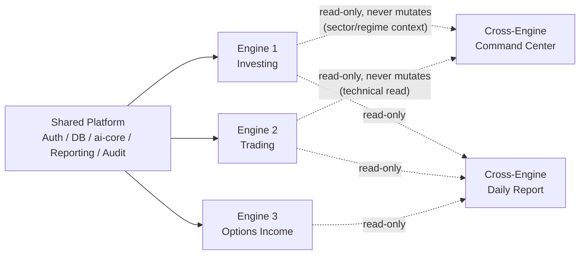
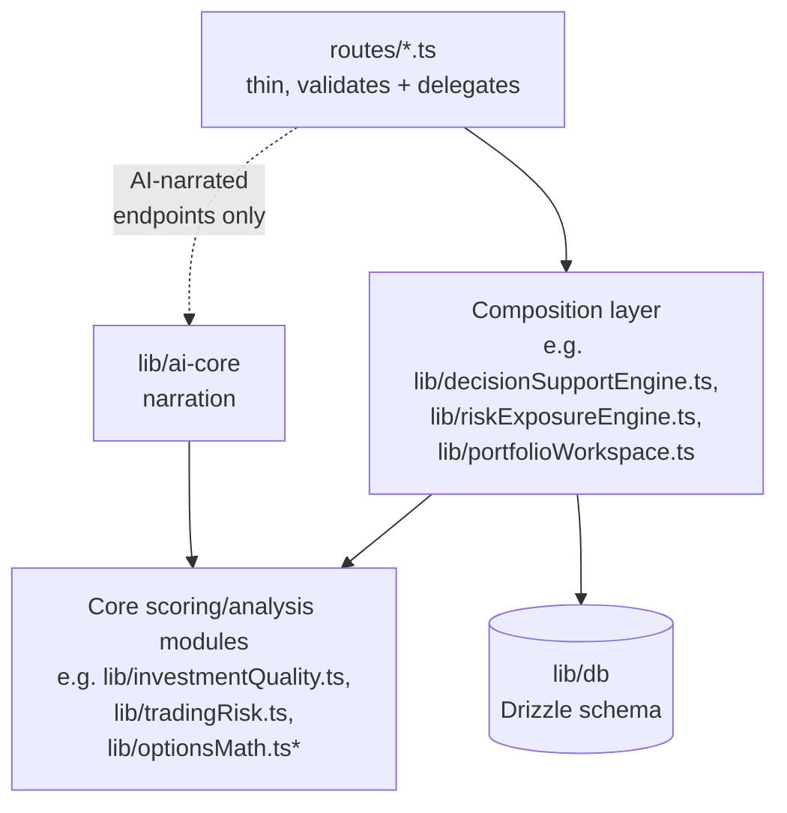

# Version 1 Release Candidate (RC1) — Diagrams & Catalogues

Step 7 of the RC1 hardening pass. Every figure below was generated from
the actual current codebase this session (grep/inspection against real
source files), not written from memory or estimated.

## 1. Version 1 Architecture Diagram

See `docs/Architecture.md` §1 for the full three-engine + shared-platform
diagram (Mermaid) and its accompanying explanation. Not duplicated here.

## 2. Engine Dependency Diagram

No engine directly imports another engine's internal `lib/` modules for
its own scoring logic — every cross-engine surface is a **read-only
composition layer** over each engine's own already-computed output,
never a shared/blended calculation. This was true at every phase this
project's history describes and was re-confirmed for this release (see
`docs/RC1-Repository-Audit.md`).

## 3. Module Dependency Diagram (representative)

The real backend module graph has 240 files — too many to render legibly
in full. This is a representative diagram of the composition layers that
matter most for understanding how a request actually resolves:

`*optionsMath.ts` is one of the 5 protected files — every composition
layer reads its already-computed output but never modifies it. `madge
--circular` confirms zero circular dependencies in the backend module
graph as of this release (one was found and fixed this phase — see
`docs/RC1-Repository-Audit.md` §7) and zero in the frontend.

## 4. Database Overview

55 tables total, grouped by the platform/engine they belong to:

| Group | Table count | Examples |
|---|---|---|
| Shared platform | 24 | `users`, `sessions`, `accounts`, `verifications`, `settings`, `platform_audit_log`, `platform_notifications`, `institutional_reports`, `intelligence_snapshots` |
| Engine 1 — Investing | 15 | `investing_watchlists`, `investing_watchlist_items`, `investing_portfolios`, `investing_holdings`, `investing_risk_snapshots`, `investing_filing_analysis`, `investing_monitoring_states`, `portfolio_workflow_instances`, `workspace_pinned_resources`, `workspace_recent_views` |
| Engine 2 — Trading | 7 | `trading_positions`, `trading_journal_entries`, `trading_backtest_results` |
| Engine 3 — Options Income | 9 | `trades`, `journal_entries`, `backtest_results`, `options_backtest_results`, `auto_execution_log` (protected, never modified as part of general audit-log work) |

Every user-scoped table's `user_id` column carries an `ON DELETE
RESTRICT` foreign key to `users.id` (universal convention), with two
disclosed exceptions using `ON DELETE CASCADE` for genuine parent-child
sub-resources (e.g. `investing_holdings.portfolio_id →
investing_portfolios.id` — deleting your own portfolio cascades to its own
holdings, a routine self-service action distinct from the whole-user-
deletion scenario `RESTRICT` protects against). Every schema change ships
as a hand-written, numbered SQL file in `lib/db/manual-migrations/`.

## 5. Navigation Map

The full navigation registry (`lib/nav-items.ts`), organized by the
engine/area each item belongs to. See `docs/Version-1-Feature-List.md` for
the same list grouped by feature rather than nav order.

- **Engine 1 (Investing)**: Investing Executive Dashboard, Research
  Terminal, Value Research, Investment Committee, Decision Engine /
  Decision Support Engine, Portfolio Construction, Rebalancing Engine,
  Portfolio Optimisation, Risk & Exposure Engine, Concentration Risk,
  Event Risk, Scenario & Stress Testing Engine, Performance & Attribution
  Engine, Monitoring & Compliance Engine, Opportunity Discovery,
  Watchlists & Opportunity Dashboard, Institutional AI Coach,
  Institutional Mentor, AI Teacher & Learning Centre, Learning Paths,
  Glossary, Value Investing School, Strategy Academy.
- **Engine 2 (Trading)**: Market Structure Workbench, Liquidity & Session
  Workbench, Trading Research, Trade Workspace, Trade Planning & Risk
  Studio, Trading Analytics, Trading Journal, Trading Backtest, Trading AI
  Coach.
- **Engine 3 (Options Income)**: Stock Scanner, Scanner, Strategy
  Workbench, Strategy Framework, Trades, Position Lifecycle Manager, Trade
  History, Adjustment Preview, Adjustments, Order Preview, Position
  Sizing, Option Chain, AutoPilot, Portfolio, Portfolio AI, Options
  Dashboard, Options Income Workspace, Portfolio Dashboard, Paper
  Portfolio, Broker Reconciliation, Performance, Trade Performance,
  Backtest, Options Backtest, Leaderboard, AI Trade Journal, Trade
  Lessons, Delta Masterclass, Greeks Tutor, Trading Quiz, AI Assistant.
- **Shared / cross-engine**: Command Center, Institutional Dashboard,
  Institutional Home, Executive Intelligence, Institutional Intelligence,
  Institutional Workspace, Cross-Engine Workspace, Institutional Portfolio
  Workspace, Institutional Reporting Centre, Notifications, Event
  Calendar, Daily Report, Operations Dashboard, Settings.

Every item above is reachable from the sidebar and confirmed present in
`App.tsx`'s route table (see `docs/RC1-Repository-Audit.md` §5).

## 6. Workflow Map

The Institutional Portfolio Workspace's Workflow Center (Phase 44) ships 9
deterministic, checklist-based review workflows, each guiding a user
through already-existing pages only:

| Workflow | Cadence | Steps |
|---|---|---|
| Morning Review | Daily | Outstanding Issues → Watchlists → Risk alerts → Compliance breaches |
| Weekly Review | Weekly | Performance → Scenario results → Watchlists → Recent Reports |
| Monthly Review | Monthly | Rebalancing drift → Diversification → Full Compliance → Generate Institutional Review Report |
| Quarterly Review | Quarterly | Full Portfolio Snapshot → Full Risk review → Full Performance review → Full Compliance review → Generate Institutional Review Report |
| Portfolio Review | Ad hoc | Holdings Overview → Rebalancing/Allocation → Executive Health |
| Risk Review | Ad hoc | Risk Overview → Scenario impact → Concentration/Correlation |
| Compliance Review | Ad hoc | Policy violations → Greeks limits → Buying-power limits |
| Performance Review | Ad hoc | Investing performance → Trading performance → Options performance |
| Scenario Review | Ad hoc | Market shock scenarios → Options Stress Test → Options rate scenarios |

Full detail: `docs/Workflow-Center.md`.

## 7. Report Catalogue

32 report types, one shared `InstitutionalReport` envelope, rendered by
one shared Reporting Centre view (`lib/institutionalReporting.ts`):

`investment-committee`, `company-research`, `portfolio-review`,
`portfolio-health`, `watchlist`, `opportunity-discovery`,
`monitoring-summary`, `ai-coach-summary`, `executive-summary`,
`trade-planning-summary`, `strategy-framework-summary`,
`trading-analytics-summary`, `executive-intelligence-summary`,
`options-income-summary`, `options-portfolio-review`,
`position-lifecycle-summary`, `risk-exposure-summary`,
`portfolio-concentration-report`, `performance-summary`,
`performance-attribution-report`, `scenario-analysis-report`,
`stress-test-report`, `executive-decision-summary`,
`institutional-health-report`, `portfolio-allocation-report`,
`rebalancing-planning-report`, `compliance-report`,
`policy-monitoring-report`, `watchlist-summary-report`,
`opportunity-dashboard-report`, `portfolio-workspace-summary`,
`institutional-review-report`.

## 8. Learning Catalogue

Every engine and cross-engine surface has its own Learning module linking
to real, already-existing Learning Path content (`lib/learningPaths.ts`) —
never duplicated lesson text. Representative topic counts per module:
Compliance (6), Decision Support (7), Rebalancing (6), Watchlists (6),
Portfolio Workspace (6), plus companion modules for Risk & Exposure,
Performance & Attribution, Scenario, Options Lifecycle, and Institutional
Intelligence. The full Learning Centre also hosts the platform's
standalone education surfaces: Learning Paths, Glossary, Value Investing
School, Strategy Academy, Trade Lessons, Delta Masterclass, Greeks Tutor,
and Trading Quiz.

## 9. AI Coach Topic Catalogue

11 domain-specific coach modules, each following the identical
`{topic, question, answer}` shape and reusing the shared
`COACH_DISCLAIMER` — structurally incapable of taking a symbol, position,
or account figure as input to a topic explanation, so no coach module can
produce a trade recommendation even by accident:

| Coach module | Topics |
|---|---|
| Compliance | 5 |
| Decision Support | 8 |
| Investing | 8 |
| Options Lifecycle | 5 |
| Performance & Attribution | 5 |
| Rebalancing | 5 |
| Risk & Exposure | 7 |
| Scenario | 5 |
| Trading | 9 |
| Watchlists | 5 |
| Portfolio Workspace | 5 |

**67 total topics** across 11 modules. Plus the original, symbol/position-
aware Options AI Assistant (`lib/coach.ts`/`coachLLM.ts`) — a free-form
chat coach for the Options Income Engine, not a fixed topic list — and the
Investment Committee narrator (Phase 61-equivalent) and Cross-Engine Daily
Report narrator, both structured, on-demand LLM narrations over
already-computed deterministic data rather than fixed topic catalogues.
